# Azure + WILLMA Excel Open Answers Interrogator in Langflow V03

## Inhoudsopgave

- [Introductie](#introductie)
- [Status en doel](#status-en-doel)
- [Gerealiseerde architectuur](#gerealiseerde-architectuur)
- [Standalone uitvoering](#standalone-uitvoering)
- [Installatie van de runtimeomgeving](#installatie-van-de-runtimeomgeving)
- [Runtimeconfiguratie](#runtimeconfiguratie)
- [Excel, normalisatie en SQLite](#excel-normalisatie-en-sqlite)
- [spaCy NER-cache](#spacy-ner-cache)
- [Nederlandse taalfiltering](#nederlandse-taalfiltering)
- [N-gramanalyse](#n-gramanalyse)
- [Unieke Nederlandse woorden](#unieke-nederlandse-woorden)
- [Crash-veilige vergrendeling](#crash-veilige-vergrendeling)
- [Vraagroutering](#vraagroutering)
- [Adaptieve resultaatlimieten](#adaptieve-resultaatlimieten)
- [Modelgestuurde SQL en herstel](#modelgestuurde-sql-en-herstel)
- [Nederlandse antwoordcorrectie](#nederlandse-antwoordcorrectie)
- [Antwoordcontract](#antwoordcontract)
- [Foutafhandeling](#foutafhandeling)
- [Gevalideerde werking](#gevalideerde-werking)
- [Pathfinding-notities](#pathfinding-notities)
- [Beheer en opnieuw bouwen](#beheer-en-opnieuw-bouwen)
- [Bekende grenzen](#bekende-grenzen)
- [Definitieve artefacten](#definitieve-artefacten)
- [Appendix A: componenten, code en werking](#appendix-a-componenten-code-en-werking)
- [Appendix B: What needs to be installed](#appendix-b-what-needs-to-be-installed)

## Introductie

Open antwoorden uit grootschalige enquêtes bevatten waardevolle signalen, maar zijn door hun vrije tekstvorm lastig systematisch te onderzoeken. Deze Langflow-oplossing maakt zulke antwoorden interactief bevraagbaar: een gebruiker selecteert een Excel-bestand, stelt een vraag in natuurlijke taal en ontvangt een controleerbaar Nederlandstalig antwoord. V03 voegt persistente n-gramanalyse, filtering van waarschijnlijk Engelstalige antwoorden en een reproduceerbare telling van unieke Nederlandse woorden toe.

De flow combineert deterministische dataverwerking met modelondersteuning. Excel-antwoorden worden genormaliseerd en persistent opgeslagen in SQLite, terwijl spaCy benoemde entiteiten extraheerbaar maakt. Bekende analysevragen volgen lokale, voorspelbare routes. Alleen voor overige vragen genereert Azure OpenAI of WILLMA een streng gevalideerde read-only SQL-query. Het berekende resultaat blijft daarbij de bron van waarheid; modelgegenereerde formuleringen worden gecontroleerd en zo nodig vervangen door het ongewijzigde analyseresultaat.

Onderstaande actuele V4-opname toont de volledige standalone flow zoals deze in Langflow 1.11.4 is geïmporteerd en gevalideerd. De flow bevat elf componenten en elf verbindingen, inclusief de configuratie en persistente opbouw van de n-gramtabellen.

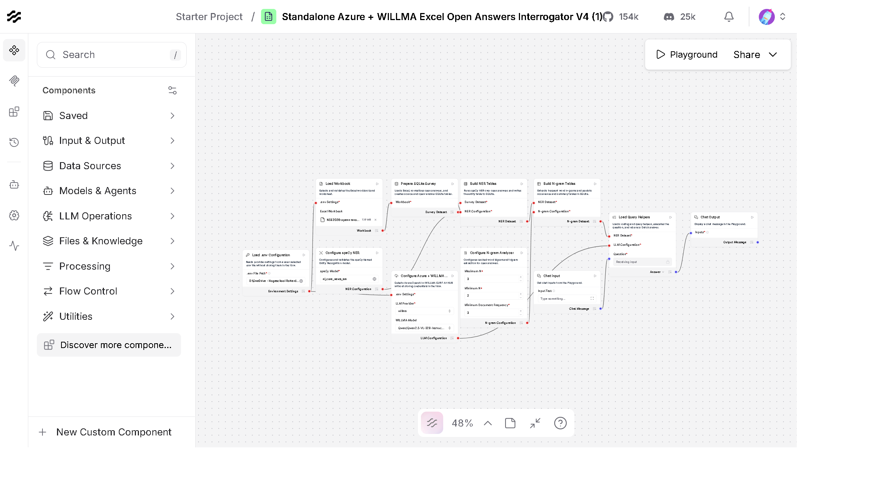

*Volledige Langflow V4-flow met elf componenten en elf verbindingen, inclusief `Configure N-gram Analyzer` en `Build N-gram Tables`.*

## Status en doel

Dit document beschrijft de gerealiseerde standalone Langflow 1.11.4-oplossing voor het bevragen van open enquêteantwoorden uit Excel. V03 bouwt voort op V02 en legt ook de feitelijk gebouwde en gevalideerde Nederlandse n-gramlaag vast.

Definitieve export:

`standaloneAzAIHubExcelOpenAnsInterro-LangV1.11.4V4.json`

De flow:

- bevat alle Python-logica die nodig is voor verwerking in de componentcode;
- heeft geen runtime-import van het lokale pakket `survey_core` nodig;
- bevat elf componenten en elf getypeerde verbindingen;
- ondersteunt Azure OpenAI en WILLMA SURF AI-HUB;
- gebruikt WILLMA met `Qwen/Qwen2.5-VL-32B-Instruct-AWQ` als ingestelde provider/modelcombinatie;
- leest instellingen uit een door de gebruiker gekozen `.env`-bestand;
- hergebruikt persistente SQLite- en spaCy-resultaten;
- valideert modelgegenereerde SQL en herstelt eenmaal bij een onbekende kolom;
- behandelt volledige-lijstvragen anders dan begrensde voorbeeldvragen;
- redigeert en valideert Nederlandstalige modelantwoorden en valt veilig terug op bronresultaten;
- filtert waarschijnlijk Engelstalige antwoorden voordat n-grammen worden opgebouwd;
- materialiseert bigrammen en trigrammen persistent in SQLite;
- telt unieke genormaliseerde Nederlandse lemma's deterministisch.

## Gerealiseerde architectuur

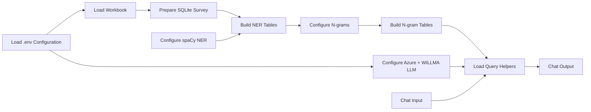

De elf componenten zijn:

1. `Load .env Configuration`
2. `Load Workbook`
3. `Prepare SQLite Survey`
4. `Configure spaCy NER`
5. `Build NER Tables`
6. `Configure N-gram Analyzer`
7. `Build N-gram Tables`
8. `Configure Azure + WILLMA LLM`
9. `Chat Input`
10. `Load Query Helpers`
11. `Chat Output`

De flow heeft elf getypeerde verbindingen. De n-gramconfiguratie en materialisatie zijn afzonderlijke stappen; vraagroutering, unieke-woordtelling en antwoordcorrectie blijven onderdeel van de kernpipeline.

## Standalone uitvoering

De bronbestanden in `survey_core` blijven de onderhoudbare ontwikkelbron. `build_flow_json.py` leest deze modules en voegt hun code in bij de componenten die de kernlogica uitvoeren:

- `Prepare SQLite Survey`;
- `Build NER Tables`;
- `Build N-gram Tables`;
- `Load Query Helpers`.

Tijdens de bouw worden lokale imports verwijderd en wordt iedere ingebedde component met `compile()` gecontroleerd. Daarna valideert de builder de compatibiliteit van alle edge-handles voordat de JSON wordt geschreven.

Hierdoor kan de geëxporteerde flow worden geïmporteerd zonder dat `survey_core` als installeerbaar pakket op de Langflow-host aanwezig is. Wijzigingen in de ontwikkelbron worden niet automatisch zichtbaar in een al geïmporteerde flow: na iedere bronwijziging moet de JSON opnieuw worden gebouwd en als nieuwe flow worden geïmporteerd.

## Installatie van de runtimeomgeving

Naast Langflow 1.11.4 heeft de flow Python 3.11 en de packages uit `requirements-langflow-components.txt` nodig. Dit bestand installeert de gevalideerde versies van pandas, openpyxl, SQLAlchemy, spaCy, het Nederlandse model `nl_core_news_sm`, OpenAI en python-dotenv. SQLite maakt deel uit van Python en vereist geen afzonderlijke databaseserver. Het lokale pakket `survey_core` hoeft voor de standalone V4-export niet te worden geïnstalleerd, omdat de benodigde code in de JSON is ingebed.

### Windows 11 met een nieuwe conda-omgeving

Installeer eerst Miniconda of Anaconda. Open daarna een Anaconda Prompt of PowerShell waarin `conda` beschikbaar is en voer vanuit de projectmap uit:

```powershell
conda create --name langflow-1.11.4 python=3.11 -y
conda activate langflow-1.11.4
python -m pip install --upgrade pip
python -m pip install "langflow==1.11.4"
python -m pip install --requirement requirements-langflow-components.txt
python -c "import langflow, pandas, openpyxl, sqlalchemy, spacy, openai, dotenv; spacy.load('nl_core_news_sm'); print('Runtime gereed')"
python -m langflow run --host 127.0.0.1 --port 7861
```

De conda-omgeving is de Python-runtime waarin Langflow draait. Alleen wanneer dezelfde omgeving ook in Jupyter of VS Code als notebookkernel moet worden gebruikt, is een kernelregistratie nodig:

```powershell
python -m pip install ipykernel
python -m ipykernel install --user --name langflow-1.11.4 --display-name "Python (Langflow 1.11.4)"
```

Open vervolgens `http://127.0.0.1:7861`, importeer `standaloneAzAIHubExcelOpenAnsInterro-LangV1.11.4V4.json`, selecteer het `.env`-bestand en daarna het workbook via `My Files`. Schrijfrechten op de map uit `EXCEL_OPEN_ANSWERS_DB_PATH` zijn vereist voor de SQLite-cache en lockbestanden.

### Docker in een Ubuntu 24.04-VM

Ubuntu heeft een LTS-uitgave `24.04`; er bestaat geen reguliere Ubuntu-uitgave `24.03`. Installeer in de VM Docker Engine met de officiële Docker-instructies en controleer dat `docker compose version` werkt. Bouw daarna een eigen image boven op Langflow 1.11.4, zodat exact dezelfde componentafhankelijkheden beschikbaar zijn.

Maak in de projectmap een `Dockerfile` met:

```dockerfile
FROM langflowai/langflow:1.11.4

USER root
COPY requirements-langflow-components.txt /tmp/requirements-langflow-components.txt
RUN python -m pip install --no-cache-dir --requirement /tmp/requirements-langflow-components.txt
USER 1000
```

Maak daarnaast `compose.yaml`:

```yaml
services:
  langflow:
    build: .
    ports:
      - "7861:7860"
    volumes:
      - langflow-data:/app/langflow
      - ./data:/workspace/data
      - ./.env:/workspace/.env:ro
      - ./standaloneAzAIHubExcelOpenAnsInterro-LangV1.11.4V4.json:/workspace/flow.json:ro
    environment:
      LANGFLOW_CONFIG_DIR: /app/langflow
    restart: unless-stopped

volumes:
  langflow-data:
```

Bouw en start de container:

```bash
docker compose build
docker compose up -d
docker compose logs -f langflow
```

Open `http://<IP-van-de-VM>:7861`. Sta TCP-poort 7861 alleen toe vanaf vertrouwde beheernetwerken. Importeer `/workspace/flow.json` via Langflow en gebruik in de componenten containerpaden, bijvoorbeeld `/workspace/.env`, `/workspace/data/invoer.xlsx` en `/workspace/data/excel_open_answers.sqlite`. Controleer na import dat alle elf componenten en elf verbindingen aanwezig zijn en voer minstens één n-gramvraag en één modelgestuurde vraag uit.

Voor beide installatievormen geldt dat alleen de actieve modelprovider hoeft te worden geconfigureerd. Bewaar API-sleutels uitsluitend in `.env` of de secretopslag van Langflow; voeg ze niet toe aan de flow-JSON, het Docker-image of versiebeheer.

## Runtimeconfiguratie

`Load .env Configuration` leest alleen een allowlist van bekende instellingen uit het geselecteerde bestand:

```dotenv
DATASET_PATH=
EXCEL_OPEN_ANSWERS_DB_PATH=
AZURE_OPENAI_ENDPOINT=
AZURE_OPENAI_API_KEY=
AZURE_OPENAI_API_VERSION=
AZURE_OPENAI_DEPLOYMENT=
AZURE_OPENAI_MODEL=
WILLMA_BASE_URL=
WILLMA_API_KEY=
WILLMA_MODEL=
```

De component retourneert instellingen als Langflow `Data`. Geheimen worden niet in de export opgeslagen of in diagnostiek weergegeven.

De providercomponent maakt één intern contract:

```json
{
  "provider": "azure of willma",
  "endpoint": "provider endpoint",
  "api_key": "runtime secret",
  "api_version": "alleen voor Azure",
  "model": "deployment- of modelnaam"
}
```

Alleen de geselecteerde provider wordt gevalideerd. De definitieve flow staat standaard op:

- provider: `willma`;
- model: `Qwen/Qwen2.5-VL-32B-Instruct-AWQ`;
- WILLMA-endpoint: uit `.env`, met `https://api.willma.surf.nl/v0` als fallback.

## Excel, normalisatie en SQLite

De gebruiker kiest het Excel-bestand via Langflow `My Files`. De verwerking:

1. valideert bestand en werkblad;
2. normaliseert kolomnamen en bekende metadata zoals opleidingsvorm;
3. schrijft het bronblad naar SQLite;
4. maakt een long-format tabel met niet-lege open antwoorden;
5. maakt een tabel voor spaCy-entiteiten;
6. schrijft metadata voor hergebruik en invalidatie.

De SQLite-cache wordt alleen hergebruikt wanneer onder andere de volgende kenmerken overeenkomen:

- absoluut workbookpad;
- bestandsgrootte;
- wijzigingstijd;
- SHA-256-hash;
- werkblad;
- cache- en normalisatieversie;
- aanwezigheid en voltooiing van de verwachte tabellen.

Een gewijzigd workbook veroorzaakt dus een gerichte herbouw.

## spaCy NER-cache

De NER-stap verwerkt de genormaliseerde antwoorden met het ingestelde model, standaard `nl_core_news_sm`. De entiteiten worden persistent opgeslagen met verwijzingen naar het bronantwoord en relevante metadata.

NER wordt overgeslagen wanneer:

- de SQLite-cache geldig is;
- de entiteitentabel compleet is;
- hetzelfde spaCy-model is gebruikt.

Een gewijzigd spaCy-model of onvolledige metadata veroorzaakt een herbouw van alleen de NER-laag.

## Nederlandse taalfiltering

De n-gramlaag gebruikt het Nederlandse spaCy-model niet als impliciete taalclassificator. Voor ieder open antwoord voert `is_probably_dutch` eerst een lichte, deterministische taalcontrole uit:

1. normaliseer de tekst naar vergelijkbare tokens;
2. tel treffers in een Nederlandse stopwoordenlijst;
3. tel treffers in een Engelse stopwoordenlijst;
4. verwerk het antwoord alleen wanneer de Nederlandse score minimaal gelijk is aan de Engelse score.

Waarschijnlijk Engelstalige antwoorden worden daarmee vóór lemmatisering en n-gramaggregatie overgeslagen. Dit voorkomt dat combinaties als `to be`, `would be` en `I think` de Nederlandse toplijsten domineren. De methode is bewust transparant en snel; bij korte of taalarme antwoorden kan zij minder onderscheidend zijn dan een volledig taalherkenningsmodel.

Deze documenttaalfiltering staat los van de Nederlandse antwoordcorrectie verderop in de flow. De eerste laag bepaalt welke bronantwoorden aan de Nederlandse n-gramanalyse deelnemen; de tweede laag controleert de formulering die het LLM aan de gebruiker toont.

## N-gramanalyse

De standaardconfiguratie bouwt bigrammen en trigrammen met:

- `min_n = 2` en `max_n = 3`;
- minimale documentfrequentie `3`;
- lemma's in plaats van verbogen woordvormen;
- verwijdering van spaCy-stopwoorden en projectspecifieke Nederlandse stopwoorden.

Per waarschijnlijk Nederlands antwoord verwerkt spaCy de tekst. Spaties, interpunctie, getallen en ongeldige tokens vormen segmentgrenzen, zodat n-grammen niet kunstmatig over zulke grenzen heen lopen. Geldige tokens worden genormaliseerd; daarna worden alle ingestelde n-gramlengtes als occurrences opgeslagen. De samenvatting bevat zowel:

- `document_frequency`: het aantal verschillende antwoorden waarin het n-gram voorkomt;
- `total_frequency`: het totale aantal voorkomens.

SQLite bevat twee afgeleide tabellen: een occurrence-tabel voor filtering per vraag of metadata en een globale samenvatting voor snelle inspectie. Bekende vragen met termen als `n-gram`, `bigram`, `trigram`, `woordcombinatie`, `frase` of `formulering` gaan via de route `deterministic_ngrams` en vereisen geen modelgegenereerde SQL.

De n-gramcache is alleen geldig wanneer workbookfingerprint, databaseschema, voltooiingsstatus, tabellen, genormaliseerde configuratie en `NGRAM_ANALYZER_VERSION` overeenkomen. De huidige analyzerversie is `2`. Een verandering in taalfiltering of tokenanalyse kan daardoor gericht een herbouw afdwingen zonder de brondata onnodig opnieuw in te lezen.

## Unieke Nederlandse woorden

Tijdens dezelfde spaCy-pass verzamelt de pipeline alle geldige genormaliseerde lemma's uit waarschijnlijk Nederlandse antwoorden in een set. Stopwoorden tellen hierbij wel mee als geldige woorden; alleen spaties, interpunctie, getallen en ongeldige tokens vallen af. Het resultaat is dus het aantal unieke woordlemma's in de Nederlandse open antwoorden, niet het aantal ruwe schrijfwijzen.

De waarde wordt als `unique_dutch_word_count` in SQLite-metadata opgeslagen en samen met de n-gramcache hergebruikt. Vragen die `hoeveel`, `unieke` en `woorden` bevatten, waaronder de typefouttolerante vraag:

`Hoeveel unieke (Nederlandse) woorden komen voor in de gehee database?`

gaan via `deterministic_unique_dutch_words`. Deze globale route wordt vóór kolomafhankelijke analyse afgehandeld. In de gevalideerde database is het antwoord:

`De database bevat 11.174 unieke Nederlandse woorden.`

## Crash-veilige vergrendeling

De oorspronkelijke directory-lock kon na een afgebroken proces blijven bestaan. Dat veroorzaakte de fout:

`Workflow execution timed out after 300.1s`

De standalone versie gebruikt nu een persistent bestand met de naam:

`<database>.build.lockfile`

Het besturingssysteem beheert de daadwerkelijke lock:

- Windows: `msvcrt.locking`;
- Unix: `fcntl.flock`.

Bij procesbeëindiging geeft het besturingssysteem de lock vrij. Het lockbestand zelf mag blijven bestaan en veroorzaakt geen blokkade.

## Vraagroutering

Bekende intenties worden lokaal uitgevoerd. Voorbeelden zijn:

- genoemde personen, organisaties of locaties via spaCy;
- feedback over docenten;
- representatieve voorbeelden per subgroep;
- welzijnsthema's per opleidingsvorm;
- vergelijking van studielast;
- frequente woorden en thema's.

Alleen vragen die niet betrouwbaar via een bekende route kunnen worden afgehandeld, gaan naar de modelgestuurde SQL-route. Dit beperkt latency, modelkosten en variatie.

## Adaptieve resultaatlimieten

De standaardwaarde van `Maximum Result Rows` blijft 15. Dit is correct voor vragen naar voorbeelden of topresultaten, bijvoorbeeld:

`Geef 15 representatieve voorbeelden van feedback over onderwijs.`

Voor herkenbare verzoeken om een volledige lijst, zoals:

`Geef een lijst van alle opleidingen in de database.`

wordt een aparte, begrensde limiet van 500 gebruikt. De SQL-prompt vraagt daarbij om unieke, gesorteerde waarden. Volledige-lijstresultaten worden rechtstreeks als Markdown weergegeven en niet opnieuw door het model herschreven. Zo blijven alle gevonden waarden behouden zonder een onbeperkte query toe te staan.

## Modelgestuurde SQL en herstel

Het model ontvangt uitsluitend:

- de natuurlijke-taalvraag;
- één toegestane tabel;
- de werkelijke kolomnamen en datatypen;
- de opdracht om precies één read-only SQLite `SELECT` terug te geven.

Voor uitvoering controleert `validate_select` dat:

- slechts één statement aanwezig is;
- de query `SELECT` of `WITH` gebruikt;
- geen schrijf- of schema-operaties voorkomen;
- alleen de toegestane tabel wordt gebruikt;
- een numerieke limiet aanwezig is of veilig wordt toegevoegd.

Tijdens runtime bleek Qwen een niet-bestaande kolom `Studiejaar_student` te kunnen genereren. Een allowlist van tabellen voorkomt dit type kolomfout niet. Daarom voert de pipeline bij uitsluitend een SQLite-fout met `no such column` één herstelpoging uit. De tweede prompt bevat:

- het echte schema;
- de eerdere SQLite-fout;
- de instructie alleen bestaande kolommen te gebruiken.

Andere databasefouten worden niet automatisch opnieuw geprobeerd.

## Nederlandse antwoordcorrectie

Een technisch correcte query kan nog steeds een taalkundig beschadigde modelsamenvatting opleveren. Tijdens de runtimevalidatie produceerde Qwen onder meer Chinese en Cyrillische fragmenten en onsamenhangende Nederlandse tekst.

Voor niet-exhaustieve antwoorden met modelsamenvatting gebruikt de flow daarom drie stappen:

1. Maak een korte, feitelijke Nederlandse samenvatting op basis van het berekende resultaat.
2. Laat een tweede modelcall uitsluitend redigeren naar helder Nederlands, zonder feiten toe te voegen.
3. Valideer de geredigeerde tekst.

De validatie vereist:

- niet-lege tekst;
- exact aanwezige secties `## Antwoord` en `## Resultaat`;
- geen Chinese, Japanse of Cyrillische Unicode-tekens.

Wanneer de tweede uitvoer deze controle niet doorstaat, toont de flow deterministisch:

- een melding dat de samenvatting niet betrouwbaar kon worden gecorrigeerd;
- het ongewijzigde Markdown-resultaat uit de analyse.

De status wordt opgenomen in `diagnostics.operation` als `validated Dutch summary` of `raw result fallback after language validation`.

Deze controle voorkomt ernstige schriftcorruptie. Zij garandeert niet dat ieder Nederlands lidwoord of iedere formulering perfect is; daarvoor zou een strengere taalchecker of een ander model nodig zijn. Samen met de bronfiltering zijn er in V03 dus twee expliciete taalpoorten: taalkeuze voor de analyse en taalvalidatie voor de presentatie.

## Antwoordcontract

Iedere gebruikersuitvoer bevat minimaal:

```markdown
## Antwoord
...

## Resultaat
...
```

Het interne resultaatobject bevat:

```json
{
  "question": "oorspronkelijke vraag",
  "route": "gekozen route",
  "selected_question_column": "geselecteerde enquêtekolom of null",
  "sql_query": "gevalideerde query of null",
  "diagnostics": {
    "operation": "uitgevoerde analyse en eventuele correctiestatus",
    "database_path": "SQLite-pad"
  },
  "rows": [],
  "result_markdown": "ongewijzigd berekend resultaat",
  "final_answer": "weergegeven Nederlands antwoord"
}
```

`result_markdown` blijft beschikbaar als controleerbare bron achter een eventuele modelsamenvatting.

## Foutafhandeling

| Situatie | Gedrag |
| --- | --- |
| Workbook ontbreekt | Meld het opgeloste pad en vraag om een geldig bestand |
| Werkblad ontbreekt | Toon de beschikbare werkbladen |
| SQLite-cache ongeldig | Bouw de vereiste tabellen opnieuw |
| spaCy-model gewijzigd | Bouw alleen de NER-resultaten opnieuw |
| N-gramconfiguratie of analyzerversie gewijzigd | Bouw alleen de n-gramtabellen en unieke-woordtelling opnieuw |
| Antwoord waarschijnlijk Engelstalig | Sla het antwoord over voor Nederlandse n-gramanalyse |
| Lock bezet | Wacht begrensd; een gecrasht proces laat geen permanente OS-lock achter |
| Providerinstelling ontbreekt | Noem alleen de ontbrekende veldnamen |
| Onveilige SQL | Weiger uitvoering |
| Onbekende SQL-kolom | Herstel eenmaal met schema en foutmelding |
| Ongeldige gecorrigeerde modeltekst | Toon het ongewijzigde analyseresultaat |
| Volledige lijst gevraagd | Gebruik maximaal 500 rijen en sla modelsamenvatting over |

## Gevalideerde werking

De V4-ontwikkelversie is gecontroleerd met vijftien gerichte tests. Naast de eerdere controles dekken deze:

- detectie en normalisatie van open antwoorden;
- vaste vraagroutes;
- read-only SQL-veiligheid;
- herkenning van volledige-lijstvragen;
- begrenzing op 500 voor exhaustieve resultaten;
- providerselectie;
- eenmalig herstel van een onbekende SQL-kolom;
- validatie en correctie van Nederlandse uitvoer;
- fallback bij blijvend ongeldige schrifttekens;
- hergebruik en invalidatie van SQLite-cache;
- hergebruik en invalidatie van NER-cache;
- Nederlandse versus Engelse bronfiltering voor n-grammen;
- persistente n-gramopbouw en analyzerversie-invalidering;
- herkenning en uitvoering van de unieke-Nederlandse-woordenvraag.

Testresultaat:

`15 passed`

De V4-JSON is opnieuw gegenereerd, bevat elf nodes en elf edges en is in Langflow geïmporteerd als flow-ID:

`76fc954d-fd9d-469a-8c9e-f5dfa77f3ee6`

De runtimevraag voor de unieke woordenschat:

`Hoeveel unieke (Nederlandse) woorden komen voor in de gehee database?`

voltooide in 101,5 seconden en gaf 11.174 unieke Nederlandse woorden. Een tweede runtimevraag naar Nederlandse bigrammen en trigrammen voltooide in 13,1 seconden. De hoogste bigrammen waren onder andere `stage lopen` (27), `goed regelen` (18) en `erg fijn` (17); de eerdere Engelse dominantie was verdwenen.

Eerder gevalideerde gegevensvragen leverden:

- 100 unieke opleidingen voor de volledige opleidingenlijst;
- 11 unieke instituten voor de volledige institutenlijst;
- exact 15 resultaten voor een begrensde top-/voorbeeldvraag.

## Pathfinding-notities

Onderstaande notities vatten het technische zoekpad compact samen.

| Waarneming | Lokale hypothese | Discriminerende controle | Gekozen correctie |
| --- | --- | --- | --- |
| `No module named 'survey_core'` na import | De flow verwees nog naar ontwikkelpaden | Inspectie van componentcode in de export | Kernmodules in de standalone JSON ingebed |
| Verbindingen verdwenen of waren fragiel | Langflow verwacht geserialiseerde typed handles | Nodes en handletypes tijdens build vergelijken | Edge-handles programmatisch opgebouwd en gevalideerd |
| SQLite en spaCy draaiden herhaaldelijk | Alleen aanwezigheid van bestanden was onvoldoende cachebewijs | Metadata vergelijken vóór verwerking | Fingerprint- en statusgestuurde cachepoorten toegevoegd |
| Exacte timeout na 300,1 seconden | Een achtergebleven directory-lock blokkeerde preprocessing | Lockpad en wachttijd correleren | OS-managed file locking ingevoerd |
| Volledige lijst stopte bij 15 | Algemene `top_n` werd ook op exhaustieve intenties toegepast | Volledige lijst vergelijken met unieke databasewaarden | Intentiedetectie plus begrensde limiet 500 |
| SQL faalde op `Studiejaar_student` | Tabelvalidatie controleerde geen modelkolommen | SQLite-fout vergelijken met werkelijk schema | Eén schema-gestuurde SQL-herstelpoging |
| Qwen produceerde vreemde schrifttekens | Eén vrije samenvattingscall had geen kwaliteitsgrens | Uitvoer op koppen en Unicode-scripts controleren | Tweede redactieronde, validatie en bronfallback |
| Wijzigingen konden bestaand flowgedrag ongemerkt verstoren | Unit tests dekten de interactie tussen Langflow-componenten en browseruitvoer niet volledig | De actuele flow met Playwright-code bedienen en representatieve testprompts uitvoeren | Browsergestuurde Langflow-simulaties als aanvullende regressiecontrole gebruikt |

Tijdens het pathfinding-proces is Playwright-code gebruikt om interacties met de actieve Langflow-flow in de browser te simuleren. Daarbij zijn gerichte testprompts ingevoerd voor onder meer n-gramanalyse, unieke Nederlandse woorden, SQL-vragen en taalkwaliteit. De resulterende componentstatussen, antwoorden en volledige flowweergave zijn gecontroleerd. Deze end-to-end controles vullen de geautomatiseerde tests aan en helpen functionele en visuele regressies vroegtijdig te signaleren en tegen te gaan.

Belangrijkste ontwerpconclusies:

- Validatie hoort direct rond niet-deterministische modelstappen te staan.
- Een tabel-allowlist is noodzakelijk maar niet voldoende voor geldige SQL.
- Volledige resultaten moeten niet door een samenvattingsmodel worden verkort.
- Cachegeldigheid moet aantoonbaar zijn via metadata en voltooiingsstatus.
- Standalone Langflow-code vereist na iedere bronwijziging een nieuwe build en import.
- Een veilige fallback is betrouwbaarder dan onbeperkt opnieuw genereren.
- Unit tests, Playwright-simulaties en vaste testprompts vormen samen de regressiecontrole voor de standalone flow.

## Beheer en opnieuw bouwen

Onderhoud vindt plaats in:

- `survey_core/pipeline.py` voor verwerking, caching, SQL-uitvoering en antwoordcorrectie;
- `survey_core/routing.py` voor vraagroutering;
- `survey_core/sql_safety.py` voor SQL-validatie;
- `survey_core/normalization.py` voor normalisatie;
- `components/excel_open_answers/` voor Langflow-componentcontracten;
- `tests/test_core.py` voor regressietests;
- `build_flow_json.py` voor de standalone export.

Na een wijziging:

1. Voer de gerichte tests uit.
2. Genereer de standalone JSON opnieuw met `build_flow_json.py`.
3. Importeer de JSON als nieuwe Langflow-flow.
4. Selecteer het workbook opnieuw via `My Files`.
5. Controleer provider, model, `.env`-pad, elf nodes en elf edges.
6. Voer minstens één n-gramvraag, de unieke-woordenvraag, één SQL-vraag en één taalkwaliteitsvraag uit.

## Bekende grenzen

- De taalvalidator detecteert structurele fouten en ongewenste schriften, maar is geen volledige Nederlandse grammatica- of spellingschecker.
- De stopwoordscore is een pragmatische bron-taalheuristiek en geen volledige statistische taalclassificator.
- De unieke telling betreft genormaliseerde lemma's uit waarschijnlijk Nederlandse open antwoorden, niet alle ruwe celwaarden of woordvormen.
- De tweede redactieronde verhoogt de latency en gebruikt een extra modelcall.
- Exhaustieve resultaten zijn bewust begrensd op 500 rijen.
- De standalone export bevat code, maar geen workbook, SQLite-data of geheime waarden.
- Een geïmporteerde flow wordt niet automatisch bijgewerkt wanneer lokale Python-bronnen veranderen.

## Definitieve artefacten

- Standalone V4-flow: `standaloneAzAIHubExcelOpenAnsInterro-LangV1.11.4V4.json`
- N-gram referentie-export: `standaloneAzAIHubExcelOpenAnsInterro-LangV1.11.4V4---N-Gram---.json`
- Dit document: `AZURE+WILLMA-excel-open-answers-interrogator-in_langflow_V03.md`
- Voorgaande gerealiseerde beschrijving: `AZURE+WILLMA-excel-open-answers-interrogator-in_langflow_V02.md`
- Voorgaande ontwerpbeschrijving: `AZURE+WILLMA-excel-open-answers-interrogator-in_langflow_V01.md`

## Appendix A: componenten, code en werking

### Leeswijzer

De componenten staan hieronder in de functionele volgorde van de datapipeline. De nummers corresponderen met de bestandsnamen van de afbeeldingen, niet met een door Langflow opgelegde uitvoeringsvolgorde. Langflow voert een component uit zodra alle vereiste inputs beschikbaar zijn.

Bij de zeven custom componenten is de onderhoudsbron letterlijk overgenomen. `Prepare SQLite Survey`, `Build NER Tables` en `Load Query Helpers` krijgen tijdens `build_flow_json.py` daarnaast dezelfde kernfuncties uit `survey_core` ingebed. Die gegenereerde duplicatie is niet driemaal afgedrukt: de getoonde wrapper is verbatim en de volledige kern blijft controleerbaar in `survey_core/normalization.py`, `survey_core/routing.py`, `survey_core/sql_safety.py` en `survey_core/pipeline.py`.

`Chat Input` en `Chat Output` zijn standaardcomponenten van Langflow 1.11.4. Hun interne bibliotheekcode maakt geen deel uit van deze repository. Daarom staat bij die twee componenten de letterlijke integratiecode uit `build_flow_json.py`; dit is precies de code waarmee ze in deze flow worden aangemaakt.

### A.1 Load .env Configuration

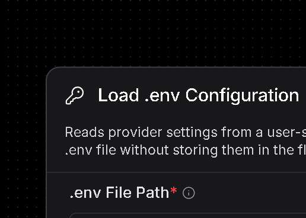

**Plaats en gegevensstroom:** startpunt voor configuratie. De component ontvangt een bestandspad en levert een `Data`-object met toegestane instellingen aan `Load Workbook` en `Configure Azure + WILLMA LLM`.

**Functionele uitleg:** deze stap scheidt geheimen en omgevingsspecifieke paden van de flowdefinitie. Alleen namen op de allowlist worden gelezen. Een API-sleutel kan daardoor wel tijdens runtime worden gebruikt, maar wordt niet in de geëxporteerde flow opgeslagen. Ontbreekt het bestand, dan stopt de flow vroeg met een begrijpelijke fout.

**Verbatim onderhoudsbron: `components/excel_open_answers/load_env.py`**

```python
from pathlib import Path

from dotenv import dotenv_values
from langflow.custom import Component
from langflow.io import Output, StrInput
from langflow.schema import Data


class LoadEnvComponent(Component):
  display_name = "Load .env Configuration"
  description = "Reads provider settings from a user-selected .env file without storing them in the flow."
  icon = "KeyRound"
  name = "LoadEnvConfiguration"

  inputs = [
    StrInput(
      name="env_path",
      display_name=".env File Path",
      value="",
      required=True,
      info="Absolute path to the .env file on the Langflow host.",
    )
  ]
  outputs = [Output(name="settings", display_name="Environment Settings", method="load_settings")]

  def load_settings(self) -> Data:
    env_file = Path(self.env_path).expanduser().resolve()
    if not env_file.is_file():
      raise FileNotFoundError(f".env file not found: {env_file}")
    allowed_names = {
      "DATASET_PATH",
      "EXCEL_OPEN_ANSWERS_DB_PATH",
      "AZURE_OPENAI_ENDPOINT",
      "AZURE_OPENAI_API_KEY",
      "AZURE_OPENAI_API_VERSION",
      "AZURE_OPENAI_DEPLOYMENT",
      "AZURE_OPENAI_MODEL",
      "WILLMA_BASE_URL",
      "WILLMA_API_KEY",
      "WILLMA_MODEL",
    }
    settings = {
      name: str(value).strip()
      for name, value in dotenv_values(env_file).items()
      if name in allowed_names and value is not None and str(value).strip()
    }
    self.status = f"Loaded {len(settings)} settings from {env_file.name}"
    return Data(data=settings)
```

### A.2 Load Workbook

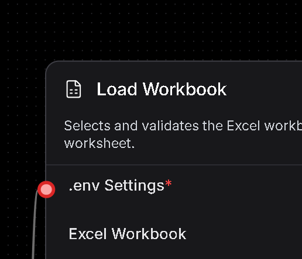

**Plaats en gegevensstroom:** ontvangt `.env Settings` en optioneel een via `My Files` gekozen Excel-bestand. De output bevat alleen gevalideerde metadata: workbookpad, werkblad, SQLite-pad en beschikbare werkbladen.

**Functionele uitleg:** deze component leest de inhoud nog niet naar de database. Hij bepaalt eerst ondubbelzinnig welk bestand en werkblad gebruikt worden. Een handmatig gekozen bestand heeft voorrang op een pad uit `.env`. Zonder expliciet werkblad wordt het eerste werkblad gekozen.

**Verbatim onderhoudsbron: `components/excel_open_answers/load_workbook.py`**

```python
from pathlib import Path

from langflow.custom import Component
from langflow.io import DataInput, FileInput, Output, StrInput
from langflow.schema import Data


class LoadWorkbookComponent(Component):
  display_name = "Load Workbook"
  description = "Selects and validates the Excel workbook and worksheet."
  icon = "FileSpreadsheet"
  name = "LoadWorkbook"

  inputs = [
    DataInput(name="env_settings", display_name=".env Settings", required=True),
    FileInput(
      name="workbook_file",
      display_name="Excel Workbook",
      fileTypes=["xlsx", "xls"],
      required=False,
    ),
    StrInput(
      name="workbook_path",
      display_name="Workbook Path Override",
      value="",
      required=False,
      advanced=True,
    ),
    StrInput(name="sheet_name", display_name="Worksheet", value="", advanced=True),
    StrInput(name="database_path", display_name="SQLite Path", value="", advanced=True),
  ]
  outputs = [Output(name="workbook", display_name="Workbook", method="load_workbook")]

  def load_workbook(self) -> Data:
    import pandas as pd

    settings = self.env_settings.data
    workbook_value = str(self.workbook_file or self.workbook_path or settings.get("DATASET_PATH", "")).strip()
    if not workbook_value:
      raise ValueError("Upload an Excel workbook or set DATASET_PATH in the selected .env file.")
    workbook = Path(workbook_value).expanduser().resolve()
    if not workbook.exists():
      raise FileNotFoundError(f"Workbook not found: {workbook}")
    sheets = pd.ExcelFile(workbook).sheet_names
    selected_sheet = self.sheet_name.strip() or sheets[0]
    if selected_sheet not in sheets:
      raise ValueError(f"Worksheet '{selected_sheet}' not found. Available: {sheets}")
    self.status = f"{workbook.name} / {selected_sheet}"
    return Data(data={
      "workbook_path": str(workbook),
      "sheet_name": selected_sheet,
      "database_path": self.database_path or settings.get("EXCEL_OPEN_ANSWERS_DB_PATH", ""),
      "available_sheets": sheets,
    })
```

### A.3 Prepare SQLite Survey

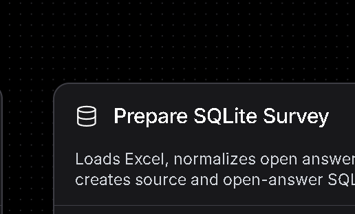

**Plaats en gegevensstroom:** ontvangt de gevalideerde workbookmetadata en levert een `Survey Dataset` met databasepad, schema, aantallen en cachestatus.

**Functionele uitleg:** dit is de eerste zware datastap. `ensure_sqlite_survey` leest Excel, normaliseert kolommen en waarden en materialiseert brondata plus open antwoorden in SQLite. Een fingerprint van het workbook bepaalt of bestaande tabellen veilig kunnen worden hergebruikt. Een OS-lock voorkomt dat twee runs tegelijk dezelfde database opbouwen.

**Verbatim onderhoudsbron: `components/excel_open_answers/prepare_sqlite.py`**

```python
from pathlib import Path
import sys

from langflow.custom import Component
from langflow.io import DataInput, Output
from langflow.schema import Data

PROJECT_ROOT = Path(r"D:\OneDrive - Hogeschool Rotterdam\AA_CODE\RAG_AZURE_LLAMAINdex\EXCEL_LANGFLOW_OPENANSWER_INTERROGATOR")
if str(PROJECT_ROOT) not in sys.path:
  sys.path.insert(0, str(PROJECT_ROOT))


class PrepareSQLiteComponent(Component):
  display_name = "Prepare SQLite Survey"
  description = "Loads Excel, normalizes open answers, and creates source and open-answer SQLite tables."
  icon = "Database"
  name = "PrepareSQLiteSurvey"

  inputs = [DataInput(name="workbook", display_name="Workbook", required=True)]
  outputs = [Output(name="dataset", display_name="Survey Dataset", method="prepare_sqlite")]

  def prepare_sqlite(self) -> Data:
    from survey_core import ensure_sqlite_survey

    config = self.workbook.data
    dataset = ensure_sqlite_survey(
      config["workbook_path"], config.get("sheet_name", ""), config.get("database_path", "")
    )
    self.status = f"{dataset['cache_status'].title()} {dataset['open_answer_count']} open answers"
    return Data(data=dataset)
```

**Standalone-transformatie:** de builder verwijdert `PROJECT_ROOT`, `sys.path` en de import van `survey_core`. Vervolgens wordt de letterlijke kerncode vóór deze klasse geplaatst. De methodeaanroep `ensure_sqlite_survey(...)` blijft inhoudelijk gelijk.

### A.4 Configure spaCy NER

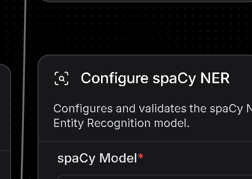

**Plaats en gegevensstroom:** ontvangt de naam van een spaCy-model en levert een kleine `NER Configuration` aan `Build NER Tables`.

**Functionele uitleg:** deze component valideert vooraf dat het gekozen taalmodel werkelijk geïnstalleerd en laadbaar is. Daardoor ontstaat een vroege, lokale fout in plaats van een onduidelijke fout tijdens de lange NER-verwerking. In deze flow is `nl_core_news_sm` de standaard.

**Verbatim onderhoudsbron: `components/excel_open_answers/configure_ner.py`**

```python
from langflow.custom import Component
from langflow.io import Output, StrInput
from langflow.schema import Data


class ConfigureNERComponent(Component):
  display_name = "Configure spaCy NER"
  description = "Configures and validates the spaCy Named Entity Recognition model."
  icon = "ScanSearch"
  name = "ConfigureNER"

  inputs = [StrInput(name="spacy_model", display_name="spaCy Model", value="nl_core_news_sm", required=True)]
  outputs = [Output(name="ner_config", display_name="NER Configuration", method="configure_ner")]

  def configure_ner(self) -> Data:
    import spacy

    spacy.load(self.spacy_model)
    self.status = self.spacy_model
    return Data(data={"spacy_model": self.spacy_model})
```

### A.5 Build NER Tables

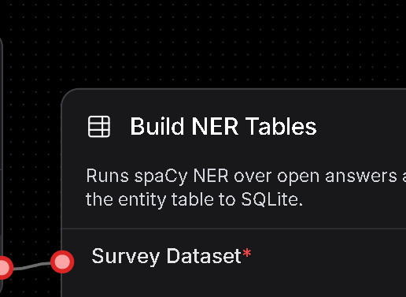

**Plaats en gegevensstroom:** combineert `Survey Dataset` en `NER Configuration` en levert een verrijkt datasetcontract aan `Load Query Helpers`.

**Functionele uitleg:** `ensure_ner_tables` laat spaCy over de open antwoorden lopen en bewaart gevonden personen, organisaties, locaties en overige entiteiten in SQLite. De cachemetadata bevat ook de modelnaam. Bij hetzelfde workbook en model wordt de bestaande entiteitentabel hergebruikt; bij een ander model wordt alleen deze afgeleide laag opnieuw gemaakt.

**Verbatim onderhoudsbron: `components/excel_open_answers/build_ner_tables.py`**

```python
from pathlib import Path
import sys

from langflow.custom import Component
from langflow.io import DataInput, Output
from langflow.schema import Data

PROJECT_ROOT = Path(r"D:\OneDrive - Hogeschool Rotterdam\AA_CODE\RAG_AZURE_LLAMAINdex\EXCEL_LANGFLOW_OPENANSWER_INTERROGATOR")
if str(PROJECT_ROOT) not in sys.path:
  sys.path.insert(0, str(PROJECT_ROOT))


class BuildNERTablesComponent(Component):
  display_name = "Build NER Tables"
  description = "Runs spaCy NER over open answers and writes the entity table to SQLite."
  icon = "TableProperties"
  name = "BuildNERTables"

  inputs = [
    DataInput(name="dataset", display_name="Survey Dataset", required=True),
    DataInput(name="ner_config", display_name="NER Configuration", required=True),
  ]
  outputs = [Output(name="enriched_dataset", display_name="NER Dataset", method="build_tables")]

  def build_tables(self) -> Data:
    from survey_core import ensure_ner_tables

    dataset = ensure_ner_tables(self.dataset.data, self.ner_config.data["spacy_model"])
    self.status = f"{dataset['cache_status'].title()} {dataset['spacy_entity_count']} entities"
    return Data(data=dataset)
```

**Standalone-transformatie:** net als bij A.3 verwijdert de builder de lokale pad- en pakketimport en plaatst hij de kernimplementatie vóór de componentklasse.

### A.6 Configure N-gram Analyzer

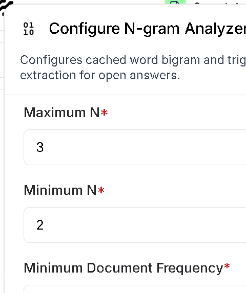

**Plaats en gegevensstroom:** levert de gevalideerde n-graminstellingen aan `Build N-gram Tables`.

**Functionele uitleg:** deze component begrenst de n-gramlengte tot 1-5, vereist een positieve minimale documentfrequentie en configureert standaard bigrammen en trigrammen op basis van lemma's zonder stopwoorden.

Belangrijkste standaardwaarden:

```text
Minimum N: 2
Maximum N: 3
Minimum Document Frequency: 3
Use Lemmas: true
Remove Stopwords: true
```

### A.7 Build N-gram Tables

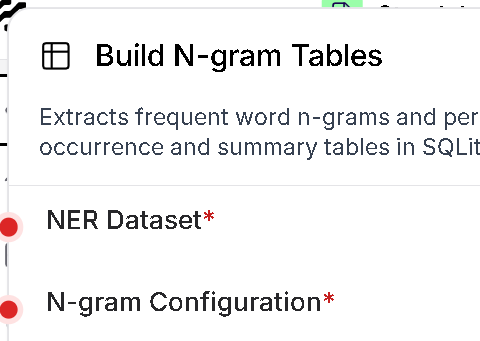

**Plaats en gegevensstroom:** combineert het verrijkte NER-datasetcontract met de n-gramconfiguratie en levert het volledige `N-gram Dataset` aan `Load Query Helpers`.

**Functionele uitleg:** `ensure_ngram_tables` controleert de persistente cache en roept zo nodig `build_ngram_tables` aan. Deze stap filtert waarschijnlijk Engelstalige antwoorden, lemmatiseert Nederlandse tekst, materialiseert occurrence- en summary-tabellen en bewaart de unieke Nederlandse woordtelling in metadata. De componentstatus toont of de cache is hergebruikt of herbouwd en hoeveel frequente n-grammen zijn opgeslagen.

**Standalone-transformatie:** de builder verwijdert de lokale pad- en pakketimport en plaatst de kernimplementatie vóór de componentklasse, zodat V4 ook zonder lokaal geïnstalleerd `survey_core` werkt.

### A.8 Configure Azure + WILLMA LLM

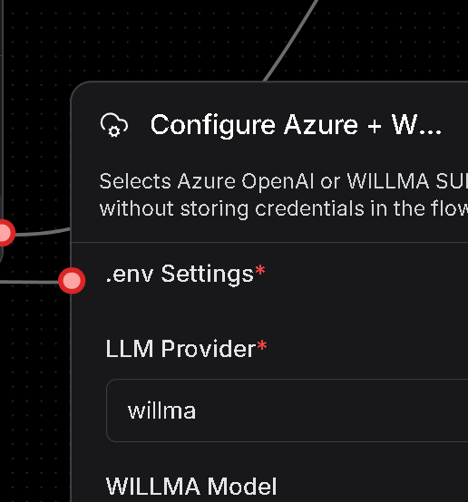

**Plaats en gegevensstroom:** ontvangt `.env Settings`, providerkeuze en eventuele UI-overrides. De output is één uniform `LLM Configuration`-object voor `Load Query Helpers`.

**Functionele uitleg:** de rest van de pipeline hoeft niet te weten waar instellingen vandaan komen. Voor Azure worden endpoint, sleutel, API-versie en deployment samengebracht; voor WILLMA endpoint, sleutel en model. Alleen de actieve provider wordt gecontroleerd. Een expliciete UI-waarde heeft voorrang op `.env`.

**Verbatim onderhoudsbron: `components/excel_open_answers/configure_azure_llm.py`**

```python
from langflow.custom import Component
from langflow.io import DataInput, DropdownInput, Output, SecretStrInput, StrInput
from langflow.schema import Data


class ConfigureAzureLLMComponent(Component):
  display_name = "Configure Azure + WILLMA LLM"
  description = "Selects Azure OpenAI or WILLMA SURF AI-HUB without storing credentials in the flow."
  icon = "CloudCog"
  name = "ConfigureAzureLLM"

  inputs = [
    DataInput(name="env_settings", display_name=".env Settings", required=True),
    DropdownInput(
      name="provider",
      display_name="LLM Provider",
      options=["azure", "willma"],
      value="azure",
      required=True,
    ),
    StrInput(name="azure_endpoint", display_name="Azure OpenAI Endpoint", value="", advanced=True),
    SecretStrInput(name="azure_api_key", display_name="Azure OpenAI API Key", value="", advanced=True),
    StrInput(name="azure_api_version", display_name="API Version Override", value="", advanced=True),
    StrInput(name="azure_deployment", display_name="Deployment Override", value="", advanced=True),
    StrInput(
      name="willma_base_url",
      display_name="WILLMA Base URL",
      value="",
      advanced=True,
    ),
    SecretStrInput(name="willma_api_key", display_name="WILLMA API Key", value="", advanced=True),
    DropdownInput(
      name="willma_model",
      display_name="WILLMA Model",
      options=[
        "Qwen/Qwen2.5-VL-32B-Instruct-AWQ",
        "Qwen/Qwen2.5-72B-Instruct-AWQ",
        "Qwen/Qwen2.5-32B-Instruct-AWQ",
        "Qwen/Qwen2.5-14B-Instruct-AWQ",
      ],
      value="",
      required=False,
    ),
  ]
  outputs = [Output(name="llm_config", display_name="LLM Configuration", method="configure_llm")]

  def configure_llm(self) -> Data:
    settings = self.env_settings.data
    azure_key = self.azure_api_key.get_secret_value() if hasattr(self.azure_api_key, "get_secret_value") else str(self.azure_api_key or "")
    willma_key = self.willma_api_key.get_secret_value() if hasattr(self.willma_api_key, "get_secret_value") else str(self.willma_api_key or "")
    provider = str(self.provider or "azure").lower()
    if provider == "azure":
      config = {
        "provider": provider,
        "endpoint": self.azure_endpoint or settings.get("AZURE_OPENAI_ENDPOINT", ""),
        "api_key": azure_key or settings.get("AZURE_OPENAI_API_KEY", ""),
        "api_version": self.azure_api_version or settings.get("AZURE_OPENAI_API_VERSION", "2024-12-01-preview"),
        "model": self.azure_deployment or settings.get("AZURE_OPENAI_DEPLOYMENT", settings.get("AZURE_OPENAI_MODEL", "")),
      }
    else:
      config = {
        "provider": provider,
        "endpoint": self.willma_base_url or settings.get("WILLMA_BASE_URL", "https://api.willma.surf.nl/v0"),
        "api_key": willma_key or settings.get("WILLMA_API_KEY", ""),
        "api_version": "",
        "model": self.willma_model or settings.get("WILLMA_MODEL", "Qwen/Qwen2.5-VL-32B-Instruct-AWQ"),
      }
    missing = [name for name in ("endpoint", "api_key", "model") if not config[name]]
    if missing:
      raise ValueError(f"Missing {provider} settings: {', '.join(missing)}")
    self.status = f"{provider}: {config['model']}"
    return Data(data=config)
```

### A.9 Chat Input

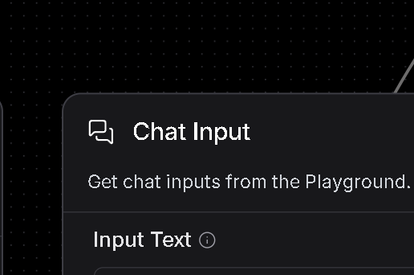

**Plaats en gegevensstroom:** ontvangt tekst uit de Langflow Playground en levert een Langflow `Message` aan de `question`-input van `Load Query Helpers`.

**Functionele uitleg:** dit is de gebruikersinterfacegrens. De component bewaart geen analysekennis; hij verpakt tekst met de berichtmetadata die Langflow nodig heeft. Daardoor blijft de analysekern ook buiten de Playground aanroepbaar.

**Verbatim integratiecode uit `build_flow_json.py`:**

```python
from langflow.components.input_output import ChatInput, ChatOutput

chat_input = make_node(ChatInput(), "ChatInput-excel-open-answers", 1110, 500)
```

De verbinding wordt letterlijk als volgt gespecificeerd:

```python
(chat_input, "message", query_helpers, "question"),
```

### A.10 Load Query Helpers

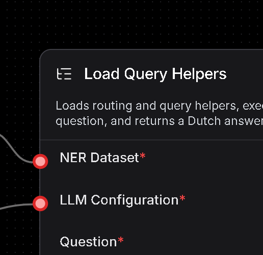

**Plaats en gegevensstroom:** ontvangt de gebruikersvraag, het verrijkte datasetcontract en de LLM-configuratie. De primaire output is een antwoordbericht; de tweede output bevat volledige diagnostiek.

**Functionele uitleg:** dit is de orkestrator van de vraagfase. `_run()` zet Langflow-objecten om naar gewone Pythonwaarden en roept `pipeline.answer_question` aan. Die kernfunctie kiest een vaste route of modelgestuurde SQL, valideert en executeert de query, begrenst resultaten en verzorgt de gecontroleerde Nederlandse uitvoer. `top_n=15` geldt voor gewone vragen; volledige-lijstintenties worden in de kern apart behandeld.

**Verbatim onderhoudsbron: `components/excel_open_answers/load_query_helpers.py`**

```python
from pathlib import Path
import importlib
import sys

from langflow.custom import Component
from langflow.io import BoolInput, DataInput, IntInput, MessageInput, Output
from langflow.schema import Data, Message

PROJECT_ROOT = Path(r"D:\OneDrive - Hogeschool Rotterdam\AA_CODE\RAG_AZURE_LLAMAINdex\EXCEL_LANGFLOW_OPENANSWER_INTERROGATOR")
if str(PROJECT_ROOT) not in sys.path:
  sys.path.insert(0, str(PROJECT_ROOT))


class LoadQueryHelpersComponent(Component):
  display_name = "Load Query Helpers"
  description = "Loads routing and query helpers, executes the question, and returns a Dutch answer."
  icon = "ListTree"
  name = "LoadQueryHelpers"

  inputs = [
    MessageInput(name="question", display_name="Question", required=True),
    DataInput(name="dataset", display_name="NER Dataset", required=True),
    DataInput(name="llm_config", display_name="LLM Configuration", required=True),
    BoolInput(name="include_summary", display_name="Use Model Summary", value=True, advanced=True),
    IntInput(name="top_n", display_name="Maximum Result Rows", value=15, advanced=True),
  ]
  outputs = [
    Output(name="answer", display_name="Answer", method="build_answer"),
    Output(name="diagnostics", display_name="Diagnostics", method="build_diagnostics"),
  ]

  def _run(self) -> dict:
    from survey_core import pipeline

    pipeline = importlib.reload(pipeline)

    dataset = self.dataset.data
    llm = self.llm_config.data
    question_text = self.question.text if hasattr(self.question, "text") else str(self.question)
    return pipeline.answer_question(
      question=question_text,
      workbook_path=dataset["workbook_path"],
      sheet_name=dataset["sheet_name"],
      database_path=dataset["database_path"],
      spacy_model=dataset["spacy_model"],
      llm_provider=llm["provider"],
      azure_endpoint=llm["endpoint"] if llm["provider"] == "azure" else "",
      azure_api_key=llm["api_key"] if llm["provider"] == "azure" else "",
      azure_api_version=llm["api_version"] if llm["provider"] == "azure" else "",
      azure_deployment=llm["model"] if llm["provider"] == "azure" else "",
      willma_base_url=llm["endpoint"] if llm["provider"] == "willma" else "",
      willma_api_key=llm["api_key"] if llm["provider"] == "willma" else "",
      willma_model=llm["model"] if llm["provider"] == "willma" else "",
      include_summary=self.include_summary,
      top_n=self.top_n,
    )

  def build_answer(self) -> Message:
    result = self._run()
    self.status = result["route"]
    return Message(text=result["final_answer"], sender="Machine", sender_name="Excel Survey")

  def build_diagnostics(self) -> Data:
    result = self._run()
    self.status = result["route"]
    return Data(data=result)
```

**Standalone-transformatie:** de builder verwijdert de lokale imports en vervangt `pipeline.answer_question(` door de rechtstreeks ingebedde functie `answer_question(`. De complete routing-, SQL-, cache- en antwoordlogica staat dan vóór deze klasse in dezelfde componentcode.

### A.11 Chat Output

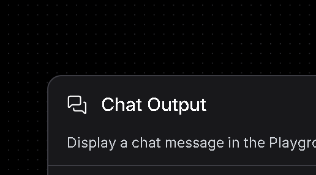

**Plaats en gegevensstroom:** ontvangt `Answer` van `Load Query Helpers` en toont het bericht in de Playground.

**Functionele uitleg:** dit is de presentatiegrens van de flow. De component verandert de inhoud niet en voert geen analyse uit. Koppen, tabellen, lijsten en fallbackmeldingen zijn dus al door de voorgaande component samengesteld.

**Verbatim integratiecode uit `build_flow_json.py`:**

```python
from langflow.components.input_output import ChatInput, ChatOutput

chat_output = make_node(ChatOutput(), "ChatOutput-excel-open-answers", 1880, 220)
```

De verbinding wordt letterlijk als volgt gespecificeerd:

```python
(query_helpers, "answer", chat_output, "input_value"),
```

### A.12 Samenvatting van de end-to-end gegevensstroom

1. `Load .env Configuration` leest uitsluitend toegestane runtime-instellingen.
2. `Load Workbook` kiest en valideert workbook en werkblad.
3. `Prepare SQLite Survey` normaliseert en materialiseert de enquêtegegevens met cachecontrole.
4. `Configure spaCy NER` valideert het gekozen taalmodel.
5. `Build NER Tables` verrijkt open antwoorden met persistente entiteiten.
6. `Configure N-gram Analyzer` valideert de n-graminstellingen.
7. `Build N-gram Tables` filtert de brontaal en materialiseert n-grammen en de unieke woordtelling.
8. `Configure Azure + WILLMA LLM` maakt één provider-onafhankelijk modelcontract.
9. `Chat Input` verpakt de gebruikersvraag als Langflow-bericht.
10. `Load Query Helpers` routeert, analyseert, valideert en formuleert het antwoord.
11. `Chat Output` toont het reeds samengestelde antwoord.

Voor reproduceerbaarheid geldt: de Pythonblokken hierboven tonen de oorspronkelijke componentbasis uit V02. De V03-uitbreidingen voor n-grammen, taalfiltering, caching en unieke woorden staan in `survey_core/normalization.py`, `survey_core/pipeline.py` en de twee n-gramcomponenten, en zijn ingebed in `standaloneAzAIHubExcelOpenAnsInterro-LangV1.11.4V4.json`. Die V4-export is de definitieve standalone runtimewaarheid voor deze documentversie.

## Appendix B: What needs to be installed

This appendix provides a standalone installation checklist for running `standaloneAzAIHubExcelOpenAnsInterro-LangV1.11.4V4.json`. Two supported setups are described: a native Windows 11 environment and Docker inside an Ubuntu 24.04 virtual machine.

### B.1 Common requirements

Both setups require:

- Langflow 1.11.4;
- Python 3.11;
- `pandas==2.3.3`;
- `openpyxl==3.1.5`;
- `SQLAlchemy==2.0.52`;
- `spacy==3.8.15`;
- the Dutch spaCy model `nl_core_news_sm==3.8.0`;
- `openai==2.54.0`;
- `python-dotenv==1.2.2`;
- an Excel workbook containing the survey data;
- a writable directory for the SQLite database, cache metadata and lock files;
- credentials for either Azure OpenAI or WILLMA SURF AI-HUB, stored in `.env` or Langflow's secret storage.

SQLite is included with Python and does not require a separate database server. The standalone flow does not require the local `survey_core` package because its runtime code is embedded in the exported JSON.

### B.2 Windows 11 installation

Install Miniconda or Anaconda and run the following commands from the project directory:

```powershell
conda create --name langflow-1.11.4 python=3.11 -y
conda activate langflow-1.11.4
python -m pip install --upgrade pip
python -m pip install "langflow==1.11.4"
python -m pip install --requirement requirements-langflow-components.txt
python -c "import langflow, pandas, openpyxl, sqlalchemy, spacy, openai, dotenv; spacy.load('nl_core_news_sm'); print('Runtime ready')"
python -m langflow run --host 127.0.0.1 --port 7861
```

Register the environment as a Jupyter or VS Code kernel only when notebook execution is also required:

```powershell
python -m pip install ipykernel
python -m ipykernel install --user --name langflow-1.11.4 --display-name "Python (Langflow 1.11.4)"
```

Open `http://127.0.0.1:7861`, import the V4 JSON, select the `.env` file and select the workbook through `My Files`.

### B.3 Docker in an Ubuntu 24.04 VM

Ubuntu 24.04 LTS is the intended version; Ubuntu 24.03 is not a regular Ubuntu release. Install Docker Engine and the Docker Compose plugin in the VM. Use the verified `langflowai/langflow:1.11.4` image as the base for a custom image containing the component dependencies.

`Dockerfile`:

```dockerfile
FROM langflowai/langflow:1.11.4

USER root
COPY requirements-langflow-components.txt /tmp/requirements-langflow-components.txt
RUN python -m pip install --no-cache-dir --requirement /tmp/requirements-langflow-components.txt
USER 1000
```

`compose.yaml`:

```yaml
services:
  langflow:
    build: .
    ports:
      - "7861:7860"
    volumes:
      - langflow-data:/app/langflow
      - ./data:/workspace/data
      - ./.env:/workspace/.env:ro
      - ./standaloneAzAIHubExcelOpenAnsInterro-LangV1.11.4V4.json:/workspace/flow.json:ro
    environment:
      LANGFLOW_CONFIG_DIR: /app/langflow
    restart: unless-stopped

volumes:
  langflow-data:
```

Build and start Langflow:

```bash
docker compose build
docker compose up -d
docker compose logs -f langflow
```

Open `http://<VM-IP>:7861`, import `/workspace/flow.json` and use container paths such as `/workspace/.env`, `/workspace/data/input.xlsx` and `/workspace/data/excel_open_answers.sqlite`. Restrict TCP port 7861 to trusted management networks.

### B.4 Post-installation verification

After importing the flow:

1. Confirm that all eleven components and eleven connections are present.
2. Confirm that `nl_core_news_sm` loads without an error.
3. Confirm that the selected cache directory is writable.
4. Run one n-gram prompt and verify that the n-gram tables are built or reused.
5. Run the unique Dutch word-count prompt.
6. Run one model-assisted SQL prompt using the configured provider.
7. Confirm that no API key is stored in the exported flow JSON or committed to version control.
