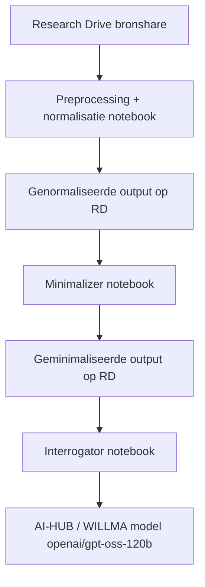

# NSE Research Drive Workflow met AI-HUB en dataminimalisatie

> Notebook-gebaseerde workflow voor het **inlezen, preprocessen, normaliseren, minimaliseren en bevragen** van NSE-data, met **Research Drive (`RD`) als bron- en doellocatie** en **SURF AI-HUB / WILLMA** voor modelinteractie.

Platform: Windows + VS Code + Jupyter Notebook  
Projectmap: `D:\OneDrive - Hogeschool Rotterdam\SURF_PILOT\AI_HUB_PILOT\NSE`  
Kernmodellen / services: `rclone`, `RD:`, `https://willma.surf.nl/api/v0`, `openai/gpt-oss-120b`

---

## Inhoudsopgave

| Nr. | Sectie |
| --- | --- |
| 1 | [Wat dit project doet](#wat-dit-project-doet) |
| 2 | [Projectstructuur](#projectstructuur) |
| 3 | [Architectuuroverzicht](#architectuuroverzicht) |
| 4 | [Randvoorwaarden](#randvoorwaarden) |
| 5 | [Quick Start](#quick-start) |
| 6 | [Benodigde configuratie in `.nse-env`](#benodigde-configuratie-in-nse-env) |
| 7 | [Stap 1 — Preprocessing + normalisatie notebook](#stap-1--preprocessing--normalisatie-notebook) |
| 8 | [Stap 2 — Minimalizer notebook](#stap-2--minimalizer-notebook) |
| 9 | [Stap 3 — Interrogator notebook](#stap-3--interrogator-notebook) |
| 10 | [Dataflow en RD/rclone-model](#dataflow-en-rdrclone-model) |
| 11 | [Stap-voor-stap code-uitleg per notebook](#stap-voor-stap-code-uitleg-per-notebook) |
| 12 | [Operationele werkwijze](#operationele-werkwijze) |
| 13 | [Outputbestanden](#outputbestanden) |
| 14 | [Validatiestatus](#validatiestatus) |
| 15 | [Security notes](#security-notes) |
| 16 | [Troubleshooting](#troubleshooting) |
| 17 | [License](#license) |

---

## Wat dit project doet

Dit project bevat drie Jupyter-notebooks die samen één gecontroleerde dataverwerkingsketen vormen:

| Onderdeel | Beschrijving |
| --- | --- |
| **Preprocessing + normalisatie** | Leest bronbestanden vanaf een SURF Research Drive-share via `rclone`, zet deze om naar analyseklaar tabulair formaat en schrijft de genormaliseerde resultaten terug naar `RD_OUTPUT_PATH` |
| **Minimalisatie** | Leest een genormaliseerde CSV vanaf Research Drive, verwijdert of reduceert privacygevoelige kenmerken en schrijft een geminimaliseerde dataset plus auditbestanden terug naar Research Drive |
| **Interrogatie / vraag-antwoord** | Leest de geminimaliseerde dataset vanaf Research Drive, bouwt een compacte datasetcontext op en bevraagt via AI-HUB / WILLMA het model `openai/gpt-oss-120b` |

Het project is bedoeld voor een workflow waarin **herkomst, opslaglocatie, dataminimalisatie en gecontroleerde AI-analyse** expliciet aantoonbaar blijven.

---

## Projectstructuur

Belangrijkste bestanden in deze map:

| Bestand / map | Rol |
| --- | --- |
| `NSE-AI-HUB_EXCEL_DATA_PREPROSESSING+NORMALIZATION_V1.ipynb` | Preprocessing en normalisatie van brondata |
| `NSE-AIHUB-MINIMALIZER_V01.ipynb` | Dataminimalisatie en suppressie van kleine cohorten |
| `NSE_INTERROGATOR_V01.ipynb` | Vraag-antwoordanalyse op de geminimaliseerde dataset |
| `.nse-env` | Secrets en runtimeconfiguratie |
| `environment_nse-2026-env.yml` | Conda environmentdefinitie |
| `rd_cache/` of `NSE_OUTPUTS/rd_cache/` | Tijdelijke runtime-cache tijdens verwerking |

Functionele volgorde:

```text
Research Drive share / bronbestanden
        ↓
NSE-AI-HUB_EXCEL_DATA_PREPROSESSING+NORMALIZATION_V1.ipynb
        ↓
RD: ... /NSE_OUTPUTS/run_<timestamp>/...normalized.csv
        ↓
NSE-AIHUB-MINIMALIZER_V01.ipynb
        ↓
RD: ... /NSE_OUTPUTS/MINIMIZED/nse_minimized_<timestamp>.csv
        ↓
NSE_INTERROGATOR_V01.ipynb
        ↓
AI-HUB / WILLMA chat-analyse op geminimaliseerde data
```

---

## Architectuuroverzicht



### Kernprincipe

De workflow scheidt logisch drie niveaus:

| Niveau | Betekenis |
| --- | --- |
| **brondata** | Ruwe aangeleverde onderzoeksdata uit de share of RD-bron |
| **genormaliseerde data** | Technisch opgeschoonde en gestandaardiseerde analysetabellen |
| **geminimaliseerde analysetabel** | Privacyreducerende dataset voor verdere analyse en AI-gebruik |

Daarmee wordt de analyse stap voor stap veiliger en beter reproduceerbaar.

---

## Randvoorwaarden

Voor correct gebruik moeten de volgende voorwaarden gelden:

| Voorwaarde | Toelichting |
| --- | --- |
| Windows-werkstation met VS Code en Jupyter-ondersteuning | Nodig voor notebookuitvoering en inspectie |
| `rclone` beschikbaar op `PATH` | Vereist voor alle RD lees-/schrijfoperaties |
| Toegang tot een werkende `RD:` remote in `rclone` | Vereist voor output naar Research Drive |
| Een bruikbaar conda-environment, bij voorkeur `nse-2026-env` | Zorgt voor reproduceerbare Python-afhankelijkheden |
| Een geldig `.nse-env` bestand in de projectmap | Bevat secrets en padconfiguratie |
| Toegestane toegang tot SURF AI-HUB / WILLMA | Nodig voor modelcalls in de interrogator |
| Schrijfrechten op de beoogde `RD_OUTPUT_PATH` | Vereist om runs en eindresultaten op RD op te slaan |

---

## Quick Start

Onderstaande stappen zijn bedoeld voor een snelle, reproduceerbare start op een Windows-machine met PowerShell.

### 1. Ga naar de projectmap

```powershell
cd "D:\OneDrive - Hogeschool Rotterdam\SURF_PILOT\AI_HUB_PILOT\NSE"
```

### 2. Maak het conda-environment aan

```powershell
conda env create -f ".\environment_nse-2026-env.yml"
```

Als het environment al bestaat en de YAML is aangepast:

```powershell
conda env update -f ".\environment_nse-2026-env.yml" --prune
```

### 3. Activeer het environment

```powershell
conda activate nse-2026-env
```

### 4. Registreer de Jupyter-kernel in VS Code

```powershell
python -m ipykernel install --user --name nse-2026-env --display-name "Python (nse-2026-env)"
```

### 5. Controleer of `rclone` beschikbaar is

```powershell
rclone version
rclone listremotes
```

Verwacht:

| Controlepunt | Verwachte uitkomst |
| --- | --- |
| `rclone version` | Geldige `rclone` installatie |
| `rclone listremotes` | Een beschikbare `RD:` remote |

### 6. Controleer of `.nse-env` aanwezig is

```powershell
Get-ChildItem .nse-env
```

### 7. Start VS Code in de projectmap

```powershell
code .
```

### 8. Voer de notebooks in deze volgorde uit

| Volgorde | Notebook | Doel |
| --- | --- | --- |
| 1 | `NSE-AI-HUB_EXCEL_DATA_PREPROSESSING+NORMALIZATION_V1.ipynb` | Brondata inlezen, normaliseren en terugschrijven naar RD |
| 2 | `NSE-AIHUB-MINIMALIZER_V01.ipynb` | Genormaliseerde data minimaliseren |
| 3 | `NSE_INTERROGATOR_V01.ipynb` | Geminimaliseerde data analyseren met AI-HUB |

### 9. Exacte uitvoerlogica per notebook

#### A. Preprocessing + normalisatie

Open in VS Code de notebook `NSE-AI-HUB_EXCEL_DATA_PREPROSESSING+NORMALIZATION_V1.ipynb`, kies kernel `Python (nse-2026-env)` en voer alle cellen van boven naar beneden uit.

Controleer na afloop in de notebookoutput dat onder meer zichtbaar is:

| Controle | Verwacht resultaat |
| --- | --- |
| Configuratie geladen | `.nse-env` is succesvol ingelezen |
| Bronvalidatie | Research Drive bron is bereikbaar |
| Doelvalidatie | Outputmap op RD is aangemaakt of bevestigd |
| Runmap | `run_<timestamp>` outputmap is aangemaakt |

Indien gewenst kun je vanuit PowerShell alvast controleren of een nieuwe runmap is verschenen:

```powershell
rclone lsf "RD:HR-DATALAB-HEALTHCARE (Projectfolder)/NSE_OUTPUTS/"
```

#### B. Minimalisatie

Open `NSE-AIHUB-MINIMALIZER_V01.ipynb` en controleer eerst in de eerste codecel of deze variabele nog naar de juiste preprocessing-output verwijst:

```python
INPUT_FILENAME = "NSE2026_open_antwoorden_22OJ_zonder_ww.xlsx.normalized.csv"
```

Voer daarna alle cellen van boven naar beneden uit.

Controle op output in RD:

```powershell
rclone lsf "RD:HR-DATALAB-HEALTHCARE (Projectfolder)/NSE_OUTPUTS/MINIMIZED"
```

Je verwacht daar bestanden zoals:

| Bestandstype | Betekenis |
| --- | --- |
| `nse_minimized_<timestamp>.csv` | Hoofdoutput van de geminimaliseerde dataset |
| `nse_minimization_rules_<timestamp>.json` | Auditspoor van toegepaste minimalisatieregels |
| `nse_suppression_summary_<timestamp>.csv` | Overzicht van suppressie op cohortniveau |
| `nse_special_category_binary_<timestamp>.csv` | Binaire afleiding van gevoelige categorievelden |

#### C. Interrogatie

Open `NSE_INTERROGATOR_V01.ipynb` en controleer in de eerste codecel of `INPUT_FILENAME` overeenkomt met het gewenste geminimaliseerde bestand.

Voorbeeld:

```python
INPUT_FILENAME = "nse_minimized_20260607_154345.csv"
```

Voer vervolgens alle cellen uit.

De vraag die naar AI-HUB wordt gestuurd staat in:

```python
USER_QUESTION = "Geef een korte samenvatting van de dataset, benoem opvallende missende waarden en noem welke kolommen waarschijnlijk het meest geschikt zijn voor cohortanalyse."
```

Pas alleen deze variabele aan voor nieuwe analyses, en voer daarna de laatste twee vraag/antwoord-cellen opnieuw uit.

### 10. Snelle eindcontrole

Gebruik deze PowerShell-commando’s voor een snelle operationele check:

```powershell
cd "D:\OneDrive - Hogeschool Rotterdam\SURF_PILOT\AI_HUB_PILOT\NSE"
conda activate nse-2026-env
rclone version
rclone listremotes
rclone lsf "RD:HR-DATALAB-HEALTHCARE (Projectfolder)/NSE_OUTPUTS/"
rclone lsf "RD:HR-DATALAB-HEALTHCARE (Projectfolder)/NSE_OUTPUTS/MINIMIZED"
```

Deze reeks bevestigt niet de notebookinhoud zelf, maar wel dat de basisrandvoorwaarden voor uitvoering aanwezig zijn.

---

## Benodigde configuratie in `.nse-env`

De notebooks verwachten configuratie in `D:\OneDrive - Hogeschool Rotterdam\SURF_PILOT\AI_HUB_PILOT\NSE\.nse-env`.

Vereiste sleutelset:

```env
WILLMA_API_KEY=<api-key>
WILLMA_BASE_URL=https://willma.surf.nl/api/v0
SHARE_LINK=<research-drive-share-link>
SHARE_PASSWORD=<share-password>
RD_OUTPUT_PATH=RD:HR-DATALAB-HEALTHCARE (Projectfolder)/NSE_OUTPUTS/
```

### Betekenis van deze variabelen

| Variabele | Betekenis |
| --- | --- |
| `WILLMA_API_KEY` | Authenticatie voor AI-HUB / WILLMA |
| `WILLMA_BASE_URL` | Basis-URL voor model-API-calls |
| `SHARE_LINK` | Publieke of afgeschermde Research Drive share-link voor broninput |
| `SHARE_PASSWORD` | Wachtwoord voor de share-link |
| `RD_OUTPUT_PATH` | Standaard schrijfdoel op Research Drive |

> Geheimen horen **niet** in notebookcode, markdown of Git-commits thuis.

---

## Stap 1 — Preprocessing + normalisatie notebook

Notebook: `NSE-AI-HUB_EXCEL_DATA_PREPROSESSING+NORMALIZATION_V1.ipynb`

### Doel

Deze notebook leest ruwe bronbestanden via `rclone` vanaf een Research Drive-share, laadt de bestanden in pandas, normaliseert kolomnamen en eenvoudige datatypes, analyseert de datasetstructuur en schrijft alle resultaten terug naar een versieerbare map op Research Drive.

### Wat deze notebook functioneel doet

| Stap | Actie |
| --- | --- |
| 1 | Controleert Python-omgeving |
| 2 | Laadt configuratie uit `.nse-env` |
| 3 | Maakt lokale runtime-cache en outputmappen aan |
| 4 | Bouwt een inline WebDAV remote voor de Research Drive-share |
| 5 | Valideert toegang tot bron en doel |
| 6 | Kopieert ondersteunde bestanden lokaal naar cache |
| 7 | Leest CSV/XLSX/XLSM/XLS/JSON/JSONL in |
| 8 | Normaliseert datasets |
| 9 | Maakt analyse-overzichten |
| 10 | Schrijft outputs lokaal weg |
| 11 | Synchroniseert outputs terug naar `RD_OUTPUT_PATH/run_<timestamp>` |
| 12 | Schrijft logging weg |

---

## Stap 2 — Minimalizer notebook

Notebook: `NSE-AIHUB-MINIMALIZER_V01.ipynb`

### Doel

Deze notebook voert **dataminimalisatie** uit op de genormaliseerde NSE-data. Het doel is het reduceren van identificeerbaarheid vóór verdere analyse of AI-gebruik.

### Wat deze notebook functioneel doet

| Stap | Actie |
| --- | --- |
| 1 | Haalt één genormaliseerd CSV-bestand op van Research Drive |
| 2 | Inspecteert beschikbare kolommen |
| 3 | Definieert regels voor verwijdering en generalisatie |
| 4 | Verwijdert direct identificerende en open-tekstvelden |
| 5 | Reduceert detailniveau van track- of cohortvariabelen |
| 6 | Zet bijzondere categorieën om naar binaire indicatoren |
| 7 | Onderdrukt kleine cohorten met minder dan 10 records |
| 8 | Exporteert resultaten en auditbestanden |
| 9 | Uploadt alle outputs terug naar `RD:.../NSE_OUTPUTS/MINIMIZED` |

### Belangrijk privacyprincipe

De notebook is expliciet opgezet rond het uitgangspunt:

| Principe | Betekenis |
| --- | --- |
| **PREPROCESSED / NORMALIZED data mag de Research Drive niet verlaten** | Bron- en doelopslag blijven logisch binnen RD |
| Tijdelijke lokale cache | Alleen technische runtime-stap voor verwerking |
| Definitieve opslag blijft op Research Drive | Resultaten worden teruggeschreven naar RD |

---

## Stap 3 — Interrogator notebook

Notebook: `NSE_INTERROGATOR_V01.ipynb`

### Doel

Deze notebook bevraagt de **geminimaliseerde** NSE-dataset met behulp van AI-HUB / WILLMA en het model `openai/gpt-oss-120b`.

### Wat deze notebook functioneel doet

| Stap | Actie |
| --- | --- |
| 1 | Laadt padconfiguratie en runtime-cache |
| 2 | Leest AI-HUB secrets uit `.nse-env` |
| 3 | Downloadt de geminimaliseerde CSV via `rclone` |
| 4 | Leest de dataset in pandas |
| 5 | Maakt schema- en missings-overzichten |
| 6 | Controleert beschikbare modellen via `/sequences` |
| 7 | Bouwt een compacte contextsamenvatting van de dataset |
| 8 | Verstuurt een vraag naar `/chat/completions` |
| 9 | Toont antwoord en minimale requestmetadata |

### AI-gebruik in deze notebook

De notebook is zo opgezet dat het model:

| Gedragsregel | Toelichting |
| --- | --- |
| Alleen antwoord geeft op basis van aangeleverde datasetcontext | Geen externe interpretatie buiten de context |
| Expliciet moet zeggen als de context onvoldoende is | Onzekerheid moet zichtbaar blijven |
| Geen extra feiten mag verzinnen buiten de context | Hallucinaties moeten worden beperkt |

---

## Dataflow en RD/rclone-model

### Waarom `rclone` centraal staat

De workflow gebruikt `rclone` om lees- en schrijfoperaties te standaardiseren richting Research Drive.

### Lees-/schrijfmodel

Het model is als volgt:

| Fase | Betekenis |
| --- | --- |
| **input** | Research Drive share of RD-map |
| **staging** | Tijdelijke lokale runtime-cache op het werkstation |
| **output** | Terugschrijven naar een reguliere schrijfbare `RD:`-bestemming |

### Praktische consequentie

De notebooks verwerken lokaal in runtime, maar de **goedgekeurde bron en definitieve bestemming** liggen op Research Drive.

---

## Stap-voor-stap code-uitleg per notebook

### `NSE-AI-HUB_EXCEL_DATA_PREPROSESSING+NORMALIZATION_V1.ipynb`

### Cel 01 — Verify environment

Print:

| Uitvoer | Doel |
| --- | --- |
| Python executable | Controleren welke interpreter actief is |
| Python-versie | Bevestigen dat de juiste runtime gebruikt wordt |
| Huidige werkdirectory | Controleren van de notebookcontext |

Doel: snelle controle dat de juiste kernel actief is.

### Cel 02 — Install missing packages

Bevat een uitgecommentarieerde `%pip install` fallback voor ontbrekende packages. Normaal niet nodig als het conda-environment goed is ingericht.

### Cel 03 — Load secrets from `.nse-env`

Definieert onder meer:

| Variabele | Rol |
| --- | --- |
| `PROJECT_DIR` | Projectbasispad |
| `ENV_FILE` | Locatie van `.nse-env` |
| `LOCAL_CACHE_DIR` | Algemene cachemap |
| `LOCAL_RUNTIME_DIR` | Runtimewerkmap voor preprocessing |
| `LOCAL_OUTPUT_DIR` | Lokale outputmap voor runs |
| `LOG_DIR` | Logmap |

Valideert verplichte variabelen en maakt runtime-mappen aan.

### Cel 04 — Configure Research Drive access

Definieert helperfuncties:

| Functie | Doel |
| --- | --- |
| `extract_share_token(...)` | Haalt share-token uit de link |
| `run_command(...)` | Gestandaardiseerde shell-uitvoering |
| `obscure_password(...)` | Zet share-wachtwoord om voor inline `rclone` gebruik |

Bouwt daarna een inline WebDAV remote voor `rclone` op basis van `SHARE_LINK` en `SHARE_PASSWORD`.

### Cel 05 — Validate Research Drive access

Controleert:

| Controlepunt | Doel |
| --- | --- |
| `rclone version` | Valideren dat `rclone` werkt |
| Bronshare bereikbaar | Bevestigen dat brondata leesbaar is |
| Outputmap op RD kan worden aangemaakt | Bevestigen dat doelpad schrijfbaar is |

### Cel 06 — Download and load input data

Kopieert ondersteunde bestandsformaten naar de lokale cache en probeert deze in pandas te laden. Ondersteunt:

| Extensie | Type |
| --- | --- |
| `.csv` | Tekstgebaseerd tabelbestand |
| `.xlsx` | Excel workbook |
| `.xlsm` | Excel workbook met macro-ondersteuning |
| `.xls` | Legacy Excel workbook |
| `.json` | JSON-structuur |
| `.jsonl` | JSON Lines |

### Cel 07 — Normalize dataset

Normaliseert kolomnamen naar een veiliger en consistenter patroon, zet lege strings om naar `NaN` en probeert objectkolommen waar mogelijk te interpreteren als datum of numeriek.

### Cel 08 — Run analyzer processing

Maakt per dataset onder meer:

| Onderdeel | Betekenis |
| --- | --- |
| row count | Aantal records |
| column count | Aantal kolommen |
| lijst met kolommen | Structuuroverzicht |
| missings per kolom | Kwaliteitscontrole op volledigheid |
| datatype-overzicht | Technisch schema |
| numerieke samenvatting | Beschrijvende statistiek voor numerieke velden |

### Cel 09 — Create output paths

Maakt een `run_<timestamp>` map aan lokaal én op RD.

### Cel 10 — Write results to Research Drive

Schrijft:

| Bestand | Inhoud |
| --- | --- |
| `analysis_index.csv` | Compact overzicht van analyses per bestand |
| `analysis_results.json` | Uitgebreide analyseresultaten |
| `schema_preview.csv` | Schemapreview van de datasets |
| `load_errors.json` | Overzicht van inleesfouten |
| `*.normalized.csv` | Genormaliseerde exports per bestand |

Daarna volgt synchronisatie naar RD via `rclone copy`.

### Cel 11 — Logging and error handling

Schrijft een logbestand naar de outputmap zodat runs later herleidbaar blijven.

---

### `NSE-AIHUB-MINIMALIZER_V01.ipynb`

### Cel 01 — Load input data

Definieert:

| Variabele | Rol |
| --- | --- |
| `RD_INPUT_PATH` | Bronpad op RD |
| `RD_OUTPUT_PATH` | Doelpad op RD |
| `INPUT_FILENAME` | Naam van het te minimaliseren bestand |
| `PROJECT_DIR` | Projectbasispad |
| `RCLONE_EXE` | Aangeroepen `rclone` executable |
| `LOCAL_CACHE_DIR` | Tijdelijke lokale cache |

Bevat helperfuncties:

| Functie | Doel |
| --- | --- |
| `rclone_copyto(...)` | Downloaden van RD naar lokaal |
| `rclone_copy_file_to_remote(...)` | Uploaden van lokaal naar RD |
| `rclone_mkdir(...)` | Aanmaken van een doelmap op RD |

Downloadt één genormaliseerd bronbestand uit RD en leest dit in met pandas.

### Cel 02 — Inspect columns

Zet alle kolomnamen in een DataFrame om de minimale set van privacyregels controleerbaar af te stemmen.

### Cel 03 — Define minimization rules

Definieert meerdere regelsets:

| Regelset | Doel |
| --- | --- |
| `DROP_EXACT_COLUMNS` | Direct identificerende kolommen verwijderen |
| `OPEN_TEXT_PATTERNS` | Vrije tekstvelden detecteren |
| `SPECIAL_CATEGORY_PATTERNS` | Gevoelige categorievelden detecteren |
| `TRACK_COLUMNS` | Opleidings- of trackvelden selecteren |
| `OPEN_TEXT_COLUMNS` | Gevonden open tekstkolommen |
| `SPECIAL_CATEGORY_COLUMNS` | Gevonden gevoelige categorievelden |

Daaruit wordt `rule_summary` opgebouwd.

### Cel 04 — Apply column drops

Verwijdert direct identificerende kolommen en open tekstvelden.

### Cel 05 — Generalize variables

| Actie | Resultaat |
| --- | --- |
| Vereenvoudigt CROHO-/trackwaarden | Minder detail en minder herleidbaarheid |
| Maakt binaire indicatoren voor bijzondere categorieën | Reductie van gevoelige detailinhoud |
| Bouwt een exporttabel met alleen die binaire velden | Aparte veilige afgeleide output |

### Cel 06 — Suppress small cohorts

Past suppressie toe op kleine cohorten met minder dan 10 observaties.

### Cel 07 — Export minimized data

Schrijft onder meer:

| Bestand | Inhoud |
| --- | --- |
| `nse_minimized_<timestamp>.csv` | Geminimaliseerde hoofdoutput |
| `nse_minimization_rules_<timestamp>.json` | Auditbestand met regels |
| `nse_suppression_summary_<timestamp>.csv` | Samenvatting van suppressie |
| `nse_special_category_binary_<timestamp>.csv` | Afgeleide binaire speciale categorieën |

Daarna uploadt de notebook elk bestand naar `RD_OUTPUT_PATH`.

---

### `NSE_INTERROGATOR_V01.ipynb`

### Cel 01 — Import libraries and configure paths

Definieert onder meer:

| Variabele | Rol |
| --- | --- |
| `PROJECT_DIR` | Projectbasispad |
| `ENV_FILE` | Locatie van `.nse-env` |
| `RCLONE_EXE` | Aangeroepen `rclone` executable |
| `RD_INPUT_PATH` | Bronmap met geminimaliseerde bestanden |
| `INPUT_FILENAME` | Te laden geminimaliseerde CSV |
| `LOCAL_CACHE_DIR` | Tijdelijke interrogator-cache |
| `LOCAL_INPUT_FILE` | Lokaal gedownload invoerbestand |

### Cel 02 — Load secrets from `.nse-env`

Valideert:

| Variabele | Doel |
| --- | --- |
| `WILLMA_API_KEY` | Beschikbare authenticatie voor AI-HUB |
| `WILLMA_BASE_URL` | Geldige API-basislocatie |

### Cel 03 — Download minimized CSV

Gebruikt `rclone copyto` om de geminimaliseerde CSV van RD naar de lokale cache te halen.

### Cel 04 — Load and inspect dataset

Laadt de CSV in pandas en maakt:

| Object | Betekenis |
| --- | --- |
| `missing_summary` | Overzicht van ontbrekende waarden |
| `schema_df` | Schemapreview van kolommen en datatypes |

### Cel 05 — Configure AI-HUB access

Maakt de headers voor REST-calls:

| Header | Doel |
| --- | --- |
| `X-API-KEY` | Authenticatie |
| `Content-Type: application/json` | JSON payload-indicatie |

### Cel 06 — List available models

Roept `GET /sequences` aan om modelbeschikbaarheid te controleren.

### Cel 07 — Prepare dataset context

Bouwt promptcontext op uit:

| Onderdeel | Doel |
| --- | --- |
| dataset overview | Samenvatting van structuur en inhoud |
| missing values | Inzicht in datavolledigheid |
| beschrijvende statistiek | Snelle numerieke en categorische indruk |
| eerste 20 rijen als sample | Concrete context voor modelinterpretatie |

### Cel 08 — Define question function

Definieert:

| Functie | Doel |
| --- | --- |
| `_extract_message_content(...)` | Tekstinhoud uit modelresponse halen |
| `ask_minimized_data(...)` | Vraag en context naar AI-HUB versturen |

Daarmee wordt een chat payload opgebouwd voor `POST /chat/completions`.

### Cel 09 — Ask a question

Hier wordt `USER_QUESTION` gezet en de vraag verstuurd.

### Cel 10 — Show answer and trace

Toont:

| Onderdeel | Betekenis |
| --- | --- |
| modelantwoord | Inhoudelijke reactie van het model |
| modelnaam | Gebruikt model |
| timestamp | Tijdstip van uitvoering |
| promptgrootte | Indicatie van contextomvang |

---

## Operationele werkwijze

Aanbevolen uitvoervolgorde:

| Stap | Actie |
| --- | --- |
| 1 | Activeer het juiste conda-environment |
| 2 | Open de preprocessing-notebook |
| 3 | Voer alle cellen van boven naar beneden uit |
| 4 | Noteer de aangemaakte `run_<timestamp>` map op RD |
| 5 | Open de minimalizer-notebook |
| 6 | Controleer of `INPUT_FILENAME` naar de juiste `.normalized.csv` wijst |
| 7 | Voer de notebook volledig uit |
| 8 | Noteer de nieuwe geminimaliseerde CSV in `MINIMIZED` |
| 9 | Open de interrogator-notebook |
| 10 | Controleer `INPUT_FILENAME` |
| 11 | Voer de notebook uit |
| 12 | Pas `USER_QUESTION` aan voor nieuwe analyses |

---

## Outputbestanden

| Fase | Outputbestand | Betekenis |
| --- | --- | --- |
| Preprocessing | `analysis_index.csv` | Compact overzicht van analyse per bestand |
| Preprocessing | `analysis_results.json` | Uitgebreide analyseresultaten |
| Preprocessing | `schema_preview.csv` | Schemapreview |
| Preprocessing | `load_errors.json` | Inleesfouten |
| Preprocessing | `*.normalized.csv` | Genormaliseerde datasets |
| Minimalisatie | `nse_minimized_<timestamp>.csv` | Geminimaliseerde hoofdoutput |
| Minimalisatie | `nse_minimization_rules_<timestamp>.json` | Auditbestand met regels |
| Minimalisatie | `nse_suppression_summary_<timestamp>.csv` | Suppressieoverzicht |
| Minimalisatie | `nse_special_category_binary_<timestamp>.csv` | Binaire categorie-export |
| Interrogatie | geen verplichte RD-output | Resultaat blijft primair in notebookoutput |
| Interrogatie | beantwoording en trace in notebookoutput | Antwoord en metadata worden lokaal getoond |

---

## Validatiestatus

Op basis van de recent uitgevoerde workflow is het volgende bevestigd:

| Onderdeel | Status |
| --- | --- |
| Minimalizer leest input van RD | Bevestigd |
| Minimalizer schrijft outputs terug naar RD | Bevestigd |
| Interrogator downloadt de geminimaliseerde CSV | Bevestigd |
| Interrogator leest dataset succesvol in | Bevestigd (`12726` rijen, `76` kolommen in de geteste run) |
| Modelcatalogus via `/sequences` | Werkte |
| `openai/gpt-oss-120b` beschikbaar | Bevestigd |
| Testvraag naar AI-HUB succesvol uitgevoerd | Bevestigd |
| Preprocessing notebook aangepast voor RD/rclone en deels gevalideerd | Bevestigd |

---

## Security notes

| Security-principe | Toelichting |
| --- | --- |
| **Data mag RD niet verlaten** | De workflow is expliciet ontworpen zodat bron- en doelopslag op Research Drive liggen |
| **Lokale cache is alleen technisch** | De lokale runtime-cache is een tijdelijke verwerkingsstap en geen beoogde eindopslag |
| **Secrets staan in `.nse-env`** | API-keys, share-links en wachtwoorden horen niet hardcoded in notebookcode |
| **Geen secrets loggen** | De notebooks zijn zo ingericht dat geheime waarden niet standaard naar notebookoutput worden geschreven |
| **Minimaliseer vóór AI-analyse** | Gebruik AI-interrogatie alleen op de geminimaliseerde dataset |
| **Controleer outputpaden altijd vooraf** | Foutieve `RD_OUTPUT_PATH`-configuratie kan leiden tot verkeerde opslaglocaties |
| **Beperk open tekstvelden** | Vrije tekst verhoogt herleidbaarheidsrisico en wordt daarom in de minimalizer verwijderd |
| **Suppressie van kleine cohorten** | Kleine groepen worden onderdrukt om indirecte identificatie te reduceren |

---

## Troubleshooting

### `rclone` werkt niet

Controleer:

| Controlepunt | Toelichting |
| --- | --- |
| Of `rclone` op `PATH` staat | De executable moet direct beschikbaar zijn |
| Of `rclone version` werkt | Basisinstallatie moet reageren |
| Of `RD:` als remote bestaat | Outputremote moet zichtbaar zijn |

### Share-link niet bereikbaar

Controleer:

| Controlepunt | Toelichting |
| --- | --- |
| `SHARE_LINK` | Moet naar de bedoelde bronshare verwijzen |
| `SHARE_PASSWORD` | Moet nog geldig zijn |
| Of de share nog geldig is | De link kan verlopen of ingetrokken zijn |
| Of de tokenextractie klopt | Nodig voor de inline WebDAV remote |

### Excelbestand laadt niet

De preprocessing notebook probeert bij `.xlsx` eerst `openpyxl` en valt daarna terug op `xlrd` als het bestand feitelijk geen standaard ZIP-gebaseerde workbook is.

### AI-HUB geeft geen antwoord

Controleer:

| Controlepunt | Toelichting |
| --- | --- |
| `WILLMA_API_KEY` | Geldige authenticatie vereist |
| `WILLMA_BASE_URL` | Moet naar de juiste API wijzen |
| Netwerktoegang | Endpoint moet bereikbaar zijn |
| Beschikbaarheid van `openai/gpt-oss-120b` via `/sequences` | Model moet aanwezig zijn in catalogus |

### Verkeerd inputbestand in volgende stap

Pas steeds handmatig de bestandsnaam aan als een nieuwe timestamp-run is gegenereerd.

---

## License

Tenzij in een hogerliggende repository of organisatiebeleid anders is vastgelegd, geldt voor deze projectdocumentatie en notebooks voorlopig het volgende:

**Voor intern onderzoeks-, onderwijs- en ontwikkelgebruik binnen de betrokken SURF / Hogeschool Rotterdam context.**

Aanbevolen vervolgstap:

| Actie | Toelichting |
| --- | --- |
| Leg een expliciete repository-licentie vast, bijvoorbeeld in een apart `LICENSE` bestand | Maakt hergebruik juridisch duidelijk |
| Stem die af op institutioneel beleid en de gewenste vorm van hergebruik | Voorkomt onduidelijkheid over distributie en gebruik |

---

Ontwikkelcontext: Hogeschool Rotterdam / SURF AI-HUB pilot  
Doel: reproduceerbare, privacybewuste verwerking van NSE-data met Research Drive en AI-HUB
