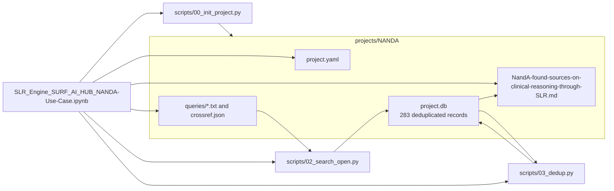
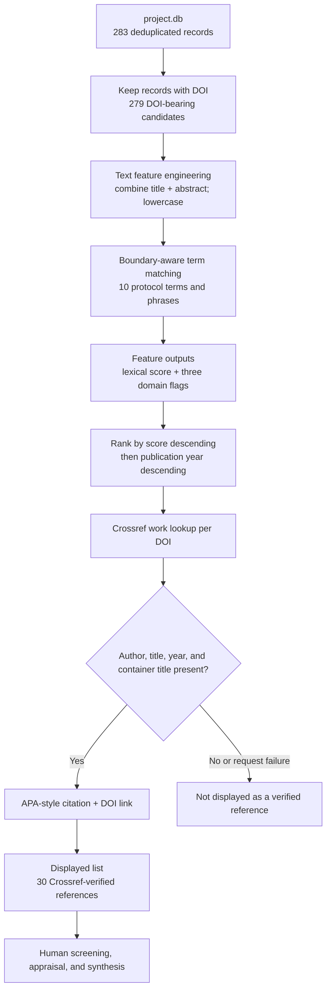
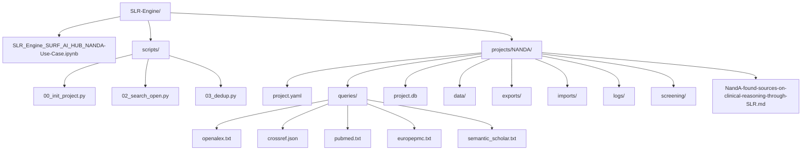

# NandA Found Sources on Clinical Reasoning Through SLR

- [Search Method](#search-method)
- [Search Queries](#search-queries)
- [Relevance Ranking](#relevance-ranking)
- [Relevant Sources Found Through SLR](#relevant-sources-found-through-slr)
- [Appendix: How This Report Was Produced](#appendix-how-this-report-was-produced)

## Scope
Scholarly metadata retrieved for the independent NANDA project on NANDA-I, NIC, NOC, clinical reasoning, and generative-AI-based agents. This report contains candidate sources only; inclusion requires human screening and it contains no patient-specific data.

The displayed candidates are ranked for triage by the number of 10 protocol terms or phrases found as whole terms in the title and abstract. Ties are ordered by publication year, newest first. This lexical score measures wording overlap with the query only; it is not an inclusion decision, evidence-quality measure, or clinical recommendation. Records must also have a DOI and complete Crossref metadata (author, title, year, and container title) before they can be rendered in the displayed reference list. Crossref verifies citation completeness and does not change the relevance score.

## Search Method
The workflow queried OpenAlex, Crossref, PubMed, Europe PMC, and Semantic Scholar using the literal query retained in `projects/NANDA/queries/`. It stored returned metadata in `project.db` and performed the engine deduplication stage before this export.

## Search Queries
| Source | Query |
| --- | --- |
| OpenAlex | `(NANDA OR "NANDA-I" OR NIC OR NOC OR "standardized nursing terminology") AND ("clinical reasoning" OR "clinical decision making") AND ("generative AI" OR "large language model" OR LLM OR agent)` |
| Crossref | `(NANDA OR "NANDA-I" OR NIC OR NOC OR "standardized nursing terminology") AND ("clinical reasoning" OR "clinical decision making") AND ("generative AI" OR "large language model" OR LLM OR agent) (rows: 100)` |
| PubMed | `(NANDA OR "NANDA-I" OR NIC OR NOC OR "standardized nursing terminology") AND ("clinical reasoning" OR "clinical decision making") AND ("generative AI" OR "large language model" OR LLM OR agent)` |
| Europe PMC | `(NANDA OR "NANDA-I" OR NIC OR NOC OR "standardized nursing terminology") AND ("clinical reasoning" OR "clinical decision making") AND ("generative AI" OR "large language model" OR LLM OR agent)` |
| Semantic Scholar | `(NANDA OR "NANDA-I" OR NIC OR NOC OR "standardized nursing terminology") AND ("clinical reasoning" OR "clinical decision making") AND ("generative AI" OR "large language model" OR LLM OR agent)` |

## Relevance Ranking
Candidates are ordered by the number of protocol terms found in their title and abstract, followed by publication year. This deterministic ranking supports triage only and is not an inclusion, exclusion, or clinical decision.

### Human-Readable Triage Overview
The 30 displayed references are Crossref-verified candidates. The score counts how many of 10 protocol terms occur in the title or abstract; a higher score indicates broader wording overlap with the query, not stronger evidence or eligibility.

| Score | Displayed references | Interpretation |
| ---: | ---: | --- |
| 5 | 1 | Broadest protocol-term overlap |
| 4 | 10 | Strong multi-term overlap |
| 3 | 19 | Focused overlap; inspect the reference before screening |

| Protocol domain | Displayed references mentioning the domain |
| --- | ---: |
| NANDA/NIC/NOC terminology | 29 |
| Clinical reasoning | 11 |
| AI or agents | 3 |

Use the **Reference** link in the table to jump to the complete APA-style citation below. Domain labels show which of the three protocol concepts are mentioned in the candidate metadata.

| Rank | Reference | Score | Protocol domains found | Candidate |
| ---: | ---: | ---: | --- | --- |
| 1 | [1](#source-1) | 5 | NANDA/NIC/NOC terminology; Clinical reasoning; AI or agents | Generative AI adaptive narratives to enhance nursing diagnostic reasoning: a classroom innovation |
| 2 | [2](#source-2) | 4 | NANDA/NIC/NOC terminology; Clinical reasoning | Integrating Collaborative Learning, Artistic Mediation, and AI to Enhance Midwifery Clinical Reasoning Based on the NANDA–NIC–NOC Framework |
| 3 | [3](#source-3) | 4 | NANDA/NIC/NOC terminology; Clinical reasoning | Developing NANDA-I, NOC, and NIC Linkages for the Diagnosis of Excessive Loneliness |
| 4 | [4](#source-4) | 4 | NANDA/NIC/NOC terminology; Clinical reasoning | Identifying NANDA-I, NOC, and NIC Linkages for the Risk for Thrombosis Nursing Diagnosis |
| 5 | [5](#source-5) | 4 | NANDA/NIC/NOC terminology; Clinical reasoning | Identification and Development of NANDA-I, NOC, and NIC (NNN) Linkages for the Nursing Diagnosis Chronic Pain Syndrome |
| 6 | [6](#source-6) | 4 | NANDA/NIC/NOC terminology; Clinical reasoning | Identification of NOC- and NIC-Linkages to NANDA-International for the Nursing Diagnosis Risk for Elder Frailty Syndrome: A Consensus Panel Based on a Narrative Review |
| 7 | [7](#source-7) | 4 | NANDA/NIC/NOC terminology; Clinical reasoning | Capabilities of computerized decision support systems supporting the nursing process in hospital settings: a scoping review |
| 8 | [8](#source-8) | 4 | NANDA/NIC/NOC terminology; Clinical reasoning | Enhancing nursing care through technology and standardized nursing language: The TEC-MED multilingual platform |
| 9 | [9](#source-9) | 4 | NANDA/NIC/NOC terminology; AI or agents | Plataforma PEnsinar®: a learning tool for teaching the nursing process |
| 10 | [10](#source-10) | 4 | NANDA/NIC/NOC terminology; Clinical reasoning | Using NANDA, NIC, and NOC (NNN) Language for Clinical Reasoning With the Outcome‐Present State‐Test (OPT) Model |
| 11 | [11](#source-11) | 4 | NANDA/NIC/NOC terminology; Clinical reasoning | Comparisons of NANDA/NIC/NOC Linkages Between Nursing Experts and Nursing Students |
| 12 | [12](#source-12) | 3 | NANDA/NIC/NOC terminology | Creating NANDA, NOC and NIC Linkages for Elder Abuse |
| 13 | [13](#source-13) | 3 | NANDA/NIC/NOC terminology | Evaluating the Outcomes of Nursing Care for Older Adults Diagnosed with Elder Frailty Syndrome (NANDA-I): A Six-Step Nursing Process Using NANDA-I, NOC, and NIC |
| 14 | [14](#source-14) | 3 | NANDA/NIC/NOC terminology | Abordaje integral de enfermería en intoxicación aguda por carbamatos en trabajador agrícola: estudio de caso con Proceso de Atención de Enfermería y taxonomías NANDA-I, NIC y NOC |
| 15 | [15](#source-15) | 3 | NANDA/NIC/NOC terminology | Teaching commercial determinants of health in nursing education: Integrating NANDA, NIC and NOC for critical pedagogy |
| 16 | [16](#source-16) | 3 | NANDA/NIC/NOC terminology | Taxonomías: limitaciones y potencial de NANDA, NIC y NOC en la práctica clínica multidisciplinaria |
| 17 | [17](#source-17) | 3 | NANDA/NIC/NOC terminology | NANDA-I, NIC, NOC for Successful Aging in Older Adults with Risk for Imbalance Blood Pressure: Cross-Mapping |
| 18 | [18](#source-18) | 3 | NANDA/NIC/NOC terminology | Nursing Care in a Patient Diagnosed with Carcinoma in Accordance with NANDA, NIC and NOC Classification Systems According to Watson's Human Care Model |
| 19 | [19](#source-19) | 3 | NANDA/NIC/NOC terminology | SISTEMATIZAÇÃO DA ASSISTÊNCIA DE ENFERMAGEM A PARTIR DAS LINGUAGENS NANDA-I, NIC E NOC EM CENÁRIO DE PRÉ-NATAL DE ALTO RISCO |
| 20 | [20](#source-20) | 3 | NANDA/NIC/NOC terminology | The Integration of AI into the Nursing Process: A Comparative Analysis of NANDA, NOC, and NIC-Based Care Plans |
| 21 | [21](#source-21) | 3 | NANDA/NIC/NOC terminology | Evaluation of child with asthma and her caregivers based on the Pender health promotion model, and linkages of NANDA, NIC–NOC: A case presentation |
| 22 | [22](#source-22) | 3 | Clinical reasoning; AI or agents | A Comparative Evaluation of Large Language Model Utility in Neuroimaging Clinical Decision Support |
| 23 | [23](#source-23) | 3 | NANDA/NIC/NOC terminology | Nursing Care of an Individual with Metastatic Colon Cancer Provided According to NANDA, NIC and NOC Classification Systems in Accordance with the Levine Protection Model |
| 24 | [24](#source-24) | 3 | NANDA/NIC/NOC terminology | Psychiatric Nursing Care Process with NANDA, NIC, and NOC Classifications: Case Example |
| 25 | [25](#source-25) | 3 | NANDA/NIC/NOC terminology | Nursing Care According to NANDA-I Diagnoses, NIC Interventions, and NOC Outcomes in a Patient with Autoimmune Encephalitis: A Case Report |
| 26 | [26](#source-26) | 3 | NANDA/NIC/NOC terminology | Planning Nursing Care Using NANDA-I, NIC and NOC Terminology in a Child with Type 1 Diabetes Mellitus, Developing Hand Foot and Mouth Disease |
| 27 | [27](#source-27) | 3 | NANDA/NIC/NOC terminology | Nursing Care Given to a Patient Diagnosed with Prostate Cancer in Line with the Nursing Model Based on Life Activities with NANDA, NOC and NIC Classification Systems |
| 28 | [28](#source-28) | 3 | NANDA/NIC/NOC terminology | An Investigation of the Use of the NANDA NIC NOC System in Psychiatric Nursing |
| 29 | [29](#source-29) | 3 | NANDA/NIC/NOC terminology | Gordon's Model of Functional Health Care Patterns of the Individual with Guillain-Barré Syndrome, Nursing Care by NANDA, NIC and NOC Classification Systems |
| 30 | [30](#source-30) | 3 | NANDA/NIC/NOC terminology | Kronik Obstrüktif Akciğer Hastalığı Tanısı Almış Yoğun Bakım Hastasının Uyku Aktivitesinin NANDA, NIC ve NOC Doğrultusunda Değerlendirilmesi: Bir Olgu Sunumu |

## Relevant Sources Found Through SLR
All references below were verified against the Crossref work record at export time.

1. Díaz, M. J. F. (2026). Generative AI adaptive narratives to enhance nursing diagnostic reasoning: a classroom innovation. *BMC Nursing*, *25*(1). [https://doi.org/10.1186/s12912-026-04359-8](https://doi.org/10.1186/s12912-026-04359-8)

2. Refki, I., Benfatah, M., Marfak, A., Saad, E., Hilali, A., & Youlyouz-Marfak, I. (2026). Integrating Collaborative Learning, Artistic Mediation, and AI to Enhance Midwifery Clinical Reasoning Based on the NANDA–NIC–NOC Framework. *International Medical Education*, *5*(3), 61. [https://doi.org/10.3390/ime5030061](https://doi.org/10.3390/ime5030061)

3. Morsiani, G., Bertocchi, L., Comparcini, D., Mecheroni, S., Saba, A., & Agostinelli, V. (2026). Developing NANDA-I, NOC, and NIC Linkages for the Diagnosis of Excessive Loneliness. *International Journal of Nursing Knowledge*. [https://doi.org/10.1177/20473087261445590](https://doi.org/10.1177/20473087261445590)

4. Mecheroni, S., Bertocchi, L., Morsiani, G., Comparcini, D., Saba, A., & Agostinelli, V. (2026). Identifying NANDA-I, NOC, and NIC Linkages for the
                    <i>Risk for Thrombosis</i>
                    Nursing Diagnosis. *International Journal of Nursing Knowledge*. [https://doi.org/10.1177/20473087261462591](https://doi.org/10.1177/20473087261462591)

5. Morsiani, G., Comparcini, D., Mecheroni, S., Saba, A., Bertocchi, L., & Agostinelli, V. (2026). Identification and Development of NANDA-I, NOC, and NIC (NNN) Linkages for the Nursing Diagnosis
                    <i>Chronic Pain Syndrome</i>. *International Journal of Nursing Knowledge*. [https://doi.org/10.1177/20473087261460968](https://doi.org/10.1177/20473087261460968)

6. Leoni-Scheiber, C., Feller-Hauser, S., & Schümann, D. (2026). Identification of NOC- and NIC-Linkages to NANDA-International for the Nursing Diagnosis Risk for Elder Frailty Syndrome: A Consensus Panel Based on a Narrative Review. *International Journal of Nursing Knowledge*. [https://doi.org/10.1177/20473087261460958](https://doi.org/10.1177/20473087261460958)

7. Abi Khalil, C., Saab, A., Rahme, J., Bouaud, J., & Seroussi, B. (2025). Capabilities of computerized decision support systems supporting the nursing process in hospital settings: a scoping review. *BMC Nursing*, *24*(1). [https://doi.org/10.1186/s12912-025-03272-w](https://doi.org/10.1186/s12912-025-03272-w)

8. Porcel Gálvez, A. M., Lima-Serrano, M., Allande-Cussó, R., Costanzo-Talarico, M. G., García, M. D. M., Bueno-Ferrán, M., Fernández-García, E., D'Agostino, F., & Romero-Sánchez, J. M. (2025). Enhancing nursing care through technology and standardized nursing language: The TEC-MED multilingual platform. *International Journal of Nursing Knowledge*, *36*(4), 421-429. [https://doi.org/10.1111/2047-3095.12493](https://doi.org/10.1111/2047-3095.12493)

9. Melo, E. C. A. d., Enders, B. C., & Basto, M. L. (2018). Plataforma PEnsinar®: a learning tool for teaching the nursing process. *Revista Brasileira de Enfermagem*, *71*(suppl 4), 1522-1530. [https://doi.org/10.1590/0034-7167-2016-0411](https://doi.org/10.1590/0034-7167-2016-0411)

10. Kautz, D. D., Kuiper, R., Pesut, D. J., & Williams, R. L. (2006). Using NANDA, NIC, and NOC (NNN) Language for Clinical Reasoning With the Outcome‐Present State‐Test (OPT) Model. *International Journal of Nursing Terminologies and Classifications*, *17*(3), 129-138. [https://doi.org/10.1111/j.1744-618x.2006.00033.x](https://doi.org/10.1111/j.1744-618x.2006.00033.x)

11. Van De Castle, B. (2003). Comparisons of NANDA/NIC/NOC Linkages Between Nursing Experts and Nursing Students. *International Journal of Nursing Terminologies and Classifications*, *14*(s4), 40-40. [https://doi.org/10.1111/j.1744-618x.2003.32_13.x](https://doi.org/10.1111/j.1744-618x.2003.32_13.x)

12. Wagner, C. M. (2026). Creating NANDA, NOC and NIC Linkages for Elder Abuse. *International Journal of Nursing Knowledge*. [https://doi.org/10.1177/20473087261471625](https://doi.org/10.1177/20473087261471625)

13. Kira, K. (2026). Evaluating the Outcomes of Nursing Care for Older Adults Diagnosed with Elder Frailty Syndrome (NANDA-I): A Six-Step Nursing Process Using NANDA-I, NOC, and NIC. *International Journal of Nursing Knowledge*. [https://doi.org/10.1177/20473087261443267](https://doi.org/10.1177/20473087261443267)

14. López Chicaíza, L. D., Quiros Irua, J. L., & López Reyes, S. L. (2026). Abordaje integral de enfermería en intoxicación aguda por carbamatos en trabajador agrícola: estudio de caso con Proceso de Atención de Enfermería y taxonomías NANDA-I, NIC y NOC Comprehensive nursing approach to acute carbamate poisoning in agricultural workers: a case study using the Nursing Care Process and NANDA-I, NIC, and NOC taxonomies. *ASCE MAGAZINE*, *5*(1), 229-255. [https://doi.org/10.70577/asce.v5i1.594](https://doi.org/10.70577/asce.v5i1.594)

15. Díaz, M. J. F. (2026). Teaching commercial determinants of health in nursing education: Integrating NANDA, NIC and NOC for critical pedagogy. *Nurse Education Today*, *164*, 107126. [https://doi.org/10.1016/j.nedt.2026.107126](https://doi.org/10.1016/j.nedt.2026.107126)

16. Mariscal Delgadillo, M. (2026). Taxonomías: limitaciones y  potencial de NANDA, NIC y NOC en la práctica clínica  multidisciplinaria. *Index de enfermería digital*, e15782. [https://doi.org/10.58807/indexenferm20257977](https://doi.org/10.58807/indexenferm20257977)

17. Silva, R. C. d., Araujo, C. S. d. L., & Cavalcante, A. M. R. Z. (2026). NANDA-I, NIC, NOC for Successful Aging in Older Adults with Risk for Imbalance Blood Pressure: Cross-Mapping. *International Journal of Nursing Knowledge*. [https://doi.org/10.1177/20473087261462595](https://doi.org/10.1177/20473087261462595)

18. BAGA, Y., BİLGİLİ TEKİN, S., KOÇAK, İ., & İPEK ÇOBAN, G. (2025). Nursing Care in a Patient Diagnosed with Carcinoma in Accordance with NANDA, NIC and NOC Classification Systems According to Watson's Human Care Model. *Turkiye Klinikleri Journal of Nursing Sciences*, *17*(3), 992-1002. [https://doi.org/10.5336/nurses.2024-107314](https://doi.org/10.5336/nurses.2024-107314)

19. Lima, R. L., Silva, L. G. d., & Sousa, Q. d. C. D. d. (2025). SISTEMATIZAÇÃO DA ASSISTÊNCIA DE ENFERMAGEM A PARTIR DAS LINGUAGENS NANDA-I, NIC E NOC EM CENÁRIO DE PRÉ-NATAL DE ALTO RISCO SYSTEMATIZATION OF NURSING CARE BASED ON NANDA-I, NIC, AND NOC LANGUAGES IN A HIGH-RISK PRENATAL SETTING. *Revista Ibero-Americana de Humanidades, Ciências e Educação*, *11*(11), 6174-6179. [https://doi.org/10.51891/rease.v11i11.21445](https://doi.org/10.51891/rease.v11i11.21445)

20. Gilart, E., Bocchino, A., Gilart-Cantizano, P., Cotobal-Calvo, E. M., Lepiani-Diaz, I., Román-Sánchez, D., & Palazón-Fernández, J. L. (2025). The Integration of AI into the Nursing Process: A Comparative Analysis of NANDA, NOC, and NIC-Based Care Plans. *Nursing Reports*, *15*(6), 186. [https://doi.org/10.3390/nursrep15060186](https://doi.org/10.3390/nursrep15060186)

21. Seval, M., Kuzlu Ayyildiz, T., & Uzuntarla Güney, E. (2025). Evaluation of child with asthma and her caregivers based on the Pender health promotion model, and linkages of NANDA, NIC–NOC: A case presentation. *International Journal of Nursing Knowledge*, *36*(2), 169-182. [https://doi.org/10.1111/2047-3095.12472](https://doi.org/10.1111/2047-3095.12472)

22. Miller, L., Kamel, P., Patel, J., Agrawal, J., Zhan, M., Bumbarger, N., & Wang, K. (2024). A Comparative Evaluation of Large Language Model Utility in Neuroimaging Clinical Decision Support. *Journal of Imaging Informatics in Medicine*, *38*(4), 2294-2302. [https://doi.org/10.1007/s10278-024-01161-3](https://doi.org/10.1007/s10278-024-01161-3)

23. ÖZKAN, S., & KARAGÖZOĞLU, Ş. (2024). Nursing Care of an Individual with Metastatic Colon Cancer Provided According to NANDA, NIC and NOC Classification Systems in Accordance with the Levine Protection Model. *Turkiye Klinikleri Journal of Nursing Sciences*, *16*(2), 611-620. [https://doi.org/10.5336/nurses.2023-100163](https://doi.org/10.5336/nurses.2023-100163)

24. Şahin Tokatlıoğlu, T., & Oflaz, F. (2024). Psychiatric Nursing Care Process with NANDA, NIC, and NOC Classifications: Case Example. *Sağlık Bilimleri Üniversitesi Hemşirelik Dergisi*, *6*(3), 279-284. [https://doi.org/10.48071/sbuhemsirelik.1450599](https://doi.org/10.48071/sbuhemsirelik.1450599)

25. Özçelik, E. E., & Çelik, S. (2024). Nursing Care According to NANDA-I Diagnoses, NIC Interventions, and NOC Outcomes in a Patient with Autoimmune Encephalitis: A Case Report. *Sakarya Üniversitesi Holistik Sağlık Dergisi*, *7*(3), 230-241. [https://doi.org/10.54803/sauhsd.1461503](https://doi.org/10.54803/sauhsd.1461503)

26. ARIKAN, A., & ESENAY, F. I. (2023). Planning Nursing Care Using NANDA-I, NIC and NOC Terminology in a Child with Type 1 Diabetes Mellitus, Developing Hand Foot and Mouth Disease. *Turkiye Klinikleri Journal of Nursing Sciences*, *15*(2), 542-554. [https://doi.org/10.5336/nurses.2022-94457](https://doi.org/10.5336/nurses.2022-94457)

27. AKSOY, F., SARI, E., BATMAZ, F., & ÖZTÜRK, H. (2023). Nursing Care Given to a Patient Diagnosed with Prostate Cancer in Line with the Nursing Model Based on Life Activities with NANDA, NOC and NIC Classification Systems. *Turkiye Klinikleri Journal of Nursing Sciences*, *15*(3), 865-881. [https://doi.org/10.5336/nurses.2023-95527](https://doi.org/10.5336/nurses.2023-95527)

28. Eray, K. (2023). An Investigation of the Use of the NANDA NIC NOC System in Psychiatric Nursing. *Journal of Psychiatric Nursing*. [https://doi.org/10.14744/phd.2022.01878](https://doi.org/10.14744/phd.2022.01878)

29. BARAN, Z., ÖZDEN, D., & GÜROL ARSLAN, G. (2023). Gordon's Model of Functional Health Care Patterns of the Individual with Guillain-Barré Syndrome, Nursing Care by NANDA, NIC and NOC Classification Systems. *Turkiye Klinikleri Journal of Nursing Sciences*, *15*(2), 562-572. [https://doi.org/10.5336/nurses.2022-92808](https://doi.org/10.5336/nurses.2022-92808)

30. BAĞCI, Y., ÇELİK, Ş., & AVŞAR, G. (2023). Kronik Obstrüktif Akciğer Hastalığı Tanısı Almış Yoğun Bakım Hastasının Uyku Aktivitesinin NANDA, NIC ve NOC Doğrultusunda Değerlendirilmesi: Bir Olgu Sunumu The Evaluation of Sleep Activity of an Intensive Care Patient Diagnosed with Chronic Obstructive Pulmonary Disease in accordance with NANDA, NIC and NOC : A Case Report. *Sağlık Akademisi Kastamonu*, *8*(3), 599-609. [https://doi.org/10.25279/sak.1090687](https://doi.org/10.25279/sak.1090687)

## Appendix: How This Report Was Produced

This appendix documents the reproducible path from the NANDA project configuration to this Markdown report. It describes candidate discovery and bibliographic presentation; it does not represent completed human screening or clinical validation.

### Inputs and Purpose

| Component | What was used | Why it was used |
| --- | --- | --- |
| Study protocol | `projects/NANDA/project.yaml` | Defines the topic, research questions, source enablement, and inclusion/exclusion criteria. |
| Search definitions | Five files in `projects/NANDA/queries/` | Preserves the literal source-specific search strings shown above. |
| Candidate database | `projects/NANDA/project.db` with 283 deduplicated records at export | Supplies the scholarly metadata considered by the report. |
| Export implementation | `SLR_Engine_SURF_AI_HUB_NANDA-Use-Case.ipynb` | Produces the ranking table, Crossref verification, APA-style references, and this report. |
| Crossref work API | `https://api.crossref.org/works/{DOI}` | Verifies the metadata required to render a displayed reference. |

### Executable Components

| File | Executed responsibility | Output or effect |
| --- | --- | --- |
| `SLR_Engine_SURF_AI_HUB_NANDA-Use-Case.ipynb` | Orchestrates project setup, configuration, search, deduplication, feature scoring, Crossref checks, and report writing. | This Markdown report. |
| `scripts/00_init_project.py` | Creates `projects/NANDA/` when it does not already exist. | Initial project structure and audit trail. |
| `scripts/02_search_open.py` | Queries OpenAlex, Crossref, PubMed, Europe PMC, and Semantic Scholar. | Candidate metadata written to the project database. |
| `scripts/03_dedup.py` | Applies the SLR-Engine deduplication stage. | Deduplicated candidate records in `project.db`. |

### Data Lineage: Code to Report

### Data Science Path: Metadata to Human Triage

The data-science transformation creates transparent metadata features only. It does not infer study quality, causal validity, or clinical suitability.

### Project Map

The configured notebook calls the three listed Python scripts. The other project folders preserve workflow artifacts for later import, screening, logging, data, and export stages; they are not evidence of completed screening in this report.

### Processing Rules

| Step | Rule applied | Rationale |
| --- | --- | --- |
| Candidate selection | Only records with a non-empty DOI enter the displayed reference pipeline. | A DOI permits a direct Crossref work lookup and a clickable resolver link. |
| Relevance score | Counts whole protocol terms and phrases in title plus abstract; ties are ordered by newer publication year. | Prevents short terms such as `NIC` from matching inside unrelated words, while retaining deterministic triage. |
| Crossref verification | A reference is shown only when Crossref returns author, title, year, and container title. | Avoids rendering incomplete local bibliographic metadata as a final reference. |
| Display limit | Export stops after 30 verified references. | Keeps the report readable while retaining a reproducible selection rule. |

### Interpretation Boundaries

| This report does | This report does not |
| --- | --- |
| Preserve the configured queries, candidate ranking, DOI links, and Crossref-verified citation metadata. | Conduct title/abstract screening, full-text appraisal, risk-of-bias assessment, or data extraction. |
| Support transparent triage of scholarly candidate records. | Treat the lexical score as an inclusion/exclusion decision, evidence-quality measure, or clinical recommendation. |
| Use scholarly metadata and public Crossref bibliographic responses. | Process patient records, identifiers, clinical notes, unpublished data, or licensed terminology content. |

To reproduce the report, run the NANDA notebook in the configured Python environment. The export reads the current project database and query files, so changes to either input will be reflected in a subsequent report.
