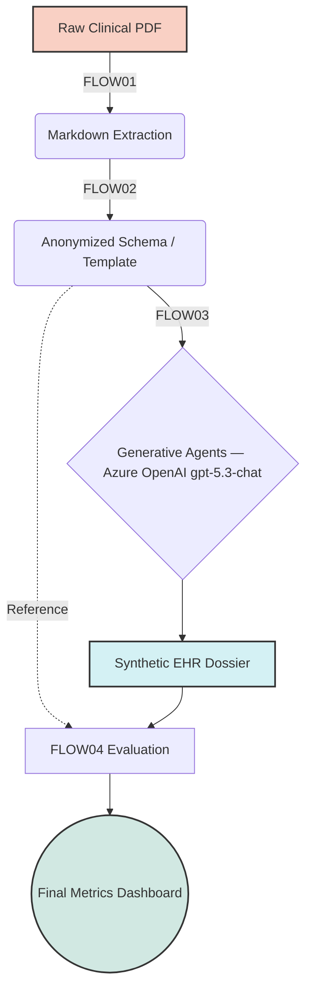
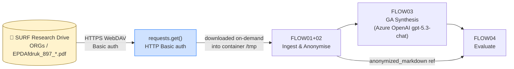
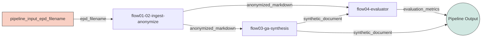

# Generative Agent-Assisted Synthetic Health Data Generation (SHDG) on UbiOps

> **Version:** V11 — 31 May 2026  
> **Author note:** This revision consolidates the complete end-to-end pipeline build executed on 31 May 2026, including debugging outcomes, package revision status, and the documented role of GitHub Copilot in deployment orchestration.

---

## Table of Contents

1. [Project Summary](#s1)
    - [Available FLOW notebooks in the original SHDG repository](#available-flow-notebooks-in-the-original-shdg-repository)
2. [GA-Assisted SHDG Workflow Overview](#s2)
3. [Data Warehouse: Raw Clinical EHR Input (SURF Research Drive)](#s3)
    - [3.1 Dataset Location](#s3-1)
    - [3.2 Manual access pattern: Web Browser Download](#s3-2)
    - [3.3 Local development access pattern: rclone Virtual Mount on Windows](#s3-3)
    - [3.4 Runtime retrieval access pattern: HTTP Download inside the UbiOps Container](#s3-4)
    - [3.5 Role in the SHDG Pipeline](#s3-5)
4. [UbiOps Migration Guide & Python Source Code](#s4)
    - [4-A FLOW01+02 — Ingestion & Privacy Masking](#s4a)
    - [4-B FLOW03 — GA-Assisted Synthesis (Azure OpenAI)](#s4b)
    - [4-C FLOW04 — Evaluator Framework](#s4c)
5. [Step-by-Step: Recreating Each Flow in UbiOps](#s5)
    - [Prerequisites](#prerequisites)
    - [Local environment note: `pubmed-env`](#local-environment-note-pubmed-env)
    - [Creating and using UbiOps API tokens in the UbiOps Web App](#creating-and-using-ubiops-api-tokens-in-the-ubiops-web-app)
    - [FLOW01+02 — Ingestion & Privacy Masking](#flow0102--ingestion--privacy-masking)
    - [FLOW03 — GA-Assisted Synthesis (Azure OpenAI)](#flow03--ga-assisted-synthesis-azure-openai)
    - [FLOW04 — Evaluation Framework](#flow04--evaluation-framework)
    - [FLOW01–04 — Assembling the Pipeline](#flow0104--assembling-the-pipeline)
6. [Pipeline Build via GitHub Copilot](#s6)
    - [6.1 Tool & Session Context](#s6-1)
    - [6.2 Pipeline YAML Specifications](#s6-2)
    - [6.3 Pipeline Creation via Python SDK](#s6-3)
    - [6.4 FLOW03 Debugging Chronicle](#s6-4)
7. [Assembling and Executing the UbiOps Pipeline](#s7)
    - [Invoke via Python SDK](#invoke-via-python-sdk)
    - [Batch all 13 EPDs](#batch-all-13-epds)
8. [Deployment Package Version History](#s8)
    - [FLOW01+02 — `flow01-02-ingest-anonymize`](#flow0102--flow01-02-ingest-anonymize)
    - [FLOW03 — `flow03-ga-synthesis`](#flow03--flow03-ga-synthesis)
    - [FLOW04 — `flow04-evaluator`](#flow04--flow04-evaluator)
    - [Pipeline — `shdg-pipeline`](#pipeline--shdg-pipeline)
9. [Security Notes](#s9)
10. [AI Accountability & Transparency](#s10)
    - [Notes on Legal References](#notes-on-legal-references)
    - [Generative AI Tools Used in This Project](#generative-ai-tools-used-in-this-project)
11. [License](#license)
12. [Acknowledgements](#acknowledgements)

---

<a id="s1"></a>
## 1. Project Summary

This project is an enterprise-scale MLOps adaptation of the research repository: **[Privacy-, Linguistic-, and Information-Preserving Synthesis of Clinical Documentation through Generative Agents](https://github.com/HR-DataLab-Healthcare/RESEARCH_SUPPORT/tree/main/PROJECTS/Generative_Agent_based_Data-Synthesis)**.

The original repository introduces a methodology for generating highly realistic Synthetic Electronic Health Records (EHRs). By utilizing Multi-Agent Large Language Models (Generative Agents), the system can ingest real clinical notes, completely strip them of Protected Health Information (PHI), and synthesize novel patient trajectories that perfectly mimic the structural, semantic, and linguistic characteristics of the original dataset. This allows researchers to share and analyze clinical data safely without violating HIPAA or GDPR regulations.

The original prototype source is available in the repository's full SHDG pipeline notebook collection: **[Generative_Agent_based_Data-Synthesis / CODE](https://github.com/HR-DataLab-Healthcare/RESEARCH_SUPPORT/tree/main/PROJECTS/Generative_Agent_based_Data-Synthesis/CODE)**. The complete workflow is provided as Jupyter Notebooks, including the ingestion, anonymization, synthesis, and evaluation stages.

### Available FLOW notebooks in the original SHDG repository

| FLOW | Notebook | Purpose | Repository link |
|---|---|---|---|
| FLOW01 + FLOW02 | `FLOW01+FLOW02.ipynb` | Ingestion, parsing, and anonymization / pseudonymization of clinical source documents | [Open notebook](https://github.com/HR-DataLab-Healthcare/RESEARCH_SUPPORT/blob/main/PROJECTS/Generative_Agent_based_Data-Synthesis/CODE/FLOW01%2BFLOW02.ipynb) |
| FLOW03 | `FLOW03.ipynb` | Generative-agent-based synthesis of synthetic clinical documentation | [Open CODE folder](https://github.com/HR-DataLab-Healthcare/RESEARCH_SUPPORT/tree/main/PROJECTS/Generative_Agent_based_Data-Synthesis/CODE) |
| FLOW04 | `FLOW04.ipynb` | Evaluation of synthetic output against anonymized reference material | [Open CODE folder](https://github.com/HR-DataLab-Healthcare/RESEARCH_SUPPORT/tree/main/PROJECTS/Generative_Agent_based_Data-Synthesis/CODE) |

> **Repository note:** The full SHDG pipeline is maintained in the `CODE` folder of the original research repository and is provided as a set of Jupyter Notebooks covering the end-to-end workflow.

---

<a id="s2"></a>
## 2. GA-Assisted SHDG Workflow Overview

Based directly on the project's **[GA-assisted SHDG Workflow State Diagram](https://github.com/HR-DataLab-Healthcare/RESEARCH_SUPPORT/tree/main/PROJECTS/Generative_Agent_based_Data-Synthesis#ga-assisted-shdg-workflow-click-to-view-statediagram)**, the methodology operates in four distinct, sequential computational stages.

When migrating this methodology to **UbiOps**, we map these workflows directly onto containerized microservices (**Deployments**) to build a secure, automated Directed Acyclic Graph (DAG) Pipeline:

1. **FLOW01 (Ingestion & Parsing):** Translates raw semi-structured clinical PDFs into structured Markdown templates.
2. **FLOW02 (Pseudonymization):** A lightweight rule-based PHI masker scrubs direct identifiers such as names, DOBs, email addresses, and structured contact fields while preserving the clinical content.
3. **FLOW03 (GA Collaborative Synthesis):** An LLM orchestrator using **Azure OpenAI `gpt-5.3-chat`** (model deployed on `llmfoundrys.cognitiveservices.azure.com`) where Generative Agents populate the scrubbed schema with high-fidelity synthetic clinical narratives.
4. **FLOW04 (Evaluation Framework):** Benchmarks the generated synthetic dossiers against the anonymized reference produced by FLOW01+02 to quantify structural alignment, privacy leakage risk, and semantic distance.



---

<a id="s3"></a>
## 3. Data Warehouse: Raw Clinical EHR Input (SURF Research Drive)

This section describes the three supported **data access patterns** for the source EPD PDF files used by the SHDG workflow. Each pattern serves a different operational context:

- **Manual access pattern**: for occasional human inspection, verification, or one-off local downloads.
- **Local development access pattern**: for Windows-based development where the remote folder should behave like a mounted drive.
- **Runtime retrieval access pattern**: for production execution in UbiOps, where files are downloaded on demand inside the container.

In short: use the **manual access pattern** for ad hoc retrieval, the **local development access pattern** for scripting and notebook work on Windows, and the **runtime retrieval access pattern** for automated execution in UbiOps.

<a id="s3-1"></a>
### 3.1 Dataset Location

| Property | Value |
|---|---|
| **Platform** | SURF Research Drive (Nextcloud) — `hr.data.surf.nl` |
| **Project folder** | `HR-DATALAB-HEALTHCARE (Projectfolder)` |
| **Path** | `UbiOps_2026 / LR_EPDs / ORGs` |
| **Files** | 13 × `EPDAfdruk_897_*.pdf` (80–120 KB each; 1.2 MB total) |
| **Share link** | [https://hr.data.surf.nl/s/AYp3KSd6EqMjNkG](https://hr.data.surf.nl/s/AYp3KSd6EqMjNkG) *(password-protected)* |
| **Last modified** | MAY 2026 |

> **Privacy & Security:** These files contain real clinical records and are protected under GDPR. The share link requires a password. Do **not** commit these files to any public repository, upload them to public cloud storage, or include them in any UbiOps deployment package. They are pipeline **inputs only**.

---

<a id="s3-2"></a>
### 3.2 Manual access pattern: Web Browser Download

Use this access pattern when you need the files only occasionally, for example to inspect the raw PDFs, verify file availability, or stage a small local test set without configuring mounts or automation.

1. Open [https://hr.data.surf.nl/s/AYp3KSd6EqMjNkG](https://hr.data.surf.nl/s/AYp3KSd6EqMjNkG) in your browser.
2. Enter the share password when prompted.
3. Select all 13 `EPDAfdruk_897_*.pdf` files → click **Download** → saves as a `.zip`.
4. Extract locally to a working folder, e.g. `D:\data\LR_EPDs\ORGs\`.

---

<a id="s3-3"></a>
### 3.3 Local development access pattern: rclone Virtual Mount on Windows

Use this access pattern when developing locally on Windows and you want the SURF Research Drive content to appear as a normal drive letter. This is the most convenient setup for iterative scripting, notebook-based experimentation, and testing local parsing code against the source PDFs.

> **Reference:** [HR-DataLab-Healthcare/RESEARCH_SUPPORT — RCLONE guide](https://github.com/HR-DataLab-Healthcare/RESEARCH_SUPPORT/tree/main/PROJECTS/RCLONE)
> **Status:** Verified and working (tested 30 May 2026 on `PROMET02` / Windows 11 Education 25H2)

Using **rclone** with **WinFsp**, the `ORGs` subfolder on SURF Research Drive is mounted directly as Windows drive letter `X:`.

#### B.1 Prerequisites

```powershell
choco install rclone -y
choco install winfsp -y
rclone version   # Expected: rclone v1.71.x
```

#### B.2 Configure the `[RD]` rclone remote

```ini
# C:\Users\PROMET02\AppData\Roaming\rclone\rclone.conf
[RD]
type   = webdav
url    = https://hr.data.surf.nl/remote.php/dav/files/Willi@hro.nl
vendor = nextcloud
user   = Willi@hro.nl
pass   = <obscured>
```

**Test:**
```powershell
rclone lsd "RD:HR-DATALAB-HEALTHCARE (Projectfolder)/UbiOps_2026/LR_EPDs"
```

#### B.3 Mount as drive `X:`

```powershell
rclone mount "RD:HR-DATALAB-HEALTHCARE (Projectfolder)/UbiOps_2026/LR_EPDs/ORGs" X: `
  --vfs-cache-mode full `
  --vfs-cache-max-age 24h `
  --links
```

#### B.4 Persistent background mount

Create `C:\Scripts\mount_shdg_orgs.bat` and a `.vbs` silent launcher, then add a shortcut to `%APPDATA%\Microsoft\Windows\Start Menu\Programs\Startup\`.

#### B.5 Using the mounted drive in Python

```python
import pdfplumber
with pdfplumber.open(r"X:\EPDAfdruk_897_59037.pdf") as pdf:
    for page in pdf.pages:
        print(page.extract_text())
```

---

<a id="s3-4"></a>
### 3.4 Runtime retrieval access pattern: HTTP Download inside the UbiOps Container

Use this access pattern for the deployed SHDG pipeline in UbiOps. In this model, the container does not rely on an interactive mount or local drive mapping. Instead, the required PDF is downloaded just-in-time during request execution, processed in temporary storage, and then discarded.

> **Lesson learned:** `curl | bash`, `apt-get install rclone`, and a bundled rclone binary all failed inside UbiOps containers. The `requests.get()` approach below works because it is a single direct HTTP GET with Basic auth.

#### C.1 `requirements.txt`

```text
pdfplumber==0.10.2
requests>=2.28.0
```

#### C.2 UbiOps Environment Variables

| Key | Value | Secret? |
|---|---|---|
| `SURF_SHARE_TOKEN` | `<token — retrieve from project password manager>` | No |
| `SURF_SHARE_PASSWORD` | `<share password>` | **Yes** |

#### C.3 How the HTTP download works

```python
requests.get(
    f"https://hr.data.surf.nl/public.php/webdav/{filename}",
    auth=(share_token, share_password),   # Basic auth: share-ID as username
    stream=True, timeout=120
)
```

---

<a id="s3-5"></a>
### 3.5 Role in the SHDG Pipeline



---

<a id="s4"></a>
## 4. UbiOps Migration Guide & Python Source Code

<a id="s4a"></a>
### A. Migrate `FLOW01 + FLOW02` (Ingestion & Privacy Masking)

> **Working package:** `flow01-02-v1-rev12.zip`  
> **Recommended baseline package name:** `flow01-02-v1-rev13.zip`  
> **Note:** `rev13` is functionally identical to `rev12` and is used only for end-to-end package naming consistency.

**`requirements.txt`**
```text
pdfplumber==0.10.2
requests>=2.28.0
```

> **Implementation note:** `rev12` intentionally removes `spacy` and `scispacy`. The earlier biomedical NER model (`en_core_sci_sm`) redacted too much normal clinical language and did not produce valid anonymized documents. Deterministic regex-based PHI masking is used instead.

**`deployment.py`**
```python
import os
import re
import tempfile
import requests
import pdfplumber

WEBDAV_URL = "https://hr.data.surf.nl/public.php/webdav/"

HEADER_NAME_DOB_PATTERN = re.compile(
    r"^\s*([^\n()]{2,120}?)\s*\((\d{1,2}[-/]\d{1,2}[-/]\d{2,4})\)\s*$"
)
NAME_FIELD_PATTERN = re.compile(
    r"^(\s*(?:Naam|Pati(?:ent|\xebnt)(?:naam)?)\s*:?\s*)(.+?)\s*$",
    re.IGNORECASE,
)
PERSON_ROLE_FIELD_PATTERN = re.compile(
    r"^(\s*(?:Verwijzer|Huisarts|Behandelaar|Specialist|Contactpersoon|Zorgverlener)\s*:?\s*)([^,\n]+?)(\s*,.*)?\s*$",
    re.IGNORECASE,
)
BIRTH_INLINE_PATTERN = re.compile(
    r"\b((?:Geboortedatum|Geb\.?\s*datum|geboren\s+op|geb\.?\s*)\s*:?\s*)(\d{1,2}[-/]\d{1,2}[-/]\d{2,4})",
    re.IGNORECASE,
)
EMAIL_PATTERN = re.compile(
    r"\b[A-Z0-9._%+-]+@[A-Z0-9.-]+\.[A-Z]{2,}\b",
    re.IGNORECASE,
)
TITLE_NAME_PATTERN = re.compile(
    r"\b(Dhr\.|Mevr\.|Mw\.|Dr\.|Prof\.)\s+([A-Z][A-Za-z.'-]+(?:\s+(?:van|de|den|der|ter|te|[A-Z][A-Za-z.'-]+))*)"
)
FIELD_PATTERNS = [
    (
        re.compile(r"^(\s*(?:BSN|BurgerServiceNummer)\s*:?\s*)(.+?)\s*$", re.IGNORECASE),
        "[REDACTED_BSN]",
    ),
    (
        re.compile(r"^(\s*(?:Telefoon|Telefoonnummer|Mobiel|Tel\.?)\s*:?\s*)(.+?)\s*$", re.IGNORECASE),
        "[REDACTED_PHONE]",
    ),
    (
        re.compile(r"^(\s*(?:E-mail|Email)\s*:?\s*)(.+?)\s*$", re.IGNORECASE),
        "[REDACTED_EMAIL]",
    ),
    (
        re.compile(r"^(\s*(?:Adres|Straat|Huisnummer|Postcode|Woonplaats)\s*:?\s*)(.+?)\s*$", re.IGNORECASE),
        "[REDACTED_ADDRESS]",
    ),
]


def _looks_like_person_name(value: str) -> bool:
    candidate = value.strip(" ,;:-")
    if not candidate or len(candidate) > 120:
        return False
    if any(char.isdigit() for char in candidate):
        return False
    tokens = [token for token in candidate.split() if token]
    if not 1 <= len(tokens) <= 8:
        return False
    return any(token[0].isupper() for token in tokens if token[0].isalpha()) or "." in candidate


def _replace_exact_values(text: str, values: set[str], replacement: str) -> str:
    for value in sorted({value.strip() for value in values if value and value.strip()}, key=len, reverse=True):
        text = text.replace(value, replacement)
    return text


def _redact_sensitive_text(text: str) -> str:
    discovered_names: set[str] = set()
    discovered_birth_dates: set[str] = set()
    redacted_lines = []

    def replace_titled_name(match: re.Match[str]) -> str:
        name = match.group(2).strip()
        if _looks_like_person_name(name):
            discovered_names.add(name)
        return f"{match.group(1)} [REDACTED_PERSON]"

    for line in text.splitlines(keepends=True):
        if line.endswith("\r\n"):
            core = line[:-2]
            newline = "\r\n"
        elif line.endswith("\n"):
            core = line[:-1]
            newline = "\n"
        else:
            core = line
            newline = ""

        match = HEADER_NAME_DOB_PATTERN.match(core)
        if match:
            name = match.group(1).strip()
            birth_date = match.group(2)
            if _looks_like_person_name(name):
                discovered_names.add(name)
            discovered_birth_dates.add(birth_date)
            redacted_lines.append(f"[REDACTED_PERSON] ([REDACTED_DOB]){newline}")
            continue

        match = NAME_FIELD_PATTERN.match(core)
        if match:
            name = match.group(2).strip()
            if _looks_like_person_name(name):
                discovered_names.add(name)
            redacted_lines.append(f"{match.group(1)}[REDACTED_PERSON]{newline}")
            continue

        match = PERSON_ROLE_FIELD_PATTERN.match(core)
        if match:
            person = match.group(2).strip()
            if _looks_like_person_name(person):
                discovered_names.add(person)
            suffix = match.group(3) or ""
            redacted_lines.append(f"{match.group(1)}[REDACTED_PERSON]{suffix}{newline}")
            continue

        replaced_field = False
        for pattern, placeholder in FIELD_PATTERNS:
            match = pattern.match(core)
            if match:
                redacted_lines.append(f"{match.group(1)}{placeholder}{newline}")
                replaced_field = True
                break
        if replaced_field:
            continue

        for _, birth_date in BIRTH_INLINE_PATTERN.findall(core):
            discovered_birth_dates.add(birth_date)

        redacted_core = BIRTH_INLINE_PATTERN.sub(lambda match: f"{match.group(1)}[REDACTED_DOB]", core)
        redacted_core = EMAIL_PATTERN.sub("[REDACTED_EMAIL]", redacted_core)
        redacted_core = TITLE_NAME_PATTERN.sub(replace_titled_name, redacted_core)
        redacted_lines.append(f"{redacted_core}{newline}")

    result = "".join(redacted_lines)
    result = _replace_exact_values(result, discovered_names, "[REDACTED_PERSON]")
    result = _replace_exact_values(result, discovered_birth_dates, "[REDACTED_DOB]")
    return result


class Deployment:
    def __init__(self, base_directory, context):
        self.share_token    = os.environ["SURF_SHARE_TOKEN"]
        self.share_password = os.environ["SURF_SHARE_PASSWORD"]

    def _fetch_from_research_drive(self, filename: str, dest_dir: str) -> str:
        dest_path = os.path.join(dest_dir, filename)
        url = f"{WEBDAV_URL}{filename}"
        response = requests.get(
            url,
            auth=(self.share_token, self.share_password),
            timeout=120,
            stream=True,
        )
        if response.status_code != 200:
            raise RuntimeError(
                f"Failed to fetch {filename} from SURF Research Drive: "
                f"HTTP {response.status_code} — {response.text[:500]}"
            )
        with open(dest_path, "wb") as f:
            for chunk in response.iter_content(chunk_size=65536):
                f.write(chunk)
        return dest_path

    def request(self, data):
        epd_filename = data["epd_filename"]

        with tempfile.TemporaryDirectory() as tmp:
            pdf_path = self._fetch_from_research_drive(epd_filename, tmp)
            extracted_text = ""
            with pdfplumber.open(pdf_path) as pdf:
                for page in pdf.pages:
                    page_text = page.extract_text() or ""
                    if page_text:
                        extracted_text += page_text + "\n"

        anonymized_text = _redact_sensitive_text(extracted_text)

        output_path = os.path.join(os.getcwd(), "anonymized_output.md")
        with open(output_path, "w", encoding="utf-8") as f:
            f.write(anonymized_text)

        return {"anonymized_markdown": output_path}
```

> **Working status:** `flow01-02-ingest-anonymize:v1` returned valid `anonymized_output.md`.

---

<a id="s4b"></a>
### B. Migrate `FLOW03` (GA-Assisted Synthesis)

> **V10 note:** FLOW03 uses **Azure OpenAI** (`gpt-5.3-chat` on `llmfoundrys.cognitiveservices.azure.com`). The environment variable name is `AZURE_OPENAI_API_KEY`. This supersedes the earlier direct OpenAI setup.

**`requirements.txt`** *(current — `flow03-ga-synthesis-v1-rev3.zip`)*
```text
openai>=1.51.0
```

> **Why `>=1.51.0`?** The original `openai==1.12.0` used an old `httpx` `proxies` parameter that was removed in `httpx ≥0.28`. The UbiOps base image (Ubuntu 22.04 + Python 3.10) ships with a recent httpx, causing `Client.__init__() got an unexpected keyword argument 'proxies'` at deployment init time. `openai>=1.51.0` is fully compatible with modern httpx.
>
> **Why remove `langchain==0.1.0`?** The `deployment.py` never imported or used langchain. Its presence was a leftover from an earlier prototype. Worse, `langchain==0.1.0` was the proximate cause of the `proxies` error — it monkey-patched the OpenAI client constructor with the deprecated kwarg.

**`deployment.py`** *(current — `flow03-ga-synthesis-v1-rev3.zip`)*
```python
import os
from openai import AzureOpenAI

AZURE_ENDPOINT   = "https://llmfoundrys.cognitiveservices.azure.com/"
AZURE_API_VERSION = "2024-12-01-preview"
AZURE_DEPLOYMENT  = "gpt-5.3-chat"

class Deployment:
    def __init__(self, base_directory, context):
        self.client = AzureOpenAI(
            api_key=os.environ.get("AZURE_OPENAI_API_KEY"),
            azure_endpoint=AZURE_ENDPOINT,
            api_version=AZURE_API_VERSION,
        )

    def request(self, data):
        input_md_path = data["anonymized_markdown"]
        with open(input_md_path, "r", encoding="utf-8") as f:
            template_context = f.read()

        system_prompt = (
            "You are a clinical synthesis agent. Generate a synthetic, highly realistic "
            "patient dossier based strictly on the structure provided."
        )

        response = self.client.chat.completions.create(
            model=AZURE_DEPLOYMENT,
            messages=[
                {"role": "system", "content": system_prompt},
                {"role": "user",   "content": template_context},
            ],
            max_completion_tokens=16384,
        )

        synthetic_data = response.choices[0].message.content
        output_path = os.path.join(os.getcwd(), "synthetic_dossier.md")

        with open(output_path, "w", encoding="utf-8") as f:
            f.write(synthetic_data)

        return {"synthetic_document": output_path}
```

**UbiOps Environment Variable for FLOW03**

| Key | Value | Secret? |
|---|---|---|
| `AZURE_OPENAI_API_KEY` | `<Azure AI Foundry key>` | **Yes** |

> **Azure AI Foundry endpoint details:**
> - Endpoint: `https://llmfoundrys.cognitiveservices.azure.com/`
> - Deployment name: `gpt-5.3-chat`
> - API version: `2024-12-01-preview`

> **Working status:** `flow03-ga-synthesis:v1`, rev3, initialized correctly with `AzureOpenAI` and passed the smoke test.

---

<a id="s4c"></a>
### C. Migrate `FLOW04` (Evaluator Framework)

> **Working package:** `flow04-evaluator-v1.zip`

**`requirements.txt`**
```text
scikit-learn==1.4.0
```

**`deployment.py`**
```python
import os
from sklearn.feature_extraction.text import TfidfVectorizer
from sklearn.metrics.pairwise import cosine_similarity

class Deployment:
    def __init__(self, base_directory, context):
        pass

    def request(self, data):
        with open(data["anonymized_markdown"], "r", encoding="utf-8") as f:
            reference_text = f.read()
        with open(data["synthetic_document"], "r", encoding="utf-8") as f:
            synth_text = f.read()

        vectorizer = TfidfVectorizer()
        tfidf_matrix = vectorizer.fit_transform([reference_text, synth_text])
        similarity_score = cosine_similarity(tfidf_matrix[0:1], tfidf_matrix[1:2])[0][0]

        metrics = {
            "cosine_similarity": float(similarity_score),
            "privacy_preservation_status": (
                "PASS" if similarity_score < 0.98 else "FAIL (Data Leakage Risk)"
            ),
        }

        return {"evaluation_metrics": metrics}
```

---

<a id="s5"></a>
## 5. Step-by-Step: Recreating Each Flow in UbiOps

> **Reference materials** (from UbiOps product specialist Dene van Venrooij, 22 May 2026):
>
> | Resource | URL |
> | :--- | :--- |
> | Full Documentation | [docs.ubiops.com](https://docs.ubiops.com) |
> | Python Client Reference | [python-client.ubiops.com](https://python-client.ubiops.com) |
> | CLI Reference | [ubiops.com/docs/reference/cli](https://ubiops.com/docs/reference/cli/) |

### Prerequisites

```powershell
pip install ubiops ubiops-cli
ubiops --version   # UbiOps CLI, version 2.30.0

# Sign in with API token (required for Google SSO accounts)
ubiops signin --token -p "Token YOUR_TOKEN_STRING_HERE"
```

### Local environment note: `pubmed-env`

The installed `ubiops` package (for example `ubiops==4.13.0`) is **only the Python SDK**. It does **not** include the `ubiops` command-line interface. The CLI must be installed separately as `ubiops-cli`.

#### Recommended installation steps in the local `pubmed-env`

```powershell
conda activate pubmed-env

# Install the Python SDK
pip install ubiops==4.13.0

# Install the separate CLI package
pip install ubiops-cli==2.30.0

# Verify Python SDK
pip show ubiops

# Verify CLI
ubiops --version
```

#### Version discovery example

```powershell
pip index versions ubiops-cli 2>&1 | Select-Object -First 5
```

Expected result pattern:

```text
ubiops-cli (2.30.0)
Available versions: 2.30.0, 2.29.0, 2.28.0, ...
```

#### Important distinction

| Package | Purpose | Example version |
|---|---|---|
| `ubiops` | Python SDK for `import ubiops` in scripts and notebooks | `4.13.0` |
| `ubiops-cli` | Command-line tool providing the `ubiops` terminal command | `2.30.0` |

If `import ubiops` works but the `ubiops` command is missing, then only the SDK is installed and the CLI still needs to be added.

### Creating and using UbiOps API tokens in the UbiOps Web App

If your account uses **Google SSO**, the UbiOps CLI cannot sign in with email/password credentials. In that case, use an **API token** created in the UbiOps Web App.

#### Create an API token

1. Go to: `https://app.ubiops.com/organizations/my-organization-15sp3/projects/sustech-01/dashboard`
2. Click **Project Admin** in the left sidebar to expand it.
3. Click **API tokens**.
4. Click **Create token**, give it a name such as `cli-token`, and click **Create**.
5. **Copy the token immediately** — it is shown only once.

#### Sign in via the CLI using the token

```powershell
ubiops signin --token -p "Token YOUR_UBIOPS_TOKEN"
ubiops whoami
ubiops --version
```

#### Optional: set the token as an environment variable

This makes the same token available to both CLI and SDK workflows in the current shell session.

```powershell
$env:UBIOPS_API_TOKEN = "Token YOUR_UBIOPS_TOKEN"
ubiops whoami
```

For a persistent user-level setting on Windows PowerShell:

```powershell
[System.Environment]::SetEnvironmentVariable("UBIOPS_API_TOKEN", "Token YOUR_UBIOPS_TOKEN", "User")
```

#### Note for the Python SDK

Use the same token in SDK code:

```python
import ubiops

configuration = ubiops.Configuration(
    api_key={"Authorization": "Token YOUR_UBIOPS_TOKEN"}
)
api_client = ubiops.ApiClient(configuration)
api = ubiops.CoreApi(api_client)
```

> **Security note:** Store the token in a password manager or a secure environment variable. Do not commit it to source control or embed it in notebooks or README files.

**Package the deployments:**

```powershell
# FLOW01+02 — use rev12 (verified working)
cd "D:\...\DEPLOYMENT_CODE\flow01-02-ingest-anonymize"
Compress-Archive -Path deployment.py, requirements.txt -DestinationPath flow01-02-v1-rev13.zip -Force

# FLOW03 — use rev3 (Azure OpenAI, current working)
cd "D:\...\DEPLOYMENT_CODE\flow03-ga-synthesis"
Compress-Archive -Path deployment.py, requirements.txt -DestinationPath flow03-ga-synthesis-v1-rev3.zip -Force

# FLOW04
cd "D:\...\DEPLOYMENT_CODE\flow04-evaluator"
Compress-Archive -Path deployment.py, requirements.txt -DestinationPath flow04-evaluator-v1.zip -Force
```

### FLOW01+02 — Ingestion & Privacy Masking

| # | Action | Detail |
|---|--------|--------|
| 1 | Log in | [app.ubiops.com](https://app.ubiops.com/) → project `shdg-project` |
| 2 | Create deployment | **Name:** `flow01-02-ingest-anonymize` · Input: `epd_filename` (String) · Output: `anonymized_markdown` (File) |
| 3 | Create version `v1` | Python 3.10 · CPU · Max instances `1` |
| 4 | Upload package | `flow01-02-v1-rev13.zip` |
| 5 | Set env vars | `SURF_SHARE_TOKEN` = `<token>` · `SURF_SHARE_PASSWORD` = `<secret>` |
| 6 | Test | Input `epd_filename` = `EPDAfdruk_897_59037.pdf` → expect `anonymized_output.md` |

### FLOW03 — GA-Assisted Synthesis (Azure OpenAI)

| # | Action | Detail |
|---|--------|--------|
| 1 | Create deployment | **Name:** `flow03-ga-synthesis` · Input: `anonymized_markdown` (File) · Output: `synthetic_document` (File) |
| 2 | Create version `v1` | Python 3.10 · CPU · Max instances `1` |
| 3 | Upload package | `flow03-ga-synthesis-v1-rev3.zip` *(the rev3 Azure OpenAI version)* |
| 4 | Add secret env var | **Key:** `AZURE_OPENAI_API_KEY` · **Value:** `<Azure AI Foundry key>` · tick **Secret** |
| 5 | Test | Upload a sample anonymized Markdown file → expect `synthetic_dossier.md` |

> **Critical:** Use `AZURE_OPENAI_API_KEY` — **not** `OPENAI_API_KEY`. The deployment.py reads `os.environ.get("AZURE_OPENAI_API_KEY")`.

### FLOW04 — Evaluation Framework

| # | Action | Detail |
|---|--------|--------|
| 1 | Create deployment | **Name:** `flow04-evaluator` · Inputs: `anonymized_markdown` (File) + `synthetic_document` (File) · Output: `evaluation_metrics` (Dictionary) |
| 2 | Create version `v1` | Python 3.10 · CPU · Max instances `1` |
| 3 | Upload package | `flow04-evaluator-v1.zip` |
| 4 | Test | Upload both files → expect `{"cosine_similarity": ..., "privacy_preservation_status": "PASS"}` |

### FLOW01–04 — Assembling the Pipeline

Once all three deployments show **Available**:

| # | Action | Detail |
|---|--------|--------|
| 1 | Create pipeline | **Name:** `shdg-pipeline` · Input: `pipeline_input_epd_filename` (String) |
| 2 | Create version `v1` | DAG editor opens |
| 3 | Add objects | `flow01-02-ingest-anonymize:v1`, `flow03-ga-synthesis:v1`, `flow04-evaluator:v1` |
| 4 | Connect input | `pipeline_input_epd_filename` → `flow01.epd_filename` |
| 5 | Connect FLOW03 | `flow01.anonymized_markdown` → `flow03.anonymized_markdown` |
| 6 | Connect FLOW04 reference | `flow01.anonymized_markdown` → `flow04.anonymized_markdown` |
| 7 | Connect FLOW04 synthetic | `flow03.synthetic_document` → `flow04.synthetic_document` |
| 8 | Map outputs | `flow04.evaluation_metrics` + `flow03.synthetic_document` → Pipeline Output |
| 9 | Save & Publish | Set version status to **Published** |



---

<a id="s6"></a>
## 6. Pipeline Build via GitHub Copilot

<a id="s6-1"></a>
### 6.1 Tool & Session Context

The complete `shdg-pipeline` was designed, debugged, and deployed in a single session on **31 May 2026**.

| Property | Value |
|---|---|
| **Tool** | GitHub Copilot |
| **Mode** | DataAnalysisExpert |
| **VS Code workspace** | `D:\OneDrive - Hogeschool Rotterdam\1_CURRENT_DOCUMENTS\AI_LLM\OVERVIEW_LLMs_2026` |
| **UbiOps project** | `shdg-project` |
| **Service user** | `<service-user-uuid>@serviceuser.ubiops.com` |
| **Auth token** | `<REDACTED — store in environment variable or password manager>` |

**Actions completed in the session:**

1. Performed an integrity check against the earlier README version.
2. Authored `ubiops_pipeline_create.yaml` and `ubiops_pipeline_v1.yaml` in `DataAnalysisExpert/`.
3. Created the `shdg-pipeline:v1` DAG entirely via the UbiOps Python SDK (no Web UI needed).
4. Diagnosed and resolved a 403 pipeline-creation error (missing `pipeline-admin` role).
5. Diagnosed the FLOW03 `proxies` keyword error root cause (langchain/openai/httpx incompatibility).
6. Fixed FLOW03 `requirements.txt` (removed langchain, bumped openai to `>=1.51.0`).
7. Migrated FLOW03 to Azure OpenAI (`gpt-5.3-chat`, `llmfoundrys` endpoint).
8. Uploaded three successive revision packages via `api.revisions_file_upload()`.
9. Rotated the UbiOps env var from `OPENAI_API_KEY` to `AZURE_OPENAI_API_KEY`.
10. Completed an end-to-end smoke test.

---

<a id="s6-2"></a>
### 6.2 Pipeline YAML Specifications

Both YAML files are stored in `DataAnalysisExpert/` within this workspace and were used as the source of truth for the SDK calls. They can be used to recreate the pipeline from scratch.

**`DataAnalysisExpert/ubiops_pipeline_create.yaml`** — pipeline metadata:

```yaml
pipeline_name: shdg-pipeline
pipeline_description: "SHDG workflow: EPD filename to anonymise, synthesise, and evaluate"
input_type: structured
input_fields:
  - name: pipeline_input_epd_filename
    data_type: string
output_type: structured
output_fields:
  - name: evaluation_metrics
    data_type: dict
  - name: synthetic_document
    data_type: file
```

**`DataAnalysisExpert/ubiops_pipeline_v1.yaml`** — version DAG definition:

```yaml
pipeline_name: shdg-pipeline
input_type: structured
input_fields:
  - name: pipeline_input_epd_filename
    data_type: string
output_type: structured
output_fields:
  - name: evaluation_metrics
    data_type: dict
  - name: synthetic_document
    data_type: file
version_name: v1
version_description: Final one-input SHDG pipeline
request_retention_mode: metadata
request_retention_time: 604800
objects:
  - name: flow01
    reference_name: flow01-02-ingest-anonymize
    reference_type: deployment
    reference_version: v1
  - name: flow03
    reference_name: flow03-ga-synthesis
    reference_type: deployment
    reference_version: v1
  - name: flow04
    reference_name: flow04-evaluator
    reference_type: deployment
    reference_version: v1
attachments:
  - destination_name: flow01
    sources:
      - source_name: pipeline_start
        mapping:
          - source_field_name: pipeline_input_epd_filename
            destination_field_name: epd_filename
  - destination_name: flow03
    sources:
      - source_name: flow01
        mapping:
          - source_field_name: anonymized_markdown
            destination_field_name: anonymized_markdown
  - destination_name: flow04
    sources:
      - source_name: flow01
        mapping:
          - source_field_name: anonymized_markdown
            destination_field_name: anonymized_markdown
      - source_name: flow03
        mapping:
          - source_field_name: synthetic_document
            destination_field_name: synthetic_document
  - destination_name: pipeline_end
    sources:
      - source_name: flow04
        mapping:
          - source_field_name: evaluation_metrics
            destination_field_name: evaluation_metrics
      - source_name: flow03
        mapping:
          - source_field_name: synthetic_document
            destination_field_name: synthetic_document
```

---

<a id="s6-3"></a>
### 6.3 Pipeline Creation via Python SDK

The pipeline was created programmatically using the UbiOps Python SDK. The key calls were:

**Step 1 — Create the pipeline:**
```python
import ubiops

cfg = ubiops.Configuration(api_key={'Authorization': 'Token YOUR_UBIOPS_TOKEN'})
api = ubiops.CoreApi(ubiops.ApiClient(cfg))

api.pipelines_create(
    project_name='shdg-project',
    data=ubiops.PipelineCreate(
        name='shdg-pipeline',
        description='SHDG workflow: EPD filename to anonymise, synthesise, and evaluate',
        input_type='structured',
        input_fields=[ubiops.PipelineInputFieldCreate(name='pipeline_input_epd_filename', data_type='string')],
        output_type='structured',
        output_fields=[
            ubiops.PipelineOutputFieldCreate(name='evaluation_metrics', data_type='dict'),
            ubiops.PipelineOutputFieldCreate(name='synthetic_document',  data_type='file'),
        ],
    )
)
```

**Step 2 — Create version v1 with DAG:**
```python
api.pipeline_versions_create(
    project_name='shdg-project',
    pipeline_name='shdg-pipeline',
    data=ubiops.PipelineVersionCreate(
        version='v1',
        description='Final one-input SHDG pipeline',
        request_retention_mode='metadata',
        request_retention_time=604800,
        objects=[
            ubiops.PipelineVersionObjectCreate(
                name='flow01',
                reference_name='flow01-02-ingest-anonymize',
                reference_type='deployment',
                reference_version='v1',
            ),
            ubiops.PipelineVersionObjectCreate(
                name='flow03',
                reference_name='flow03-ga-synthesis',
                reference_type='deployment',
                reference_version='v1',
            ),
            ubiops.PipelineVersionObjectCreate(
                name='flow04',
                reference_name='flow04-evaluator',
                reference_type='deployment',
                reference_version='v1',
            ),
        ],
        attachments=[
            # pipeline_start → flow01
            ubiops.AttachmentCreate(
                destination_name='flow01',
                sources=[ubiops.AttachmentSourceCreate(
                    source_name='pipeline_start',
                    mapping=[ubiops.AttachmentFieldCreate(
                        source_field_name='pipeline_input_epd_filename',
                        destination_field_name='epd_filename',
                    )],
                )],
            ),
            # flow01 → flow03
            ubiops.AttachmentCreate(
                destination_name='flow03',
                sources=[ubiops.AttachmentSourceCreate(
                    source_name='flow01',
                    mapping=[ubiops.AttachmentFieldCreate(
                        source_field_name='anonymized_markdown',
                        destination_field_name='anonymized_markdown',
                    )],
                )],
            ),
            # flow01 + flow03 → flow04
            ubiops.AttachmentCreate(
                destination_name='flow04',
                sources=[
                    ubiops.AttachmentSourceCreate(
                        source_name='flow01',
                        mapping=[ubiops.AttachmentFieldCreate(
                            source_field_name='anonymized_markdown',
                            destination_field_name='anonymized_markdown',
                        )],
                    ),
                    ubiops.AttachmentSourceCreate(
                        source_name='flow03',
                        mapping=[ubiops.AttachmentFieldCreate(
                            source_field_name='synthetic_document',
                            destination_field_name='synthetic_document',
                        )],
                    ),
                ],
            ),
            # flow04 + flow03 → pipeline_end
            ubiops.AttachmentCreate(
                destination_name='pipeline_end',
                sources=[
                    ubiops.AttachmentSourceCreate(
                        source_name='flow04',
                        mapping=[ubiops.AttachmentFieldCreate(
                            source_field_name='evaluation_metrics',
                            destination_field_name='evaluation_metrics',
                        )],
                    ),
                    ubiops.AttachmentSourceCreate(
                        source_name='flow03',
                        mapping=[ubiops.AttachmentFieldCreate(
                            source_field_name='synthetic_document',
                            destination_field_name='synthetic_document',
                        )],
                    ),
                ],
            ),
        ],
    )
)
```

**Permissions prerequisite — assign `pipeline-admin` role:**

> The service user token used for CLI/SDK access initially lacked pipeline-create rights, causing a 403. Fixed by assigning the `pipeline-admin` role at project level via:
> `UbiOps Web UI → shdg-project → Project Admin → Permissions → API tokens → cli-token → Add role → pipeline-admin (Project level)`

---

<a id="s6-4"></a>
### 6.4 FLOW03 Debugging Chronicle

The following table documents every revision of `flow03-ga-synthesis:v1` uploaded on 31 May 2026:

| Revision | Zip file | `requirements.txt` | `deployment.py` client | Error observed | Fix applied |
|---|---|---|---|---|---|
| **v1 (original)** | `flow03-ga-synthesis-v1.zip` | `openai==1.12.0`<br>`langchain==0.1.0` | `OpenAI(api_key=...)` | `Client.__init__() got an unexpected keyword argument 'proxies'` — langchain 0.1.0 passes deprecated `proxies` kwarg to openai ≥1.0 init; httpx ≥0.28 in UbiOps base image removed `proxies` parameter | Remove langchain; bump openai |
| **rev2** | `flow03-ga-synthesis-v1-rev2.zip` | `openai>=1.51.0` | `OpenAI(api_key=...)` | Init succeeded; runtime 500 — `OPENAI_API_KEY` env var set but model `gpt-4-turbo` not available / user switched to Azure OpenAI | Migrate to AzureOpenAI |
| **rev3 ✅** | `flow03-ga-synthesis-v1-rev3.zip` | `openai>=1.51.0` | `AzureOpenAI(...)` with `gpt-5.3-chat` on `llmfoundrys` | No error — pipeline `status: completed` | — |

**Root cause of the original `proxies` error (technical detail):**

`langchain==0.1.0` patches the `openai.OpenAI` constructor to inject `proxies={}` for HTTP proxy support. In `openai ≥ 1.0`, the `httpx.Client` constructor signature changed: `proxies` was replaced by `proxy`. The UbiOps Ubuntu 22.04 base image ships `httpx ≥ 0.28`, which raises `TypeError` on the legacy kwarg. Since the FLOW03 `deployment.py` never imported langchain at all, removing it was the cleanest fix.

---

<a id="s7"></a>
## 7. Assembling and Executing the UbiOps Pipeline

### Invoke via Python SDK

```python
import ubiops

api = ubiops.CoreApi(ubiops.ApiClient(
    ubiops.Configuration(api_key={'Authorization': 'Token YOUR_UBIOPS_TOKEN'})
))

result = api.pipeline_requests_create(
    project_name='shdg-project',
    pipeline_name='shdg-pipeline',
    data={'pipeline_input_epd_filename': 'EPDAfdruk_897_59037.pdf'}
)

print('Status:', result.status)
print('Metrics:', result.result['evaluation_metrics'])
```

### Batch all 13 EPDs

```python
epd_files = [
    'EPDAfdruk_897_59037.pdf', 'EPDAfdruk_897_59684.pdf', 'EPDAfdruk_897_60038.pdf',
    'EPDAfdruk_897_60384.pdf', 'EPDAfdruk_897_60818.pdf', 'EPDAfdruk_897_61014.pdf',
    'EPDAfdruk_897_61368.pdf', 'EPDAfdruk_897_61665.pdf', 'EPDAfdruk_897_61810.pdf',
    'EPDAfdruk_897_62117.pdf', 'EPDAfdruk_897_62177.pdf', 'EPDAfdruk_897_62655.pdf',
    'EPDAfdruk_897_63175.pdf',
]

results = []
for filename in epd_files:
    r = api.pipeline_requests_create(
        project_name='shdg-project',
        pipeline_name='shdg-pipeline',
        data={'pipeline_input_epd_filename': filename}
    )
    print(f'{filename}: status={r.status}')
    if r.result:
        print(f'  metrics={r.result.get("evaluation_metrics")}')
    results.append(r)
```

---

<a id="s8"></a>
## 8. Deployment Package Version History

### FLOW01+02 — `flow01-02-ingest-anonymize`

| Package | Status | Notes |
|---|---|---|
| `flow01-02-v1-rev1.zip` … `rev11.zip` | Superseded | Earlier iterations; spacy/scispacy variants and various debugging revisions |
| `flow01-02-v1-rev12.zip` | ✅ **Verified working** | pdfplumber + requests only; regex PHI masking; completed live test 31 May 2026 |
| `flow01-02-v1-rev13.zip` | Recommended baseline | Same code as rev12; renamed for end-to-end versioning consistency |

### FLOW03 — `flow03-ga-synthesis`

| Package | Status | Notes |
|---|---|---|
| `flow03-ga-synthesis-v1.zip` | ❌ Broken | `openai==1.12.0` + `langchain==0.1.0` → `proxies` kwarg error on httpx ≥0.28 |
| `flow03-ga-synthesis-v1-rev2.zip` | ⚠️ Intermediate | Fixed requirements (`openai>=1.51.0`, no langchain); still using direct OpenAI API |
| `flow03-ga-synthesis-v1-rev3.zip` | ✅ **Current working** | `openai>=1.51.0` + `AzureOpenAI` client; `gpt-5.3-chat` on `llmfoundrys`; env var `AZURE_OPENAI_API_KEY`; smoke test passed |

### FLOW04 — `flow04-evaluator`

| Package | Status | Notes |
|---|---|---|
| `flow04-evaluator-v1.zip` | ✅ **Working** | `scikit-learn==1.4.0`; TF-IDF cosine similarity; no env vars required |

### Pipeline — `shdg-pipeline`

| Version | Created | Status | Notes |
|---|---|---|---|
| `v1` | 2026-05-31 03:16:36 UTC | ✅ **Completed smoke test** | Created via Python SDK by GitHub Copilot DataAnalysisExpert; 4 attachments; input `pipeline_input_epd_filename`; outputs `evaluation_metrics` + `synthetic_document` |

---

<a id="s9"></a>
## 9. Security Notes

- Secrets such as the UbiOps token, Azure OpenAI key, and SURF share password must be stored in secret managers or UbiOps secret environment variables.
- Do not place secrets in source code, ZIP packages, or version control.
- EPD PDF files are fetched into ephemeral container storage only during request execution and are not intended for persistent storage outside SURF Research Drive.

---

<a id="s10"></a>
## 10. AI Accountability & Transparency

This document was produced with the assistance of generative AI tools. An initial draft was authored by a human, subsequently revised with AI support, and then reviewed by the author for accuracy, relevance, and compliance.

- **GDPR Art. 12**: Transparency obligations regarding the processing of personal data.
- **GDPR Art. 5**: Principles of purpose limitation and data minimisation.
- **EU AI Act Art. 13**: Transparency requirements for high-risk AI systems, including explainability of how systems operate.
- **EU AI Act Art. 50**: General transparency requirements for relevant AI systems, such as labelling AI-generated content.

### Notes on Legal References

**GDPR (General Data Protection Regulation)**

- *Article 12*: Requires that information about data processing is provided in a clear, transparent, and accessible manner.
- *Article 5*: Establishes core principles including purpose limitation and data minimisation.

**EU AI Act (Regulation on Artificial Intelligence)**

- *Article 13*: Transparency obligations for providers and deployers of high-risk AI systems, including explanations of how the system functions.
- *Article 50*: General transparency requirements for certain AI systems, including obligations to label or disclose AI-generated output.

### Generative AI Tools Used in This Project

| Tool | Role | Provider |
|---|---|---|
| **GitHub Copilot** | Pipeline design, SDK code generation, debugging, deployment orchestration, README authoring | Microsoft |
| **Azure OpenAI** (`gpt-5.3-chat` on `llmfoundrys`) | FLOW03 runtime — GA-assisted EHR synthesis | Microsoft / OpenAI |

> **Scope note:** The listed AI tools were used for software engineering tasks and controlled clinical text synthesis within the UbiOps pipeline. No personal health data was intentionally persisted outside the controlled processing environment.

---

## License

> This repository documentation and the included example source code snippets may be used, copied, and adapted for research, education, and implementation purposes, provided that applicable intellectual property rights, attribution requirements, confidentiality obligations, and third-party rights are respected.

- **Author:** [Rob van der Willigen - Hogeschool Rotterdam](https://www.hogeschoolrotterdam.nl/onderzoek/lectoren/zorginnovatie/medewerkers/van-der-willigen-rob/)

This README does **not** place third-party materials, trademarks, datasets, platform services, screenshots, referenced documentation, or other third-party content into the public domain, and it does **not** waive rights that are owned by parties other than the author or the publishing institution.

Use of this repository and its materials remains subject to applicable law, including, where relevant, European Union and national legislation on copyright and related rights, data protection, confidentiality, cybersecurity, accessibility, platform and service terms, and the regulatory obligations that may apply to AI systems and AI-generated content.

Within the European context, such use should be understood in light of the broader EU digital regulatory framework, including, where relevant to the concrete use case, the GDPR, the EU AI Act, the Digital Services Act, the Digital Markets Act, the Data Act, accessibility requirements, and other applicable Union or Member State rules.

> In particular, users are responsible for ensuring that their own use, reuse, deployment, publication, redistribution, or operational deployment complies with:

| Compliance area | Requirement |
|---|---|
| Intellectual property and related rights | Applicable copyright and related-rights rules of all parties involved |
| Contractual and confidentiality constraints | Contractual, institutional, and confidentiality restrictions attached to source materials or connected systems |
| EU and Member State law | Applicable European Union and Member State law, including where relevant the **GDPR** and the **EU AI Act** for transparency, documentation, human oversight, and downstream deployment obligations |
| Platform and infrastructure terms | Platform, hosting, cloud, and service-provider terms that govern connected infrastructure or referenced systems |
| Other regulatory requirements | Other applicable digital-regulatory requirements relevant to the specific implementation, sector, and jurisdiction |

No statement in this README should be interpreted as legal advice, as a public-domain dedication, as a waiver of third-party rights, or as confirmation that a specific downstream use is automatically lawful or compliant.

---

## Acknowledgements

This README and the associated UbiOps migration work were further informed by support and platform guidance from the UbiOps team, including **Dene van Venrooij (Product Specialist, UbiOps)**, as well as **Manon Sikkes (Software Engineer, UbiOps)** and **Lindel Pieters (UbiOps)**.

This work was also enabled by the **Agile IDT innovation group** within **Informatievoorziening en Digitale Transformatie (IDT)** at Hogeschool Rotterdam. Dienst IDT supports institutes and services with IT implementation, digital transformation, architecture, information management, information security, and the improvement of institutional and educational processes.

Within that context, the following contributors are acknowledged as part of the Agile IDT innovation group that helped make it possible to start this pilot with the **Nutanix Kubernetes node solution in combination with UbiOps**:

| Name | Role |
|---|---|
| **Joost Roos** | Domein lead ICT |
| **Eric Kerkdijk** | IT-architect |
| **Frans Verschoor** | Informatiemanager |
| **Jeffry Sleddens** | Adviseur informatiebeveiliging |
| **Skelo, M. (Matej)** | Technisch Information Security Officer |
| **Wijngen, P. van (Patrick)** | Senior System Engineer, Dienst IDT |

The guidance and on-boarding shared by UbiOps helped structure the practical exploration of core UbiOps concepts, including deployments, pipelines, services, API usage, and CI/CD integration.

The following official UbiOps resources were explicitly shared as orientation and learning material:

| Resource | URL |
|---|---|
| Full documentation | [https://ubiops.com/docs/](https://ubiops.com/docs/) |
| Python client documentation | [https://ubiops.com/docs/python_client_library/](https://ubiops.com/docs/python_client_library/) |
| CLI documentation | [https://ubiops.com/docs/ubiops_cli/](https://ubiops.com/docs/ubiops_cli/) |
| Swagger / API reference | [https://api.ubiops.com/v2.1/swagger/](https://api.ubiops.com/v2.1/swagger/) |
| Deployment tutorial — multiplication example | [https://ubiops.com/docs/ubiops_tutorials/ready-deployments/multiplication/multiplication/](https://ubiops.com/docs/ubiops_tutorials/ready-deployments/multiplication/multiplication/) |
| Pipeline tutorial — haystack annotation | [https://ubiops.com/docs/ubiops_tutorials/haystack-annotation/haystack-annotation/](https://ubiops.com/docs/ubiops_tutorials/haystack-annotation/haystack-annotation/) |
| Services tutorial — vLLM chat services | [https://ubiops.com/docs/ubiops_tutorials/vllm-chat-services/vllm-chat-services/](https://ubiops.com/docs/ubiops_tutorials/vllm-chat-services/vllm-chat-services/) |
| CI/CD how-to | [https://ubiops.com/docs/howto/howto-deploygit-ubiops/](https://ubiops.com/docs/howto/howto-deploygit-ubiops/) |

This acknowledgement is included for transparency and attribution of practical platform guidance. It should not be interpreted as formal endorsement, co-authorship, or legal approval of the full contents of this README.

