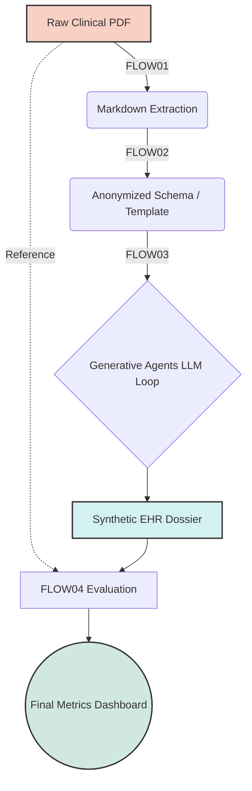

# 🚀 Generative Agent-Assisted Synthetic Health Data Generation (SHDG) on UbiOps

## 📖 1. Project Summary: The SHDG Repository
This project is an enterprise-scale MLOps adaptation of the research repository: **[Privacy-, Linguistic-, and Information-Preserving Synthesis of Clinical Documentation through Generative Agents](https://github.com/HR-DataLab-Healthcare/RESEARCH_SUPPORT/tree/main/PROJECTS/Generative_Agent_based_Data-Synthesis)**. 

The original repository introduces a methodology for generating highly realistic Synthetic Electronic Health Records (EHRs). By utilizing Multi-Agent Large Language Models (Generative Agents), the system can ingest real clinical notes, completely strip them of Protected Health Information (PHI), and synthesize novel patient trajectories that perfectly mimic the structural, semantic, and linguistic characteristics of the original dataset. This allows researchers to share and analyze clinical data safely without violating HIPAA or GDPR regulations.

---

## 🔄 2. GA-Assisted SHDG Workflow Overview

Based directly on the project's **[GA-assisted SHDG Workflow State Diagram](https://github.com/HR-DataLab-Healthcare/RESEARCH_SUPPORT/tree/main/PROJECTS/Generative_Agent_based_Data-Synthesis#ga-assisted-shdg-workflow-click-to-view-statediagram)**, the methodology operates in four distinct, sequential computational stages. 

When migrating this methodology to **UbiOps**, we map these workflows directly onto containerized microservices (**Deployments**) to build a secure, automated Directed Acyclic Graph (DAG) Pipeline:

1. **FLOW01 (Ingestion & Parsing):** Translates raw semi-structured clinical PDFs into structured Markdown templates.
2. **FLOW02 (Pseudonymization):** A privacy-preserving NER module that scrubs residual identifiers (names, dates, locations) to produce a generalized, safe schema.
3. **FLOW03 (GA Collaborative Synthesis):** An LLM orchestrator where Generative Agents populate the scrubbed schema with high-fidelity synthetic clinical narratives.
4. **FLOW04 (Evaluation Framework):** Benchmarks the generated synthetic dossiers against the original inputs to quantify structural alignment, privacy leakage risk, and semantic distance.



---

## 🛠 3. UbiOps Migration Guide & Python Source Code

As a Data Scientist, you are likely comfortable experimenting in Jupyter Notebooks. However, scaling these workflows, managing dependencies, and securing API keys requires a robust MLOps platform. UbiOps allows you to turn your Python code into containerized microservices and chain them together.

In UbiOps, every Deployment requires a `requirements.txt` and a `deployment.py` file.

### A. Migrate `FLOW01 + FLOW02` (Ingestion & Privacy Masking)
This deployment handles the raw PDF ingestion and applies NLP logic to strip Protected Health Information (PHI).

**`requirements.txt`**
```text
pdfplumber==0.10.2
spacy==3.7.2
en_core_sci_sm @ https://s3-us-west-2.amazonaws.com/ai2-s2-scispacy/releases/v0.5.1/en_core_sci_sm-0.5.1.tar.gz
```

**`deployment.py`**
```python
import os
import pdfplumber
import spacy

class Deployment:
    def __init__(self, base_directory, context):
        # ⚡ Cold Start: Load your NLP models once when the container boots
        print("Loading NLP Anonymization models...")
        self.nlp = spacy.load("en_core_sci_sm")

    def request(self, data):
        pdf_path = data["clinical_pdf"]
        
        # FLOW01: Extract Text
        extracted_text = ""
        with pdfplumber.open(pdf_path) as pdf:
            for page in pdf.pages:
                extracted_text += page.extract_text() + "\n"
                
        # FLOW02: De-identification via NER
        doc = self.nlp(extracted_text)
        anonymized_text = extracted_text
        for ent in doc.ents:
            anonymized_text = anonymized_text.replace(ent.text, f"[REDACTED_{ent.label_}]")
            
        output_path = os.path.join(os.getcwd(), "anonymized_output.md")
        with open(output_path, "w", encoding="utf-8") as f:
            f.write(anonymized_text)
            
        return {"anonymized_markdown": output_path}
```

### B. Migrate `FLOW03` (GA-Assisted Synthesis)
This deployment acts as the LLM orchestrator. Ensure your `OPENAI_API_KEY` is added to UbiOps Environment Variables.

**`requirements.txt`**
```text
openai==1.12.0
langchain==0.1.0
```

**`deployment.py`**
```python
import os
from openai import OpenAI

class Deployment:
    def __init__(self, base_directory, context):
        # ⚡ Securely initialize OpenAI Client using UbiOps env vars
        self.client = OpenAI(api_key=os.environ.get("OPENAI_API_KEY"))

    def request(self, data):
        input_md_path = data["anonymized_markdown"]
        with open(input_md_path, "r", encoding="utf-8") as f:
            template_context = f.read()
            
        # FLOW03: Generative Agent Prompting
        system_prompt = "You are a clinical synthesis agent. Generate a synthetic, highly realistic patient dossier based strictly on the structure provided."
        
        response = self.client.chat.completions.create(
            model="gpt-4-turbo",
            messages=[
                {"role": "system", "content": system_prompt},
                {"role": "user", "content": template_context}
            ],
            temperature=0.7
        )
        
        synthetic_data = response.choices[0].message.content
        output_path = os.path.join(os.getcwd(), "synthetic_dossier.md")
        
        with open(output_path, "w", encoding="utf-8") as f:
            f.write(synthetic_data)
            
        return {"synthetic_document": output_path}
```

### C. Migrate `FLOW04` (Evaluator Framework)
Evaluates structural and semantic fidelity between the real inputs and synthetic outputs.

**`requirements.txt`**
```text
scikit-learn==1.4.0
```

**`deployment.py`**
```python
import os
from sklearn.feature_extraction.text import TfidfVectorizer
from sklearn.metrics.pairwise import cosine_similarity

class Deployment:
    def __init__(self, base_directory, context):
        pass

    def request(self, data):
        with open(data["real_document"], "r") as f:
            real_text = f.read()
        with open(data["synthetic_document"], "r") as f:
            synth_text = f.read()
            
        # FLOW04: Compute Similarity Score
        vectorizer = TfidfVectorizer()
        tfidf_matrix = vectorizer.fit_transform([real_text, synth_text])
        similarity_score = cosine_similarity(tfidf_matrix[0:1], tfidf_matrix[1:2])[0][0]
        
        metrics = {
            "cosine_similarity": float(similarity_score),
            "privacy_preservation_status": "PASS" if similarity_score < 0.98 else "FAIL (Data Leakage Risk)"
        }
        
        return {"evaluation_metrics": metrics}
```

---

## 🔗 4. Assembling and Executing the UbiOps Pipeline

Once your deployments are active, stitch them together via the UbiOps Web UI (Pipelines -> Create Pipeline):

1. **Map the DAG Connections:**
   * `pipeline_input_pdf` ➡️ `flow01-02-ingest-anonymize` (`clinical_pdf`).
   * `pipeline_input_pdf` ➡️ `flow04-evaluator` (`real_document`). 
   * `flow01-02-ingest-anonymize` (`anonymized_markdown`) ➡️ `flow03-ga-synthesis` (`anonymized_markdown`).
   * `flow03-ga-synthesis` (`synthetic_document`) ➡️ `flow04-evaluator` (`synthetic_document`).

You can now securely trigger the multi-agent execution pipeline directly via the Python SDK without local GPU requirements:

```python
import ubiops

api = ubiops.CoreApi(ubiops.ApiClient(ubiops.Configuration(api_key={'Authorization': 'Token YOUR_UBIOPS_TOKEN'})))

# Upload Raw Patient Record
file_uri = api.files_upload(project_name="shdg-project", file="path/to/real_patient_record.pdf")

# Execute Full Automated Pipeline
result = api.pipeline_requests_create(
    project_name="shdg-project",
    pipeline_name="shdg-pipeline",
    data={"pipeline_input_pdf": file_uri.file}
)

print(result.result['evaluation_metrics'])
```
