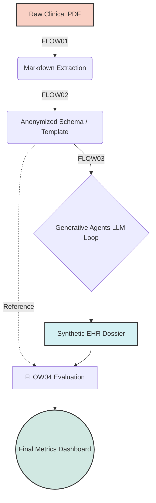
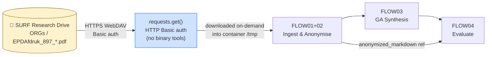
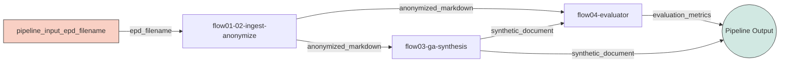

# 🚀 Generative Agent-Assisted Synthetic Health Data Generation (SHDG) on UbiOps

## 📖 1. Project Summary: The SHDG Repository
This project is an enterprise-scale MLOps adaptation of the research repository: **[Privacy-, Linguistic-, and Information-Preserving Synthesis of Clinical Documentation through Generative Agents](https://github.com/HR-DataLab-Healthcare/RESEARCH_SUPPORT/tree/main/PROJECTS/Generative_Agent_based_Data-Synthesis)**. 

The original repository introduces a methodology for generating highly realistic Synthetic Electronic Health Records (EHRs). By utilizing Multi-Agent Large Language Models (Generative Agents), the system can ingest real clinical notes, completely strip them of Protected Health Information (PHI), and synthesize novel patient trajectories that perfectly mimic the structural, semantic, and linguistic characteristics of the original dataset. This allows researchers to share and analyze clinical data safely without violating HIPAA or GDPR regulations.

The original prototype source for the ingestion and anonymization stage is also available as **[FLOW01+FLOW02.ipynb](https://github.com/HR-DataLab-Healthcare/RESEARCH_SUPPORT/blob/main/PROJECTS/Generative_Agent_based_Data-Synthesis/CODE/FLOW01%2BFLOW02.ipynb)**.

---

## 🔄 2. GA-Assisted SHDG Workflow Overview

Based directly on the project's **[GA-assisted SHDG Workflow State Diagram](https://github.com/HR-DataLab-Healthcare/RESEARCH_SUPPORT/tree/main/PROJECTS/Generative_Agent_based_Data-Synthesis#ga-assisted-shdg-workflow-click-to-view-statediagram)**, the methodology operates in four distinct, sequential computational stages. 

When migrating this methodology to **UbiOps**, we map these workflows directly onto containerized microservices (**Deployments**) to build a secure, automated Directed Acyclic Graph (DAG) Pipeline:

1. **FLOW01 (Ingestion & Parsing):** Translates raw semi-structured clinical PDFs into structured Markdown templates.
2. **FLOW02 (Pseudonymization):** In the current UbiOps implementation, a lightweight rule-based PHI masker scrubs direct identifiers such as names, DOBs, email addresses, and structured contact fields while preserving the clinical content.
3. **FLOW03 (GA Collaborative Synthesis):** An LLM orchestrator where Generative Agents populate the scrubbed schema with high-fidelity synthetic clinical narratives.
4. **FLOW04 (Evaluation Framework):** Benchmarks the generated synthetic dossiers against the anonymized reference produced by FLOW01+02 to quantify structural alignment, privacy leakage risk, and semantic distance.



---

## � 3. Data Warehouse: Raw Clinical EHR Input (SURF Research Drive)

The raw input data for this pipeline consists of **Electronic Patient Dossiers (EPD)** stored as PDF files on the **SURF Research Drive** — the national research storage infrastructure provided by SURF to Dutch universities and research institutions.

### 3.1 Dataset Location

| Property | Value |
|---|---|
| **Platform** | SURF Research Drive (Nextcloud) — `hr.data.surf.nl` |
| **Project folder** | `HR-DATALAB-HEALTHCARE (Projectfolder)` |
| **Path** | `UbiOps_2026 / LR_EPDs / ORGs` |
| **Files** | 13 × `EPDAfdruk_897_*.pdf` (80–120 KB each; 1.2 MB total) |
| **Share link** | [https://hr.data.surf.nl/s/AYp3KSd6EqMjNkG](https://hr.data.surf.nl/s/AYp3KSd6EqMjNkG) *(password-protected)* |
| **Last modified** | March 2025 |

> ⚠️ **Privacy & Security:** These files contain real clinical records and are protected under GDPR. The share link requires a password. Do **not** commit these files to any public repository, upload them to public cloud storage, or include them in any UbiOps deployment package. They are pipeline **inputs only**.

---

### 3.2 Accessing the Data — Option A: Web Browser Download (manual fallback)

1. Open [https://hr.data.surf.nl/s/AYp3KSd6EqMjNkG](https://hr.data.surf.nl/s/AYp3KSd6EqMjNkG) in your browser.
2. Enter the share password when prompted.
3. Select all 13 `EPDAfdruk_897_*.pdf` files → click **Download** → saves as a `.zip`.
4. Extract locally to a working folder, e.g. `D:\data\LR_EPDs\ORGs\`.

> Use this option only for occasional one-off access. For repeated or automated access use Option B or C below.

---

### 3.3 Accessing the Data — Option B: rclone Virtual Mount on Windows (local development)

> **Reference:** [HR-DataLab-Healthcare/RESEARCH_SUPPORT — RCLONE guide](https://github.com/HR-DataLab-Healthcare/RESEARCH_SUPPORT/tree/main/PROJECTS/RCLONE)
> **Status: ✅ Verified and working** (tested 30 May 2026 on `PROMET02` / Windows 11 Education 25H2)

Using **rclone** with **WinFsp**, the `ORGs` subfolder on SURF Research Drive is mounted directly as Windows drive letter `X:`. **No files are physically copied** — each PDF is streamed on demand over WebDAV. The 13 EPD files appear in File Explorer and are accessible from Python exactly like local files.

---

#### B.1 Prerequisites — install rclone and WinFsp

Both tools must be present before a mount is possible.

```powershell
# Step 1a: Install rclone (the sync/mount engine)
# rclone is available via Chocolatey, winget, or direct download.
# On this machine it is installed at: C:\ProgramData\chocolatey\bin\rclone.exe (v1.71.2)
choco install rclone -y          # via Chocolatey (recommended)
# -- OR --
winget install Rclone.Rclone     # via winget

# Step 1b: Verify
rclone version
# Expected: rclone v1.71.x  ...  go/tags: cmount

# Step 2: Install WinFsp — the Windows filesystem driver that rclone uses
# to expose any remote as a real drive letter.
# On this machine it is installed at: C:\Program Files (x86)\WinFsp\
choco install winfsp -y
# -- OR -- download the installer from: https://winfsp.dev/rel/
```

> **Verify WinFsp is installed:** open Registry Editor and check that the key
> `HKLM\SOFTWARE\WinFsp` exists, or run:
> ```powershell
> Get-ItemProperty "HKLM:\SOFTWARE\WinFsp" | Select-Object InstallDir
> # Expected: C:\Program Files (x86)\WinFsp\
> ```

---

#### B.2 Configure the `[RD]` rclone remote (personal SURF account)

rclone stores all remote definitions in a single config file. On Windows its location is:

```
C:\Users\<username>\AppData\Roaming\rclone\rclone.conf
```

Find the path on any machine with:
```powershell
rclone config file
# Prints: Configuration file is stored at: C:\Users\PROMET02\AppData\Roaming\rclone\rclone.conf
```

The config already contains an `[RD]` remote for the **personal** SURF Research Drive account. This is what enables access to the `HR-DATALAB-HEALTHCARE (Projectfolder)` project tree (which is not publicly shared — it lives under your own account):

```ini
# C:\Users\PROMET02\AppData\Roaming\rclone\rclone.conf

[RD]
type   = webdav
url    = https://hr.data.surf.nl/remote.php/dav/files/Willi@hro.nl
vendor = nextcloud
user   = Willi@hro.nl
pass   = <obscured — stored by rclone, never plain text>
```

**Key points about this config:**
- `type = webdav` — SURF Research Drive (Nextcloud) speaks the WebDAV protocol.
- `url` — the personal WebDAV root for the user `Willi@hro.nl`. Every folder you own or have been shared appears here.
- `vendor = nextcloud` — tells rclone to use Nextcloud-specific chunking and locking behaviour.
- `user` — your SURF Research Drive login name (typically `Firstname@institution.nl`).
- `pass` — stored in rclone's **obscured** format (not encrypted, but not plain text). It is **not** your Google SSO password — it is a dedicated **WebDAV app password** generated in the SURF portal (see below).

**If the `[RD]` remote does not yet exist**, create it interactively:
```powershell
rclone config
# Choose: n (new remote) → name: RD → type: webdav
# url: https://hr.data.surf.nl/remote.php/dav/files/YOUR_SURF_USERNAME
# vendor: nextcloud
# user: YOUR_SURF_USERNAME  (e.g. Willi@hro.nl)
# password: <generate an app password — see below>
```

**Generating a WebDAV app password** (required because Google SSO does not work for WebDAV):
1. Log in to [hr.data.surf.nl](https://hr.data.surf.nl) via your browser.
2. Click your **avatar** (top-right) → **Personal settings** → **Security** tab.
3. Under **App passwords** → type a name (e.g., `rclone`) → click **Create new app password**.
4. Copy the password shown — it is only displayed once.
5. Pass this password to `rclone config` (or run `rclone config update RD pass <obscured>` after generating it with `rclone obscure YOUR_APP_PASSWORD`).

**Test the connection:**
```powershell
# List the LR_EPDs subfolders to confirm authentication works
rclone lsd "RD:HR-DATALAB-HEALTHCARE (Projectfolder)/UbiOps_2026/LR_EPDs"
# Expected output:
#   -1 2026-05-30 ...  EXTRA
#   -1 2026-05-30 ...  ORGs
#   -1 2026-05-30 ...  TEST
```

---

#### B.3 Mount the `ORGs` folder as drive letter `X:`

The mount command points rclone at the exact subfolder containing the EPD files, so `X:\` shows **only** the 13 PDFs — not the entire Research Drive tree.

**One-liner (ad hoc, foreground — blocks the terminal):**
```powershell
rclone mount "RD:HR-DATALAB-HEALTHCARE (Projectfolder)/UbiOps_2026/LR_EPDs/ORGs" X: `
  --vfs-cache-mode full `
  --vfs-cache-max-age 24h `
  --links
# Press Ctrl+C to unmount
```

**Flag explanations:**
| Flag | Effect |
|---|---|
| `--vfs-cache-mode full` | Reads are cached locally in `%TEMP%\rclone\vfs\` on first access, then served from cache. Required for PDF random-access (pdfplumber seeks within files). |
| `--vfs-cache-max-age 24h` | Cached files are evicted after 24 hours, ensuring you always get a fresh copy next day. |
| `--links` | Allows rclone to follow symbolic links on the remote side. |
| `--no-console` | (used in the .bat below) Suppresses the rclone terminal window when launched silently. |

**Verify the mount immediately after running:**
```powershell
Get-ChildItem X:\ | Select-Object Name, Length, LastWriteTime
```
Expected — all 13 EPDs visible with their sizes and March 2025 timestamps:
```
Name                    Length LastWriteTime
----                    ------ -------------
EPDAfdruk_897_59037.pdf 112138 3/26/2025 1:24:42 PM
EPDAfdruk_897_59684.pdf 100735 3/26/2025 1:24:42 PM
EPDAfdruk_897_60038.pdf  87853 3/26/2025 1:24:42 PM
EPDAfdruk_897_60384.pdf  95232 3/26/2025 1:24:42 PM
EPDAfdruk_897_60818.pdf  93371 3/26/2025 1:24:42 PM
EPDAfdruk_897_61014.pdf 109457 3/26/2025 1:24:42 PM
EPDAfdruk_897_61368.pdf 112883 3/26/2025 1:24:42 PM
EPDAfdruk_897_61665.pdf  83845 3/26/2025 1:24:42 PM
EPDAfdruk_897_61810.pdf 122348 3/26/2025 1:24:42 PM
EPDAfdruk_897_62117.pdf  81579 3/26/2025 1:24:42 PM
EPDAfdruk_897_62177.pdf  94426 3/26/2025 1:24:42 PM
EPDAfdruk_897_62655.pdf  90800 3/26/2025 1:24:42 PM
EPDAfdruk_897_63175.pdf  88106 3/26/2025 1:24:42 PM
```

---

#### B.4 Persistent background mount — auto-start at Windows login

Running the mount interactively blocks a terminal window. The solution is a two-file pair: a `.bat` that holds the rclone command, and a `.vbs` wrapper that launches it completely silently (no console window). A shortcut to the `.vbs` in the Windows startup folder ensures `X:` is always available after login.

**Step 1 — Create `C:\Scripts\mount_shdg_orgs.bat`**

```bat
@echo off
REM ─────────────────────────────────────────────────────────────────────────
REM  mount_shdg_orgs.bat
REM  Mounts SURF Research Drive ORGs folder as drive X:
REM  Remote : [RD] in %APPDATA%\rclone\rclone.conf
REM  Source : HR-DATALAB-HEALTHCARE (Projectfolder)/UbiOps_2026/LR_EPDs/ORGs
REM  Target : X:\  (contains 13 × EPDAfdruk_897_*.pdf)
REM ─────────────────────────────────────────────────────────────────────────
rclone mount "RD:HR-DATALAB-HEALTHCARE (Projectfolder)/UbiOps_2026/LR_EPDs/ORGs" X: --vfs-cache-mode full --vfs-cache-max-age 24h --links --no-console
```

> Note: the `rclone mount` command must be on a **single line** in the `.bat` file. The `^` line-continuation character does not work reliably when the `.bat` is launched from a `.vbs` wrapper.

**Step 2 — Create `C:\Scripts\mount_shdg_orgs.vbs`**

The `.vbs` wrapper calls the `.bat` with `WindowStyle = 0` (hidden), so no console window flashes at login.

```vbs
' mount_shdg_orgs.vbs
' Silently launches mount_shdg_orgs.bat without showing a console window.
Set WinScriptHost = CreateObject("WScript.Shell")
WinScriptHost.Run Chr(34) & "C:\Scripts\mount_shdg_orgs.bat" & Chr(34), 0
Set WinScriptHost = Nothing
```

**Step 3 — Add a startup shortcut**

Run this once in PowerShell to register the mount at login:

```powershell
# Creates a .lnk shortcut in the user startup folder pointing to the VBS launcher
$startupFolder = [System.Environment]::GetFolderPath("Startup")
$shortcutPath   = Join-Path $startupFolder "Mount SURF SHDG ORGs.lnk"
$wsh            = New-Object -ComObject WScript.Shell
$shortcut       = $wsh.CreateShortcut($shortcutPath)
$shortcut.TargetPath = "C:\Scripts\mount_shdg_orgs.vbs"
$shortcut.Save()
Write-Host "Startup shortcut created at: $shortcutPath"
# Output: C:\Users\PROMET02\AppData\Roaming\Microsoft\Windows\Start Menu\Programs\Startup\Mount SURF SHDG ORGs.lnk
```

After this, `X:\` will be available automatically every time you log in to Windows — no terminal required.

**To unmount manually:**
```powershell
Get-Process rclone | Stop-Process -Force
# X: is released immediately
```

---

#### B.5 Using the mounted drive in Python (local development)

Once `X:` is mounted, read any EPD directly by path — no download, no upload, no credentials in code:

```python
import pdfplumber

# X:\ is the live SURF Research Drive ORGs folder
pdf_path = r"X:\EPDAfdruk_897_59037.pdf"

with pdfplumber.open(pdf_path) as pdf:
    for page in pdf.pages:
        print(page.extract_text())
```

To iterate over all 13 files:
```python
from pathlib import Path

epd_dir = Path(r"X:\\")
for pdf_file in sorted(epd_dir.glob("EPDAfdruk_897_*.pdf")):
    with pdfplumber.open(pdf_file) as pdf:
        text = "\n".join(p.extract_text() or "" for p in pdf.pages)
    print(f"{pdf_file.name}: {len(text)} chars")
```

Add a shortcut to `mount_surf_shdg_orgs.vbs` in `shell:startup` to mount automatically at login.

---

### 3.4 Accessing the Data — Option C: HTTP Download inside the UbiOps Container (production)

UbiOps deployments run as **Linux Docker containers** with **no outbound package manager access** during `__init__` (curl, apt, and pip installs of system binaries are all blocked). The correct approach is to use the **Python `requests` library** — which is already installed as part of the deployment's `requirements.txt` — to download individual PDFs on demand over HTTPS using Nextcloud's public share WebDAV endpoint.

> **Lesson learned (May 2026):** Three approaches were tried and failed: (1) `curl | bash` rclone installer → exit code 4 (curl blocked); (2) `apt-get install rclone` → exit code 100 (apt blocked); (3) bundled rclone binary + `rclone copyto` → exit code 1 (PROPFIND metadata call fails on the public share endpoint). The `requests.get()` approach below works because it uses a single direct HTTP GET with Basic auth — no handshake overhead, no vendor quirks.

This is the recommended approach for the `flow01-02-ingest-anonymize` deployment.

#### C.1 Add to `requirements.txt`

```text
pdfplumber==0.10.2
requests>=2.28.0
```

> **Revision note (rev12):** The working UbiOps package `flow01-02-v1-rev12.zip` removed `spacy` and `scispacy`. The earlier biomedical NER approach over-redacted normal clinical content and produced unusable Markdown. The current implementation uses deterministic regex-based PHI masking instead, which is lighter to build and preserves the medical narrative.

`requests` is the only extra dependency needed for SURF access, and `pdfplumber` is used for PDF text extraction — no system binaries, no rclone, no model downloads.

#### C.2 UbiOps Environment Variables to set

| Key | Value | Secret? |
|---|---|---|
| `SURF_SHARE_TOKEN` | `AYp3KSd6EqMjNkG` | No |
| `SURF_SHARE_PASSWORD` | `<share password>` | **Yes** |

> Set these in the UbiOps version editor under **Environment variables**. The `deployment.py` reads them at runtime — the password is never stored in code or logs.

#### C.3 How the HTTP download works

The `_fetch_from_research_drive` method in `deployment.py` calls:

```python
requests.get(
    f"https://hr.data.surf.nl/public.php/webdav/{filename}",
    auth=(share_token, share_password),   # Basic auth: share-ID as username
    stream=True, timeout=120
)
```

Nextcloud authenticates public share WebDAV with **HTTP Basic auth** where:
- **username** = the share token (the ID in the share URL, e.g. `AYp3KSd6EqMjNkG`)
- **password** = the share password set on the folder

No binary tools, no config files, no network-installed packages — just HTTPS. See the full `deployment.py` in **§4-A**.

---

### 3.5 Role in the SHDG Pipeline

These files are the **raw input** to **FLOW01**. Each `EPDAfdruk_897_*.pdf` is one complete longitudinal patient dossier. In the working `rev12` container approach, files remain on Research Drive and are fetched into the UbiOps container only when a deployment request is triggered:



When running the deployment or pipeline (§6), pass the **filename** of the EPD as a string input. The container fetches it from Research Drive at runtime via HTTPS. To process all 13 files in batch, loop over the filename list using the Python SDK (see §6).

---

## 🛠 4. UbiOps Migration Guide & Python Source Code

As a Data Scientist, you are likely comfortable experimenting in Jupyter Notebooks. However, scaling these workflows, managing dependencies, and securing API keys requires a robust MLOps platform. UbiOps allows you to turn your Python code into containerized microservices and chain them together.

In UbiOps, every Deployment requires a `requirements.txt` and a `deployment.py` file.

### A. Migrate `FLOW01 + FLOW02` (Ingestion & Privacy Masking)
This deployment handles raw PDF ingestion and applies deterministic PHI masking to strip direct identifiers while keeping the clinical text readable.

Files are **fetched directly from SURF Research Drive via HTTPS** at request time using the Python `requests` library — no binary tools required, no files permanently stored in UbiOps storage. See §3.4-C for the environment variables to configure.

> **Working package:** `flow01-02-v1-rev12.zip` is the currently verified package for UbiOps. It built successfully and completed a live request on 31 May 2026.

> **Original research prototype:** [FLOW01+FLOW02.ipynb](https://github.com/HR-DataLab-Healthcare/RESEARCH_SUPPORT/blob/main/PROJECTS/Generative_Agent_based_Data-Synthesis/CODE/FLOW01%2BFLOW02.ipynb)

**`requirements.txt`**
```text
pdfplumber==0.10.2
requests>=2.28.0
```

> **Implementation note:** `rev12` intentionally removes `spacy` and `scispacy`. The earlier biomedical NER model (`en_core_sci_sm`) redacted too much normal clinical language and did not produce valid anonymized documents.

**`deployment.py`**
```python
import os
import re
import tempfile
import requests
import pdfplumber

WEBDAV_URL = "https://hr.data.surf.nl/public.php/webdav/"

HEADER_NAME_DOB_PATTERN = re.compile(
    r"^\s*([^\n()]{2,120}?)\s*\((\d{1,2}[-/]\d{1,2}[-/]\d{2,4})\)\s*$"
)
NAME_FIELD_PATTERN = re.compile(
    r"^(\s*(?:Naam|Pati(?:ent|\xebnt)(?:naam)?)\s*:?\s*)(.+?)\s*$",
    re.IGNORECASE,
)
PERSON_ROLE_FIELD_PATTERN = re.compile(
    r"^(\s*(?:Verwijzer|Huisarts|Behandelaar|Specialist|Contactpersoon|Zorgverlener)\s*:?\s*)([^,\n]+?)(\s*,.*)?\s*$",
    re.IGNORECASE,
)
BIRTH_INLINE_PATTERN = re.compile(
    r"\b((?:Geboortedatum|Geb\.?\s*datum|geboren\s+op|geb\.?\s*)\s*:?\s*)(\d{1,2}[-/]\d{1,2}[-/]\d{2,4})",
    re.IGNORECASE,
)
EMAIL_PATTERN = re.compile(
    r"\b[A-Z0-9._%+-]+@[A-Z0-9.-]+\.[A-Z]{2,}\b",
    re.IGNORECASE,
)
TITLE_NAME_PATTERN = re.compile(
    r"\b(Dhr\.|Mevr\.|Mw\.|Dr\.|Prof\.)\s+([A-Z][A-Za-z.'-]+(?:\s+(?:van|de|den|der|ter|te|[A-Z][A-Za-z.'-]+))*)"
)
FIELD_PATTERNS = [
    (
        re.compile(r"^(\s*(?:BSN|BurgerServiceNummer)\s*:?\s*)(.+?)\s*$", re.IGNORECASE),
        "[REDACTED_BSN]",
    ),
    (
        re.compile(r"^(\s*(?:Telefoon|Telefoonnummer|Mobiel|Tel\.?)\s*:?\s*)(.+?)\s*$", re.IGNORECASE),
        "[REDACTED_PHONE]",
    ),
    (
        re.compile(r"^(\s*(?:E-mail|Email)\s*:?\s*)(.+?)\s*$", re.IGNORECASE),
        "[REDACTED_EMAIL]",
    ),
    (
        re.compile(r"^(\s*(?:Adres|Straat|Huisnummer|Postcode|Woonplaats)\s*:?\s*)(.+?)\s*$", re.IGNORECASE),
        "[REDACTED_ADDRESS]",
    ),
]


def _looks_like_person_name(value: str) -> bool:
    candidate = value.strip(" ,;:-")
    if not candidate or len(candidate) > 120:
        return False
    if any(char.isdigit() for char in candidate):
        return False
    tokens = [token for token in candidate.split() if token]
    if not 1 <= len(tokens) <= 8:
        return False
    return any(token[0].isupper() for token in tokens if token[0].isalpha()) or "." in candidate


def _replace_exact_values(text: str, values: set[str], replacement: str) -> str:
    for value in sorted({value.strip() for value in values if value and value.strip()}, key=len, reverse=True):
        text = text.replace(value, replacement)
    return text


def _redact_sensitive_text(text: str) -> str:
    discovered_names: set[str] = set()
    discovered_birth_dates: set[str] = set()
    redacted_lines = []

    def replace_titled_name(match: re.Match[str]) -> str:
        name = match.group(2).strip()
        if _looks_like_person_name(name):
            discovered_names.add(name)
        return f"{match.group(1)} [REDACTED_PERSON]"

    for line in text.splitlines(keepends=True):
        if line.endswith("\r\n"):
            core = line[:-2]
            newline = "\r\n"
        elif line.endswith("\n"):
            core = line[:-1]
            newline = "\n"
        else:
            core = line
            newline = ""

        match = HEADER_NAME_DOB_PATTERN.match(core)
        if match:
            name = match.group(1).strip()
            birth_date = match.group(2)
            if _looks_like_person_name(name):
                discovered_names.add(name)
            discovered_birth_dates.add(birth_date)
            redacted_lines.append(f"[REDACTED_PERSON] ([REDACTED_DOB]){newline}")
            continue

        match = NAME_FIELD_PATTERN.match(core)
        if match:
            name = match.group(2).strip()
            if _looks_like_person_name(name):
                discovered_names.add(name)
            redacted_lines.append(f"{match.group(1)}[REDACTED_PERSON]{newline}")
            continue

        match = PERSON_ROLE_FIELD_PATTERN.match(core)
        if match:
            person = match.group(2).strip()
            if _looks_like_person_name(person):
                discovered_names.add(person)
            suffix = match.group(3) or ""
            redacted_lines.append(f"{match.group(1)}[REDACTED_PERSON]{suffix}{newline}")
            continue

        replaced_field = False
        for pattern, placeholder in FIELD_PATTERNS:
            match = pattern.match(core)
            if match:
                redacted_lines.append(f"{match.group(1)}{placeholder}{newline}")
                replaced_field = True
                break
        if replaced_field:
            continue

        for _, birth_date in BIRTH_INLINE_PATTERN.findall(core):
            discovered_birth_dates.add(birth_date)

        redacted_core = BIRTH_INLINE_PATTERN.sub(lambda match: f"{match.group(1)}[REDACTED_DOB]", core)
        redacted_core = EMAIL_PATTERN.sub("[REDACTED_EMAIL]", redacted_core)
        redacted_core = TITLE_NAME_PATTERN.sub(replace_titled_name, redacted_core)
        redacted_lines.append(f"{redacted_core}{newline}")

    result = "".join(redacted_lines)
    result = _replace_exact_values(result, discovered_names, "[REDACTED_PERSON]")
    result = _replace_exact_values(result, discovered_birth_dates, "[REDACTED_DOB]")
    return result

class Deployment:
    def __init__(self, base_directory, context):
        # Read SURF share credentials from UbiOps environment variables
        self.share_token    = os.environ["SURF_SHARE_TOKEN"]
        self.share_password = os.environ["SURF_SHARE_PASSWORD"]

    def _fetch_from_research_drive(self, filename: str, dest_dir: str) -> str:
        """Download a single EPD PDF from SURF Research Drive via WebDAV HTTP."""
        dest_path = os.path.join(dest_dir, filename)
        url = f"{WEBDAV_URL}{filename}"
        response = requests.get(
            url,
            auth=(self.share_token, self.share_password),
            timeout=120,
            stream=True,
        )
        if response.status_code != 200:
            raise RuntimeError(
                f"Failed to fetch {filename} from SURF Research Drive: "
                f"HTTP {response.status_code} — {response.text[:500]}"
            )
        with open(dest_path, "wb") as f:
            for chunk in response.iter_content(chunk_size=65536):
                f.write(chunk)
        return dest_path

    def request(self, data):
        epd_filename = data["epd_filename"]

        with tempfile.TemporaryDirectory() as tmp:
            # FLOW01: Fetch PDF on-demand from Research Drive
            pdf_path = self._fetch_from_research_drive(epd_filename, tmp)

            # FLOW01: Extract text
            extracted_text = ""
            with pdfplumber.open(pdf_path) as pdf:
                for page in pdf.pages:
                    page_text = page.extract_text() or ""
                    if page_text:
                        extracted_text += page_text + "\n"

        # FLOW02: Rule-based PHI redaction keeps clinical content intact while masking
        # names and direct identifiers found in structured EPD headers/fields.
        anonymized_text = _redact_sensitive_text(extracted_text)

        output_path = os.path.join(os.getcwd(), "anonymized_output.md")
        with open(output_path, "w", encoding="utf-8") as f:
            f.write(anonymized_text)

        return {"anonymized_markdown": output_path}
```

> **Working status (31 May 2026):** Deployment `flow01-02-ingest-anonymize` version `v1`, uploaded from `flow01-02-v1-rev12.zip`, built successfully and completed a test request using `EPDAfdruk_897_59037.pdf`.

> **Input field change:** The deployment takes `epd_filename` (Type: **String**) instead of `clinical_pdf` (Type: File). Update the deployment input definition in the UbiOps UI accordingly (§5 step 4).

### B. Migrate `FLOW03` (GA-Assisted Synthesis)
This deployment acts as the LLM orchestrator. Ensure your `OPENAI_API_KEY` is added to UbiOps Environment Variables.

**`requirements.txt`**
```text
openai==1.12.0
langchain==0.1.0
```

**`deployment.py`**
```python
import os
from openai import OpenAI

class Deployment:
    def __init__(self, base_directory, context):
        # ⚡ Securely initialize OpenAI Client using UbiOps env vars
        self.client = OpenAI(api_key=os.environ.get("OPENAI_API_KEY"))

    def request(self, data):
        input_md_path = data["anonymized_markdown"]
        with open(input_md_path, "r", encoding="utf-8") as f:
            template_context = f.read()
            
        # FLOW03: Generative Agent Prompting
        system_prompt = "You are a clinical synthesis agent. Generate a synthetic, highly realistic patient dossier based strictly on the structure provided."
        
        response = self.client.chat.completions.create(
            model="gpt-4-turbo",
            messages=[
                {"role": "system", "content": system_prompt},
                {"role": "user", "content": template_context}
            ],
            temperature=0.7
        )
        
        synthetic_data = response.choices[0].message.content
        output_path = os.path.join(os.getcwd(), "synthetic_dossier.md")
        
        with open(output_path, "w", encoding="utf-8") as f:
            f.write(synthetic_data)
            
        return {"synthetic_document": output_path}
```

### C. Migrate `FLOW04` (Evaluator Framework)
Evaluates structural and semantic fidelity between the anonymized reference produced by FLOW01+02 and the synthetic outputs.

**`requirements.txt`**
```text
scikit-learn==1.4.0
```

**`deployment.py`**
```python
import os
from sklearn.feature_extraction.text import TfidfVectorizer
from sklearn.metrics.pairwise import cosine_similarity

class Deployment:
    def __init__(self, base_directory, context):
        pass

    def request(self, data):
        with open(data["anonymized_markdown"], "r", encoding="utf-8") as f:
            reference_text = f.read()
        with open(data["synthetic_document"], "r", encoding="utf-8") as f:
            synth_text = f.read()
            
        # FLOW04: Compare the generated synthetic dossier against the anonymized
        # reference document produced upstream by FLOW01+02.
        vectorizer = TfidfVectorizer()
        tfidf_matrix = vectorizer.fit_transform([reference_text, synth_text])
        similarity_score = cosine_similarity(tfidf_matrix[0:1], tfidf_matrix[1:2])[0][0]
        
        metrics = {
            "cosine_similarity": float(similarity_score),
            "privacy_preservation_status": "PASS" if similarity_score < 0.98 else "FAIL (Data Leakage Risk)"
        }
        
        return {"evaluation_metrics": metrics}
```

---

## 🖱️ 5. Step-by-Step: Recreating Each Flow in UbiOps (Web UI)

> **Context:** On 22 May 2026, UbiOps product specialist Dene van Venrooij shared the following reference materials after the live demo. Use these alongside the steps below:
>
> | Resource | URL |
> | :--- | :--- |
> | Full Documentation | [docs.ubiops.com](https://docs.ubiops.com) |
> | Python Client Reference | [python-client.ubiops.com](https://python-client.ubiops.com) |
> | CLI Reference | [ubiops.com/docs/reference/cli](https://ubiops.com/docs/reference/cli/) |
> | Swagger / API Explorer | [ubiops.com/swagger](https://ubiops.com/swagger/) |
> | Deployment Tutorial | [ubiops.com/docs/deployments/](https://ubiops.com/docs/deployments/) *(the example from the demo)* |
> | Pipeline Tutorial | [ubiops.com/docs/pipelines/](https://ubiops.com/docs/pipelines/) *(data enrichment / annotation pipeline)* |
> | Services + vLLM Tutorial | [ubiops.com/docs/services/](https://ubiops.com/docs/services/) |
> | CI/CD (GitHub / GitLab) | [ubiops.com/docs/integrations/cicd](https://ubiops.com/docs/integrations/cicd/) |

---

### Prerequisites

Before touching the UbiOps UI, prepare the following on your local machine:

1. **UbiOps account** — create a free account at [app.ubiops.com](https://app.ubiops.com/) and create a project called `shdg-project`.

2. **Install the UbiOps CLI and Python SDK** — these are **two separate packages**:

   | Package | Purpose | Install command |
   |---|---|---|
   | `ubiops` | Python SDK — use in scripts/notebooks with `import ubiops` | `pip install ubiops` |
   | `ubiops-cli` | CLI tool — use in the terminal with `ubiops` commands | `pip install ubiops-cli` |

   ```powershell
   pip install ubiops ubiops-cli
   ubiops --version   # should print: UbiOps CLI, version 2.30.0
   ```

   > **Windows PATH note:** If `ubiops` is not found after install, add the conda env Scripts folder to your PATH for the current session:
   > ```powershell
   > $env:PATH = "C:\Users\PROMET02\anaconda3\envs\pubmed-env\Scripts;" + $env:PATH
   > ```

3. **Create an API token and sign in** — if your UbiOps account uses **Google SSO** (e.g., `@hr.nl`), the CLI cannot use email/password. You must use an API token:

   **Step A — Create the token in the Web UI:**
   1. Go to your project → **Project Admin** (left sidebar) → click to expand → **Permissions** → **API tokens** tab
   2. Click **Add token** → enter a name (e.g., `cli-token`) → click **Create**
   3. In the 3-step wizard: ① service user is created → ② click **Assign roles to user** → select `editor` → **Save** → ③ **copy the token string** (shown only once)

   **Step B — Sign in via CLI using the token:**
   ```powershell
   # Note: --token is a flag (no value); the actual token goes in -p with "Token " prefix
   ubiops signin --token -p "Token YOUR_TOKEN_STRING_HERE"
   ```

   Expected output:
   ```
   Welcome to UbiOps!
   Selected project: shdg-project
   ```

   **Alternative — set as environment variable** (works for both CLI and Python SDK, no signin needed):
   ```powershell
   $env:UBIOPS_API_TOKEN = "Token YOUR_TOKEN_STRING_HERE"
   ubiops projects list   # verify connection
   ```

4. **OpenAI API Key** — required for FLOW03.

5. **Local deployment packages** — for each flow, create a folder containing exactly two files: `deployment.py` and `requirements.txt`, then zip them:

   ```powershell
    # Recommended FLOW01+02 package for the final single-input baseline
    cd "D:\OneDrive - Hogeschool Rotterdam\1_CURRENT_DOCUMENTS\DATALAB_ALIGNMENT\UbiOps-NutaNix\DEPLOYMENT_CODE\flow01-02-ingest-anonymize"
    Compress-Archive -Path deployment.py, requirements.txt -DestinationPath flow01-02-v1-rev13.zip -Force

    # Prepared FLOW03 package (31 May 2026)
    cd "D:\OneDrive - Hogeschool Rotterdam\1_CURRENT_DOCUMENTS\DATALAB_ALIGNMENT\UbiOps-NutaNix\DEPLOYMENT_CODE\flow03-ga-synthesis"
    Compress-Archive -Path deployment.py, requirements.txt -DestinationPath flow03-ga-synthesis-v1.zip -Force

    # Prepared FLOW04 package (31 May 2026)
    cd "D:\OneDrive - Hogeschool Rotterdam\1_CURRENT_DOCUMENTS\DATALAB_ALIGNMENT\UbiOps-NutaNix\DEPLOYMENT_CODE\flow04-evaluator"
    Compress-Archive -Path deployment.py, requirements.txt -DestinationPath flow04-evaluator-v1.zip -Force
   ```

---

### FLOW01 + FLOW02 — Ingestion & Privacy Masking Deployment

**Responsible for:** Ingesting raw clinical PDFs → extracting text (FLOW01) → running deterministic PHI masking (FLOW02) → outputting an anonymised Markdown file.

| # | Action | Detail |
|---|--------|--------|
| 1 | Log in to UbiOps | Navigate to [app.ubiops.com](https://app.ubiops.com/) and open the project `shdg-project`. |
| 2 | Open Deployments | In the left sidebar click **Deployments** → **Create deployment**. |
| 3 | Fill in metadata | **Name:** `flow01-02-ingest-anonymize`  ·  **Description:** `PDF ingestion and PHI pseudonymization (FLOW01 + FLOW02)`  ·  **Input type:** Structured  ·  **Output type:** Structured. |
| 4 | Define Input fields | Add one field: `epd_filename` → Type: **String**. *(The deployment fetches the PDF from SURF Research Drive by filename at runtime — it does not accept a File upload.)* |
| 5 | Define Output fields | Add one field: `anonymized_markdown` → Type: **File**. |
| 6 | Click **Create** | The deployment is created; you are now on the Versions tab. |
| 7 | Click **Create version** | A form opens. Enter version name: `v1`. |
| 8 | Select deployment template | Under **Deployment template** choose **Python 3.10** from the dropdown. This is the base container image — it determines the Python runtime and pre-installed system libraries. Leave hardware as default (CPU). Set **Maximum instances** to `1` (the free/starter subscription enforces a hard limit of 1 — leaving the default higher will cause a *"maximum instances conflicts with the limit in the subscription"* error at create time). Click **Next** (or **Create** depending on UI step). |
| 9 | Upload deployment package | Upload the recommended package `flow01-02-v1-rev13.zip` (or an equivalent zip containing only `deployment.py` + `requirements.txt` from §4-A) under **Upload files**. UbiOps reads `requirements.txt` from the zip and installs all packages during the image build. |
| 10 | Set Environment Variables | Add two variables (required for the HTTPS connection to SURF Research Drive — see §3.4-C.2 and §3.4-C.3 for how these are used): **Key** `SURF_SHARE_TOKEN` → Value `AYp3KSd6EqMjNkG` (not secret; this is the share ID used as the WebDAV username) · **Key** `SURF_SHARE_PASSWORD` → Value `<share password>` → tick **Secret**. |
| 11 | Click **Create** | UbiOps builds the Docker image. Wait for the status indicator to turn **Available** (≈ 2–5 min). |
| 12 | Test the deployment | Click **Create request** → set `epd_filename` to `EPDAfdruk_897_59037.pdf` → click **Submit**. Verify that `anonymized_output.md` is returned. |

> **Versioning note:** `flow01-02-v1-rev13.zip` is the recommended package name for the final one-input pipeline baseline. Its code matches the verified `rev12` implementation; the rename is to keep the end-to-end baseline versioning clean.

> **Last executed proof:** `flow01-02-v1-rev12.zip` was successfully deployed as `flow01-02-ingest-anonymize` version `v1` and returned a valid `anonymized_output.md` on 31 May 2026.

> **Tip:** If the build fails, open the **Build logs** tab. With `rev12`, the most likely causes are a bad zip structure or missing `SURF_SHARE_TOKEN` / `SURF_SHARE_PASSWORD` variables rather than missing model wheels.

---

### FLOW03 — Generative Agent Synthesis Deployment

**Responsible for:** Consuming the anonymised Markdown template produced by FLOW02 and using GPT-4 Turbo (via multi-agent prompting) to generate a fully synthetic EHR dossier.

| # | Action | Detail |
|---|--------|--------|
| 1 | Open Deployments | Click **Deployments** → **Create deployment**. |
| 2 | Fill in metadata | **Name:** `flow03-ga-synthesis`  ·  **Description:** `LLM orchestrator — GA-assisted synthetic dossier generation (FLOW03)`. |
| 3 | Define Input fields | Add one field: `anonymized_markdown` → Type: **File**. |
| 4 | Define Output fields | Add one field: `synthetic_document` → Type: **File**. |
| 5 | Click **Create** | |
| 6 | Click **Create version** | A form opens. Enter version name: `v1`. |
| 7 | Select deployment template | Under **Deployment template** choose **Python 3.10**. Leave hardware as default (CPU). Set **Maximum instances** to `1` (subscription limit). Click **Next**. |
| 8 | Upload deployment package | Upload `flow03-ga-synthesis-v1.zip` (or an equivalent zip containing only `deployment.py` + `requirements.txt` from §4-B). |
| 9 | Add secret ENV variable | Open **Environment variables** → **Add variable**. Set **Key** to `OPENAI_API_KEY`, paste your key as **Value**, tick **Secret** (masks the value in logs). |
| 10 | Click **Create** | Wait for status **Available**. |
| 11 | Test the deployment | Click **Create request** → upload a sample anonymised Markdown file → click **Submit**. Verify that `synthetic_dossier.md` is returned and contains plausible clinical language. |

> **Security note:** Never hard-code the API key in `deployment.py`. The `os.environ.get("OPENAI_API_KEY")` pattern in the code fetches it from the UbiOps-managed secret at runtime.

> **Packaging status (31 May 2026):** `flow03-ga-synthesis-v1.zip` has been created locally from the current source files. Deployment in UbiOps is the next operational step.

---

### FLOW04 — Evaluation Framework Deployment

**Responsible for:** Comparing the anonymized reference document produced by FLOW01+02 with the generated synthetic dossier and returning a dictionary of fidelity and privacy-leakage metrics.

| # | Action | Detail |
|---|--------|--------|
| 1 | Open Deployments | Click **Deployments** → **Create deployment**. |
| 2 | Fill in metadata | **Name:** `flow04-evaluator`  ·  **Description:** `Structural & semantic benchmarking of synthetic vs. anonymized reference documents (FLOW04)`. |
| 3 | Define Input fields | Add **two** fields: `anonymized_markdown` → Type: **File**;  `synthetic_document` → Type: **File**. Both inputs must be readable text/Markdown files. |
| 4 | Define Output fields | Add one field: `evaluation_metrics` → Type: **Dictionary**. |
| 5 | Click **Create** | |
| 6 | Click **Create version** | A form opens. Enter version name: `v1`. |
| 7 | Select deployment template | Under **Deployment template** choose **Python 3.10**. Leave hardware as default (CPU). Set **Maximum instances** to `1` (subscription limit). Click **Next**. |
| 8 | Upload deployment package | Upload `flow04-evaluator-v1.zip` (or an equivalent zip containing only `deployment.py` + `requirements.txt` from §4-C). |
| 9 | Click **Create** | Wait for status **Available**. |
| 10 | Test the deployment | Click **Create request** → upload an anonymized Markdown file and a synthetic Markdown/text file → click **Submit**. Verify the returned dictionary contains `cosine_similarity` and `privacy_preservation_status`. |

> **Packaging status (31 May 2026):** `flow04-evaluator-v1.zip` has been created locally from the current source files. Deployment in UbiOps is the next operational step.

**Exact UbiOps Click-Path for FLOW04**

1. Open `app.ubiops.com` and select project `shdg-project`.
2. In the left sidebar, click `Deployments`.
3. Click `Create deployment`.
4. In the metadata form, enter `flow04-evaluator` as the name and keep `Structured` input/output.
5. Under `Input fields`, click `Add field` twice:
    First field: `anonymized_markdown` → `File`.
    Second field: `synthetic_document` → `File`.
6. Under `Output fields`, click `Add field` and create `evaluation_metrics` → `Dictionary`.
7. Click `Create` to open the deployment details page.
8. On the `Versions` tab, click `Create version`.
9. Enter version name `v1`.
10. Under `Deployment template`, select `Python 3.10`.
11. Keep hardware on default CPU and set `Maximum instances` to `1`.
12. Click `Next`.
13. On the files step, upload `flow04-evaluator-v1.zip`.
14. Click `Create`.
15. Wait until the version status becomes `Available`.
16. Click `Create request` and test with one anonymized Markdown file plus one synthetic Markdown file.

---

### FLOW01–04 — Assembling the UbiOps Pipeline

Once all three Deployments are **Available**, wire them into a single Pipeline (DAG). The pipeline is now truly single-input: FLOW01+02 takes the `epd_filename`, produces `anonymized_markdown`, and that same artifact is fanned out to both FLOW03 and FLOW04.

| # | Action | Detail |
|---|--------|--------|
| 1 | Open Pipelines | In the left sidebar click **Pipelines** → **Create pipeline**. |
| 2 | Fill in metadata | **Name:** `shdg-pipeline`  ·  **Description:** `SHDG workflow: EPD filename → Anonymise → Synthesise → Evaluate`. |
| 3 | Define Pipeline Input | Add one field: `pipeline_input_epd_filename` → Type: **String**. Click **Create**. |
| 4 | Open the Pipeline Editor | Click the newly created pipeline → **Create version** → name it `v1` → **Create** → the visual DAG editor opens. |
| 5 | Add Deployment Objects | Click **+** (Add object) → **Deployment** three times, selecting `flow01-02-ingest-anonymize`, `flow03-ga-synthesis`, and `flow04-evaluator` (each at version `v1`). |
| 6 | Connect FLOW01+02 input | Drag from the **Pipeline Input** node (`pipeline_input_epd_filename`) → `flow01-02-ingest-anonymize` input port (`epd_filename`). |
| 7 | Connect FLOW03 | Drag from `flow01-02-ingest-anonymize` output port (`anonymized_markdown`) → `flow03-ga-synthesis` input port (`anonymized_markdown`). |
| 8 | Connect FLOW04 (reference) | Drag from `flow01-02-ingest-anonymize` output port (`anonymized_markdown`) → `flow04-evaluator` input port (`anonymized_markdown`). |
| 9 | Connect FLOW04 (synthetic) | Drag from `flow03-ga-synthesis` output port (`synthetic_document`) → `flow04-evaluator` input port (`synthetic_document`). |
| 10 | Define Pipeline Output | Click **+ Add output** → map `flow04-evaluator` → `evaluation_metrics` to the pipeline output. Optionally also map `flow03-ga-synthesis` → `synthetic_document`. |
| 11 | Save & Publish | Click **Save version** → set version status to **Published**. The pipeline is now callable via API. |



**Final One-Input Pipeline Checklist**

1. Create deployment `flow01-02-ingest-anonymize` with input `epd_filename` and output `anonymized_markdown`.
2. Create version `v1` for FLOW01+02 using `flow01-02-v1-rev13.zip`, Python 3.10, CPU, max instances `1`, and set `SURF_SHARE_TOKEN` plus `SURF_SHARE_PASSWORD`.
3. Create deployment `flow03-ga-synthesis` with input `anonymized_markdown` and output `synthetic_document`.
4. Create version `v1` for FLOW03 using `flow03-ga-synthesis-v1.zip`, Python 3.10, CPU, max instances `1`, and set secret `OPENAI_API_KEY`.
5. Create deployment `flow04-evaluator` with inputs `anonymized_markdown` and `synthetic_document`, and output `evaluation_metrics`.
6. Create version `v1` for FLOW04 using `flow04-evaluator-v1.zip`, Python 3.10, CPU, max instances `1`.
7. Verify all three deployment versions show status `Available` before building the pipeline.
8. Open `Pipelines` and click `Create pipeline`.
9. Create pipeline `shdg-pipeline` with one structured input field: `pipeline_input_epd_filename` → `String`.
10. Create pipeline version `v1` to open the DAG editor.
11. Add deployment objects `flow01-02-ingest-anonymize:v1`, `flow03-ga-synthesis:v1`, and `flow04-evaluator:v1`.
12. Connect `pipeline_input_epd_filename` → `flow01-02-ingest-anonymize.epd_filename`.
13. Connect `flow01-02-ingest-anonymize.anonymized_markdown` → `flow03-ga-synthesis.anonymized_markdown`.
14. Connect `flow01-02-ingest-anonymize.anonymized_markdown` → `flow04-evaluator.anonymized_markdown`.
15. Connect `flow03-ga-synthesis.synthetic_document` → `flow04-evaluator.synthetic_document`.
16. Map pipeline output `flow04-evaluator.evaluation_metrics`.
17. Optionally map `flow03-ga-synthesis.synthetic_document` as a second pipeline output.
18. Click `Save version`.
19. Change the pipeline version status to `Published`.
20. Smoke-test the published pipeline with `EPDAfdruk_897_59037.pdf`.

---

### (Optional) FLOW03 as a UbiOps Service — Hosting the LLM via vLLM

If you want to serve a self-hosted model (e.g., `Qwen2.5-32B`) instead of calling the OpenAI API, you can deploy it as a **UbiOps Service** using vLLM:

| # | Action | Detail |
|---|--------|--------|
| 1 | Open Services | In the left sidebar click **Services** → **Create service**. |
| 2 | Fill in metadata | **Name:** `llm-vllm-service`  ·  **Service type:** REST endpoint. |
| 3 | Configure hardware | Select a GPU-enabled instance (≥ 48 GB VRAM for Qwen2.5-32B). |
| 4 | Upload service code | In `deployment.py` launch a `vllm.entrypoints.api_server` subprocess in `__init__`; in `request` proxy calls to the local vLLM REST endpoint. |
| 5 | Update FLOW03 | Change `flow03-ga-synthesis/deployment.py` to call this service's internal URL instead of the OpenAI API. |

> See the official vLLM service tutorial linked in the table at the top of this section.

---

### (Optional) CI/CD Integration — GitHub / GitLab

To automate re-deployment whenever you push updated code:

| # | Action | Detail |
|---|--------|--------|
| 1 | Generate UbiOps API token | **Settings** → **API tokens** → **Create token**. Copy the token value. |
| 2 | Add token as a CI secret | In GitHub: **Repository Settings** → **Secrets** → add `UBIOPS_TOKEN`. In GitLab: **Settings** → **CI/CD** → **Variables**. |
| 3 | Add workflow file | Create `.github/workflows/deploy.yml` (GitHub) or `.gitlab-ci.yml` (GitLab). |
| 4 | Add deploy step | Call `ubiops deployment-versions create` or use the Python SDK to upload a new deployment package on every push to `main`. |

Example GitHub Actions step:
```yaml
- name: Deploy to UbiOps
  run: |
    pip install ubiops
    ubiops signin --token ${{ secrets.UBIOPS_TOKEN }} --project shdg-project
    ubiops deployment-versions create \
      flow01-02-ingest-anonymize v2 \
                        --deployment-file ./packages/flow01-02-v1-rev13.zip
```

---

## 🔗 6. Assembling and Executing the UbiOps Pipeline

Once your deployments are active, stitch them together via the UbiOps Web UI (Pipelines -> Create Pipeline):

1. **Map the DAG Connections:**
    * `pipeline_input_epd_filename` ➡️ `flow01-02-ingest-anonymize` (`epd_filename`).
    * `flow01-02-ingest-anonymize` (`anonymized_markdown`) ➡️ `flow03-ga-synthesis` (`anonymized_markdown`).
    * `flow01-02-ingest-anonymize` (`anonymized_markdown`) ➡️ `flow04-evaluator` (`anonymized_markdown`).
    * `flow03-ga-synthesis` (`synthetic_document`) ➡️ `flow04-evaluator` (`synthetic_document`).

You can now securely trigger the multi-agent execution pipeline directly via the Python SDK without local GPU requirements:

```python
import ubiops

api = ubiops.CoreApi(ubiops.ApiClient(ubiops.Configuration(api_key={'Authorization': 'Token YOUR_UBIOPS_TOKEN'})))

# Execute Full Automated Pipeline
result = api.pipeline_requests_create(
    project_name="shdg-project",
    pipeline_name="shdg-pipeline",
    data={"pipeline_input_epd_filename": "EPDAfdruk_897_59037.pdf"}
)

print(result.result['evaluation_metrics'])
```
