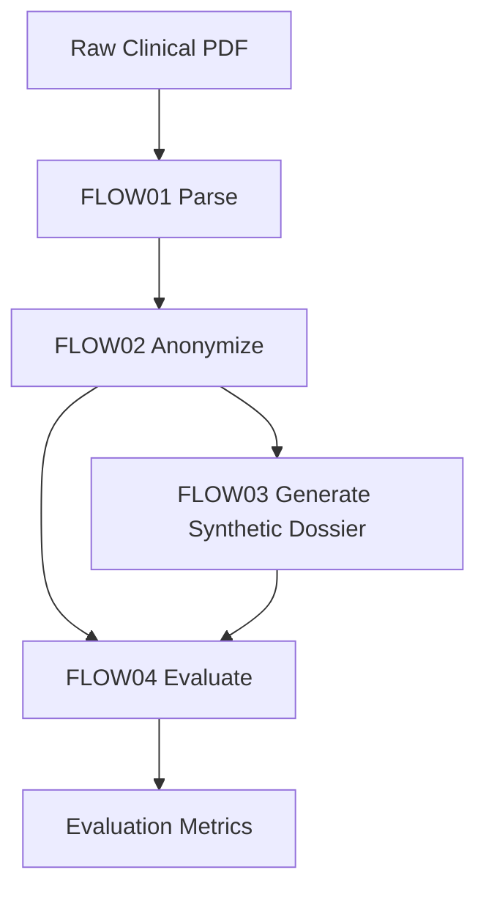

# Generative Agent-Assisted Synthetic Health Data Generation (SHDG) on UbiOps

## Table of Contents

1. [Purpose and Scope](#1-purpose-and-scope)
2. [Workflow Summary](#2-workflow-summary)
3. [Source Data Access Model](#3-source-data-access-model)
4. [Deployment Implementations](#4-deployment-implementations)
5. [Current Reproducible UbiOps Setup](#5-current-reproducible-ubiops-setup)
6. [Validation State and Operational Findings](#6-validation-state-and-operational-findings)
7. [Minimal Rebuild Procedure](#7-minimal-rebuild-procedure)
8. [Security, Governance, and Documentation Hygiene](#8-security-governance-and-documentation-hygiene)
9. [Version History Snapshot](#9-version-history-snapshot)
10. [Final Conclusion](#10-final-conclusion)

---

## 1. Purpose and Scope

This document records the current, validated UbiOps implementation of the SHDG workflow derived from the original research repository:

- Research source: [Privacy-, Linguistic-, and Information-Preserving Synthesis of Clinical Documentation through Generative Agents](https://github.com/HR-DataLab-Healthcare/RESEARCH_SUPPORT/tree/main/PROJECTS/Generative_Agent_based_Data-Synthesis)
- Original implementation form: Jupyter notebooks for FLOW01+02, FLOW03, and FLOW04
- Operational target: a containerized UbiOps pipeline for ingestion, anonymization, synthesis, and evaluation

This version focuses on the production-relevant path, removes repetition, and keeps only information needed to understand, recreate, validate, and govern the deployment.

---

## 2. Workflow Summary

The SHDG pipeline consists of four sequential stages:

1. **FLOW01 — Ingestion & Parsing**: convert raw clinical PDFs into structured text.
2. **FLOW02 — Privacy Masking**: remove direct identifiers while preserving clinical content.
3. **FLOW03 — Synthetic Dossier Generation**: generate synthetic clinical narratives from anonymized input.
4. **FLOW04 — Evaluation**: compare synthetic output to the anonymized reference and report similarity/privacy metrics.



### Current validated production path

| Stage | Deployment | Version | Status |
| --- | --- | --- | --- |
| FLOW01+02 | `flow01-02-ingest-anonymize` | `v1` | Validated |
| FLOW03 | `flow03-ga-synthesis` | `v3` | Validated |
| FLOW04 | `flow04-evaluator` | `v1` | Validated |
| Pipeline | `shdg-pipeline` | `v2` | Validated |

> `shdg-pipeline:v2` is the current validated end-to-end configuration.

---

## 3. Source Data Access Model

The source dataset contains 13 clinical PDF files stored in SURF Research Drive.

| Property | Value |
| --- | --- |
| Platform | SURF Research Drive (`hr.data.surf.nl`) |
| Path | `UbiOps_2026 / LR_EPDs / ORGs` |
| File pattern | `EPDAfdruk_897_*.pdf` |
| Volume | 13 files, ~1.2 MB total |
| Classification | Real clinical data; GDPR-protected |

### Supported access patterns

| Pattern | Use case | Notes |
| --- | --- | --- |
| Manual browser download | Inspection or ad hoc retrieval | Use current secure share link from password manager |
| Local Windows mount via `rclone` | Development and testing | Most convenient for iterative local work |
| Runtime HTTP download in container | UbiOps execution | Current production pattern |

### Production runtime pattern

The deployed FLOW01+02 container downloads the requested PDF on demand via WebDAV/HTTP Basic auth and processes it in temporary storage.

Required UbiOps environment variables:

| Key | Purpose | Secret |
| --- | --- | --- |
| `SURF_SHARE_TOKEN` | Share identifier / username for WebDAV | Yes |
| `SURF_SHARE_PASSWORD` | Share password | Yes |

Current validated 13-file EPD set:

- `EPDAfdruk_897_59037.pdf`
- `EPDAfdruk_897_59684.pdf`
- `EPDAfdruk_897_60038.pdf`
- `EPDAfdruk_897_60384.pdf`
- `EPDAfdruk_897_60818.pdf`
- `EPDAfdruk_897_61014.pdf`
- `EPDAfdruk_897_61368.pdf`
- `EPDAfdruk_897_61665.pdf`
- `EPDAfdruk_897_61810.pdf`
- `EPDAfdruk_897_62117.pdf`
- `EPDAfdruk_897_62177.pdf`
- `EPDAfdruk_897_62655.pdf`
- `EPDAfdruk_897_63175.pdf`

Security constraints:

- Never commit source PDFs to the repository.
- Never bundle source PDFs inside deployment artifacts.
- Keep links, tokens, and passwords outside documentation and source code.

---

## 4. Deployment Implementations

### 4.1 FLOW01+02 — `flow01-02-ingest-anonymize:v1`

**Purpose:** download a source PDF, extract text, redact direct identifiers, and return `anonymized_output.md`.

**Package baseline:** `flow01-02-v1-rev13.zip`

**Key implementation choices:**

- `pdfplumber` for PDF extraction
- `requests` for runtime SURF retrieval
- deterministic regex-based masking instead of `spacy` / `scispacy`

**Why regex masking is retained:** the earlier biomedical NER path over-redacted normal clinical text and did not produce acceptable anonymized output.

**Runtime output:** `anonymized_markdown`

**Status:** validated and used in the production pipeline.

### 4.2 FLOW03 — `flow03-ga-synthesis`

Two FLOW03 variants exist conceptually, but only one is part of the current validated pipeline.

#### A. Current validated pipeline variant: local LLM on HRO NutaNix GPU

| Property | Value |
| --- | --- |
| Deployment version | `v3` |
| Model | `meta-llama/Llama-3.1-8B-Instruct` |
| Runtime | `ubuntu22-04-python3-10-cuda12-3-2` |
| Instance group | `HRO - 1 GPU - 14 vCPU - 30GB RAM - 140GB Disk` |
| Required secret | `HUGGINGFACE_TOKEN` |
| Scaling | `min=1`, `max=1` |

**Purpose:** generate a synthetic dossier from anonymized markdown while keeping inference within the HRO/UbiOps runtime boundary.

**Key operational notes:**

- first startup can take 10–20+ minutes due to model download
- warm instance retention is required to avoid repeated cold starts
- `MAX_NEW_TOKENS = 1024` is the restored and validated setting

**Status:** validated directly and through `shdg-pipeline:v2`.

#### B. Validated alternative variant: Azure OpenAI (`flow03-ga-synthesis:v1`)

An Azure OpenAI implementation also exists and is documented as a migration option, using:

- endpoint `https://llmfoundrys.cognitiveservices.azure.com/`
- deployment `gpt-5.3-chat`
- secret `AZURE_OPENAI_API_KEY`

Validated behavior for this Azure variant:

- synthesis runs through Azure OpenAI and writes a local output file `synthetic_dossier.md`
- the deployment output field remains `synthetic_document`
- the container attempts a best-effort WebDAV upload to the SURF share using `SURF_SHARE_TOKEN` and `SURF_SHARE_PASSWORD`
- the upload target uses the `public.php/webdav/` share path and derives the RD filename from the anonymized input basename plus `_syn_<8hex>.md`
- upload failure does not fail the FLOW03 request; the generated dossier is still returned through the normal deployment output

Operational implication:

- this variant can reuse the SURF public-share credentials already used for FLOW01+02 for an upload attempt
- request completion through this deployment is now validated
- successful persistence to Research Drive remains best-effort rather than guaranteed, because earlier runtime testing produced HTTP 500 on `PUT`

This path is now validated as the Azure-based FLOW03 `v1` implementation used by `shdg-pipeline:v1`, but it is still **not** the current validated production baseline in `shdg-pipeline:v2`.

### 4.3 FLOW04 — `flow04-evaluator:v1`

**Purpose:** compare anonymized source text with the synthetic dossier and return evaluation metrics.

**Current contract:** output field `evaluation_metrics`

**Important constraint:** this deployment must keep its output schema aligned with the pipeline contract. A temporary image-output variant caused a pipeline failure and was reverted.

**Status:** reverted to the metrics-returning implementation and validated again with `shdg-pipeline:v2`.

---

## 5. Current Reproducible UbiOps Setup

### 5.1 Local tooling

Recommended local environment: `pubmed-env`

| Package | Purpose | Example version |
| --- | --- | --- |
| `ubiops` | Python SDK | `4.13.0` |
| `ubiops-cli` | CLI | `2.30.0` |

Important distinction: the Python SDK does not provide the CLI binary. Both packages are needed for the documented workflow.

Batch smoke-test helper now present in this workspace:

- script: `DataAnalysisExpert/create_shdg_pipeline_batch_smoke_test.py`
- purpose: submit a `shdg-pipeline:v1` Azure-path batch smoke test across the original EPD set
- default EPD set: the 13 filenames listed in Section 3 above
- default operating pattern: 13 original EPDs × 25 requests each = 325 pipeline requests
- prerequisite: local shell must have `UBIOPS_API_TOKEN` set before submission

What this helper does:

- submits all 13 EPDs × 25 requests = 325 requests to `shdg-pipeline:v1`
- writes the manifest locally to `batch_smoke_test_requests.json` after every submission so partial results are always saved
- can upload the same manifest JSON at the end to `https://hr.data.surf.nl/public.php/webdav/` using the same SURF credentials already used by FLOW01+02 and FLOW03
- treats RD manifest upload as non-fatal: if the share returns HTTP 500, a warning is printed and the script still exits cleanly
- includes a final JSON summary with pipeline version, aggregate request timing stats, failed submission summaries, and per-request object version/duration details

Important syntax distinction:

- use `--output` to choose the local manifest filename written in the workspace
- use `--rd-manifest-name` only to choose the optional upload filename on the SURF WebDAV share
- these flags are independent; `--rd-manifest-name` does not rename the local manifest file
- when setting PowerShell environment variables, do not include leading spaces inside the quoted value; a value such as `" 48c5..."` causes malformed auth headers and request failures

What this helper does not do:

- it submits pipeline requests but does not poll those requests to final completion
- it does not download resulting synthetic markdown files back to the local workspace
- it does not prove that every submitted request finished successfully downstream; it proves that the submission phase succeeded or failed per request

Operational note:

- use `--copies-per-epd 25 --delay-seconds 40` for the intended batch run pattern
- treat this as a submission smoke test plus manifest/audit trail, not as a full end-to-end result harvesting workflow

Manifest content and interpretation:

- `requests`: one entry per successfully submitted UbiOps pipeline request, including `epd_filename`, `copy_index`, `attempts`, and the serialized UbiOps request metadata
- `errors`: one entry per failed submission attempt after retry handling, including `epd_filename`, `copy_index`, `status`, `reason`, and any returned error body
- `total_expected_requests`: the planned submission count derived from `epd_count × copies_per_epd`
- `submitted_requests`: printed in the final console summary as the number of entries in `requests`
- `request_duration_stats`: printed in the final console summary as aggregate `min/avg/max` request duration across successful submissions when timing data is available
- `failed_submissions`: printed in the final console summary as a compact list of failed `epd_filename`, `copy_index`, `status`, and `reason`
- `request_summaries`: printed in the final console summary with one entry per successful submission, including `pipeline_version`, `request_duration_seconds`, `object_version_map`, and `object_durations_seconds`
- `rd_manifest_uploaded`: printed in the final console summary as `true` when `--rd-manifest-name` was supplied, meaning an RD upload was attempted after local manifest creation

How to read the outcome:

- ideal submission result: `submitted_requests` equals `total_expected_requests` and `errors` equals `0`
- partial submission result: `submitted_requests` is lower than `total_expected_requests` and `errors` is greater than `0`
- timing interpretation: `request_duration_stats` summarizes end-to-end pipeline runtime per successful request, while `object_durations_seconds` shows the runtime of each pipeline object inside that request
- interrupted run: the manifest is still written locally and includes `interrupted: true`
- RD upload warning: the local manifest remains the primary audit artifact even if the WebDAV upload attempt fails

Verified CLI help, rewritten for operators:

The helper command is:

```powershell
python .\DataAnalysisExpert\create_shdg_pipeline_batch_smoke_test.py [options]
```

Available options in plain language:

- `--copies-per-epd`: controls how many synthetic variants are requested per original PDF; with 13 source PDFs and the current default `25`, the script submits `325` requests.
- `--delay-seconds`: inserts a pause between submissions to avoid burst pressure on UbiOps; with the current default `40`, the delay budget alone is about 3.6 hours for a full 325-request run.
- `--output`: changes where the local JSON manifest is written; by default the manifest is written to `batch_smoke_test_requests.json` in the workspace root.
- `--epd`: limits the run to one or more explicitly named PDFs instead of the full 13-file set; repeat the flag to submit multiple selected EPDs.
- `--timeout-seconds`: sets the HTTP timeout for each submission call to the UbiOps API; this affects request creation, not the full downstream pipeline runtime.
- `--max-retries`: controls how often transient submission failures are retried before the script records an error in the manifest.
- `--rd-manifest-name`: enables a final best-effort upload of the completed manifest JSON to the SURF WebDAV share; this requires `SURF_SHARE_TOKEN` and `SURF_SHARE_PASSWORD` in the shell environment.

Minimal mental model:

- `--output` names the local manifest file
- `--rd-manifest-name` names the optional WebDAV upload target
- `--copies-per-epd` and `--delay-seconds` determine batch size and pacing
- `--timeout-seconds` and `--max-retries` determine how aggressively submission failures are retried

Correct PowerShell environment variable syntax:

```powershell
$env:UBIOPS_API_TOKEN="<your_ubiops_api_token>"
$env:SURF_SHARE_TOKEN="<your_surf_share_token>"
$env:SURF_SHARE_PASSWORD="<your_surf_share_password>"
```

Do not write values with a leading space inside the quotes.

Verified one-line PowerShell commands:

1. Full run with RD upload:

```powershell
conda activate pubmed-env; Set-Location "D:\OneDrive - Hogeschool Rotterdam\1_CURRENT_DOCUMENTS\DATALAB_ALIGNMENT\UbiOps-NutaNix"; $env:UBIOPS_API_TOKEN="<your_ubiops_api_token>"; $env:SURF_SHARE_TOKEN="<your_surf_share_token>"; $env:SURF_SHARE_PASSWORD="<your_surf_share_password>"; python .\DataAnalysisExpert\create_shdg_pipeline_batch_smoke_test.py --rd-manifest-name "batch_smoke_test_requests.json"
```

Explanation:

- runs the full default batch across all 13 EPDs with 25 requests per EPD
- uploads the final manifest JSON to the SURF WebDAV share
- requires both UbiOps API authentication and SURF share credentials in the shell

1. Full run with local manifest explicitly named `dummy.json`:

```powershell
conda activate pubmed-env; Set-Location "D:\OneDrive - Hogeschool Rotterdam\1_CURRENT_DOCUMENTS\DATALAB_ALIGNMENT\UbiOps-NutaNix"; $env:UBIOPS_API_TOKEN="<your_ubiops_api_token>"; python .\DataAnalysisExpert\create_shdg_pipeline_batch_smoke_test.py --copies-per-epd 1 --delay-seconds 40 --output ".\dummy.json"
```

Explanation:

- writes the local manifest to `dummy.json` in the workspace root
- submits all 13 original EPDs once each, so the planned total is `13`
- uses the requested `40` second delay between submissions
- this command does not upload the manifest to Research Drive unless `--rd-manifest-name` is also supplied

Observed console summary for this command on 2026-06-16:

```json
{
  "output": "dummy.json",
  "pipeline": "shdg-pipeline",
  "pipeline_version": "v1",
  "submitted_requests": 12,
  "errors": 1,
  "total_expected_requests": 13,
  "rd_manifest_uploaded": false,
  "interrupted": false,
  "request_duration_stats": {
    "min_seconds": 31.808,
    "avg_seconds": 44.361,
    "max_seconds": 58.844
  },
  "failed_submissions": [
    {
      "epd_filename": "EPDAfdruk_897_59037.pdf",
      "copy_index": 1,
      "status": 0,
      "reason": "ReadTimeout"
    }
  ],
  "request_summaries": [
    {
      "epd_filename": "EPDAfdruk_897_59684.pdf",
      "copy_index": 1,
      "pipeline": "shdg-pipeline",
      "pipeline_version": "v1",
      "pipeline_request_id": "7ad1df51-a6ab-439b-9697-e9a2857a7072",
      "pipeline_status": "completed",
      "pipeline_success": true,
      "object_version_map": {
        "flow01": "flow01-02-ingest-anonymize:v1",
        "flow03": "flow03-ga-synthesis:v1",
        "flow04": "flow04-evaluator:v1"
      },
      "object_durations_seconds": {
        "flow01": 2.29,
        "flow03": 37.523,
        "flow04": 0.811
      },
      "request_duration_seconds": 45.538
    }
  ]
}
```

Interpretation:

- the helper wrote the local manifest to `dummy.json`
- the summary now reports the pipeline name/version used for the run
- `12` submissions were accepted by UbiOps
- `1` submission failed during the submission phase and was recorded in the manifest `errors` array
- the run is a partial submission result because `submitted_requests` is lower than `total_expected_requests`
- `request_duration_stats` gives a quick min/avg/max view of successful request runtimes
- each `request_summaries` entry shows the per-request runtime plus the exact object/deployment versions used inside the pipeline
- `failed_submissions` gives a short operator-facing list of which EPD submissions failed without opening the full manifest
- in the current `dummy.json`, the failed submission was a client-side submission timeout rather than a server-side HTTP 500 response
- no Research Drive manifest upload was attempted in this invocation

1. One-EPD pilot run:

```powershell
conda activate pubmed-env; Set-Location "D:\OneDrive - Hogeschool Rotterdam\1_CURRENT_DOCUMENTS\DATALAB_ALIGNMENT\UbiOps-NutaNix"; $env:UBIOPS_API_TOKEN="<your_ubiops_api_token>"; python .\DataAnalysisExpert\create_shdg_pipeline_batch_smoke_test.py --epd "EPDAfdruk_897_59037.pdf"
```

Explanation:

- limits the run to a single named EPD instead of the full 13-file set
- still uses the current script defaults of 25 requests and 40 seconds delay unless overridden
- useful as a low-risk pilot before starting the full batch

1. Logged run that writes console output to a file:

```powershell
conda activate pubmed-env; Set-Location "D:\OneDrive - Hogeschool Rotterdam\1_CURRENT_DOCUMENTS\DATALAB_ALIGNMENT\UbiOps-NutaNix"; $env:UBIOPS_API_TOKEN="<your_ubiops_api_token>"; python .\DataAnalysisExpert\create_shdg_pipeline_batch_smoke_test.py *>&1 | Tee-Object -FilePath ".\batch_smoke_test_run.log"
```

Explanation:

- runs the batch helper and mirrors all console output to `batch_smoke_test_run.log`
- keeps the output visible in the terminal while also preserving a local execution log
- useful for long runs where submission progress and warnings need to be reviewed afterwards

If you want the logged run and RD upload combined, use:

```powershell
conda activate pubmed-env; Set-Location "D:\OneDrive - Hogeschool Rotterdam\1_CURRENT_DOCUMENTS\DATALAB_ALIGNMENT\UbiOps-NutaNix"; $env:UBIOPS_API_TOKEN="<your_ubiops_api_token>"; $env:SURF_SHARE_TOKEN="<your_surf_share_token>"; $env:SURF_SHARE_PASSWORD="<your_surf_share_password>"; python .\DataAnalysisExpert\create_shdg_pipeline_batch_smoke_test.py --rd-manifest-name "batch_smoke_test_requests.json" *>&1 | Tee-Object -FilePath ".\batch_smoke_test_run.log"
```

Explanation:

- combines the full RD-upload run with a persistent local console log
- this is the most complete operational command when both audit logging and manifest upload are required

### 5.2 Project-level secrets and variables

| Context | Key | Secret |
| --- | --- | --- |
| FLOW01+02 | `SURF_SHARE_TOKEN` | Yes |
| FLOW01+02 | `SURF_SHARE_PASSWORD` | Yes |
| FLOW03 local | `HUGGINGFACE_TOKEN` | Yes |
| FLOW03 Azure alternative | `AZURE_OPENAI_API_KEY` | Yes |
| FLOW03 Azure alternative | `SURF_SHARE_TOKEN` | Yes |
| FLOW03 Azure alternative | `SURF_SHARE_PASSWORD` | Yes |
| Local CLI / SDK auth | `UBIOPS_API_TOKEN` | Yes |

### 5.3 Packaging baselines

| Component | Artifact |
| --- | --- |
| FLOW01+02 | `flow01-02-v1-rev13.zip` |
| FLOW03 local | `flow03-ga-synthesis-v3.zip` |
| FLOW04 | `flow04-evaluator-v1.zip` |

---

## 6. Validation State and Operational Findings

### 6.1 Validated outcomes

The following state has been explicitly validated in this workspace/session history:

1. `flow01-02-ingest-anonymize:v1` successfully returns `anonymized_output.md`.
2. `flow03-ga-synthesis:v3` successfully returns `synthetic_dossier.md`.
3. `flow04-evaluator:v1` successfully returns `evaluation_metrics`.
4. `shdg-pipeline:v2` completes end-to-end successfully.
5. Pipeline output includes both synthetic output and FLOW04 evaluation results.
6. `shdg-pipeline:v1` also completed a narrow Azure-path request on 2026-06-15 with `flow01:v1`, `flow03:v1`, and `flow04:v1`, returning `synthetic_document` and `evaluation_metrics`.
7. `DEPLOYMENT_CODE/flow03-ga-synthesis-azure-v1/deployment.py` is the validated source for the current Azure FLOW03 `v1` behavior.

### 6.1.1 Most recent observed `shdg-pipeline:v1` behavior

Observed request input:

```json
{
  "pipeline_input_epd_filename": "EPDAfdruk_897_59037.pdf"
}
```

Observed result on 2026-06-15:

- pipeline `shdg-pipeline:v1` completed successfully
- `flow01-02-ingest-anonymize:v1` completed successfully
- `flow03-ga-synthesis:v1` completed successfully
- `flow04-evaluator:v1` completed successfully
- top-level result returned `synthetic_document`
- top-level result returned `evaluation_metrics`
- observed privacy result: `PASS`

This confirms that the current Azure FLOW03 `v1` path is validated for request completion even when Research Drive persistence is treated as best-effort.

### 6.2 Important resolved issues

| Issue | Resolution |
| --- | --- |
| FLOW03 local variant failed with `No module named 'torch'` | Rebuilt from clean folder with pinned dependencies |
| FLOW03 dossier truncation | Root cause was stale local `MAX_NEW_TOKENS = 256`; restored to `1024` and redeployed |
| FLOW04 image-output experiment broke pipeline | Reverted to metrics output to preserve pipeline schema |
| Pipeline monitoring via CLI was fragile | Use request-id capture and explicit polling |
| FLOW03 Azure RD upload initially failed with missing/mismatched credential names and wrong DAV endpoint | Azure `v1` now uses SURF share credentials for a best-effort `public.php/webdav/` upload attempt and no longer fails the request when RD upload returns HTTP 500 |
| Batch smoke-test submission from workspace initially failed | Local terminal session did not have `UBIOPS_API_TOKEN` set; batch helper is ready but requires authenticated shell |

### 6.3 Current integrity conclusion

There is no open contradiction in the currently validated production path:

- FLOW03 in the active pipeline points to `v3`
- FLOW03 `v3` is validated after redeploy
- FLOW04 is back on the schema-compatible metrics path
- `shdg-pipeline:v2` is the authoritative validated pipeline version

---

## 7. Minimal Rebuild Procedure

Use this sequence to recreate the validated production path.

### Step 1 — prepare local shell

```powershell
conda activate pubmed-env
ubiops status
ubiops current_project set shdg-hro-project
```

### Step 2 — deploy or verify FLOW01+02

- deployment: `flow01-02-ingest-anonymize`
- version: `v1`
- package: `flow01-02-v1-rev13.zip`
- env vars: `SURF_SHARE_TOKEN`, `SURF_SHARE_PASSWORD`

### Step 3 — deploy or verify FLOW03 local v3

- deployment: `flow03-ga-synthesis`
- version: `v3`
- package/folder: local Llama implementation
- runtime: `ubuntu22-04-python3-10-cuda12-3-2`
- instance group: `HRO - 1 GPU - 14 vCPU - 30GB RAM - 140GB Disk`
- env var: `HUGGINGFACE_TOKEN`
- scaling: `min=1`, `max=1`

### Step 4 — deploy or verify FLOW04

- deployment: `flow04-evaluator`
- version: `v1`
- contract must return `evaluation_metrics`

### Step 5 — assemble pipeline

- pipeline: `shdg-pipeline`
- version: `v2`
- wiring:
  - `flow01` → `flow01-02-ingest-anonymize:v1`
  - `flow03` → `flow03-ga-synthesis:v3`
  - `flow04` → `flow04-evaluator:v1`

### Step 6 — smoke test

Input:

```json
{
  "pipeline_input_epd_filename": "EPDAfdruk_897_59037.pdf"
}
```

Expected result:

- top-level pipeline request completes
- FLOW01 child request completes
- FLOW03 child request completes
- FLOW04 child request completes
- evaluation indicates a valid metrics response, e.g. privacy preservation `PASS`

### Step 7 — optional batch smoke test for `shdg-pipeline:v1` Azure path

The workspace includes a helper script for bulk submission:

- file: `DataAnalysisExpert/create_shdg_pipeline_batch_smoke_test.py`
- target: `shdg-pipeline:v1`
- intended scope: all 13 original EPDs, 25 submissions each

Prerequisite:

- local shell must export `UBIOPS_API_TOKEN`

Result:

- writes a manifest file `batch_smoke_test_requests.json`
- stores submitted request metadata and any submission errors
- if `--rd-manifest-name` is provided, uploads the final manifest JSON to the SURF WebDAV share using `SURF_SHARE_TOKEN` and `SURF_SHARE_PASSWORD`
- reports `rd_manifest_uploaded` in the final JSON summary output
- recommended invocation pattern: `--copies-per-epd 25 --delay-seconds 40`
- does not itself wait for all submitted pipeline requests to finish; downstream completion must be checked separately if full execution validation is required

Correct syntax note:

- use `--output .\dummy.json` if you want the local manifest file to be named `dummy.json`
- use `--rd-manifest-name "dummy.json"` only if you want the optional WebDAV upload target on Research Drive to be named `dummy.json`

### Step 7.1 — check active instances for the `shdg-pipeline:v1` objects

Use this when you want to confirm that the three deployment objects behind the Azure-path pipeline version already have warm running instances.

Prerequisite:

- local shell must export `UBIOPS_API_TOKEN`
- active project should be `shdg-hro-project`

Command pattern:

```powershell
ubiops instances list -d flow01-02-ingest-anonymize -v v1 -fmt table
ubiops instances list -d flow03-ga-synthesis -v v1 -fmt table
ubiops instances list -d flow04-evaluator -v v1 -fmt table
```

One-line PowerShell variant:

```powershell
conda activate pubmed-env; Set-Location "D:\OneDrive - Hogeschool Rotterdam\1_CURRENT_DOCUMENTS\DATALAB_ALIGNMENT\UbiOps-NutaNix"; $env:UBIOPS_API_TOKEN="<your_ubiops_api_token>"; ubiops current_project set shdg-hro-project; ubiops instances list -d flow01-02-ingest-anonymize -v v1 -fmt table; ubiops instances list -d flow03-ga-synthesis -v v1 -fmt table; ubiops instances list -d flow04-evaluator -v v1 -fmt table
```

How to interpret the output:

- if a table row is returned with `STATUS` = `running`, that deployment version currently has an active warm instance
- if no rows are returned, there is no active instance at that moment for that deployment version
- for `shdg-pipeline:v1`, the relevant objects are `flow01-02-ingest-anonymize:v1`, `flow03-ga-synthesis:v1`, and `flow04-evaluator:v1`
- this check confirms instance presence only; it does not prove that a new pipeline request will complete successfully

### Step 7.2 — terminate warm instances via CLI by scaling to zero

UbiOps CLI does not expose a direct `terminate instance` command. The supported CLI procedure is to update each deployment version so it no longer keeps or starts instances.

Command pattern:

```powershell
ubiops deployment_versions update v1 -d flow01-02-ingest-anonymize -min 0 -max 0
ubiops deployment_versions update v1 -d flow03-ga-synthesis -min 0 -max 0
ubiops deployment_versions update v1 -d flow04-evaluator -min 0 -max 0
```

One-line PowerShell variant:

```powershell
conda activate pubmed-env; Set-Location "D:\OneDrive - Hogeschool Rotterdam\1_CURRENT_DOCUMENTS\DATALAB_ALIGNMENT\UbiOps-NutaNix"; $env:UBIOPS_API_TOKEN="<your_ubiops_api_token>"; ubiops current_project set shdg-hro-project; ubiops deployment_versions update v1 -d flow01-02-ingest-anonymize -min 0 -max 0; ubiops deployment_versions update v1 -d flow03-ga-synthesis -min 0 -max 0; ubiops deployment_versions update v1 -d flow04-evaluator -min 0 -max 0
```

Verification after scale-down:

```powershell
ubiops instances list -d flow01-02-ingest-anonymize -v v1 -fmt table
ubiops instances list -d flow03-ga-synthesis -v v1 -fmt table
ubiops instances list -d flow04-evaluator -v v1 -fmt table
```

Operational note:

- `-min 0` removes the requirement to keep a warm instance alive
- `-max 0` prevents new instances from being started for that version
- running instances may not disappear instantly; the platform can take a short time to drain and stop them
- this affects the deployment versions directly, so new requests to those versions will not start until scaling is raised again

### Step 8 — deploy or verify validated Azure FLOW03 `v1`

Use this only for the Azure-path variant documented above.

- source folder: `DEPLOYMENT_CODE/flow03-ga-synthesis-azure-v1`
- deployment: `flow03-ga-synthesis`
- version: `v1`
- required env vars: `AZURE_OPENAI_API_KEY`, `SURF_SHARE_TOKEN`, `SURF_SHARE_PASSWORD`
- runtime behavior: returns `synthetic_document` and attempts best-effort RD persistence via `public.php/webdav/`

---

## 8. Security, Governance, and Documentation Hygiene

### Security rules

- Do not store secrets in README files, notebooks, scripts, or shell history.
- Use UbiOps secret environment variables or a password manager.
- Keep personal identifiers, local usernames, org-specific dashboard URLs, and share URLs out of distributable documentation.

### Governance relevance

This implementation is relevant to:

- secure software deployment of LLM workflows
- privacy-preserving handling of clinical source data
- auditable pipeline-based processing
- reproducible operational validation

### Documentation intent of this version

This V14 document is intentionally concise and operational. It retains:

- the validated architecture
- the current production path
- the minimum reproducible deployment state
- the main resolved issues and constraints

It omits long duplicate command trails, obsolete branches, and exploratory dead ends unless they materially explain the current validated state.

---

## 9. Version History Snapshot

| Component | Current validated version | Notes |
| --- | --- | --- |
| FLOW01+02 | `v1` | stable |
| FLOW03 | `v3` | local Llama path, validated |
| FLOW04 | `v1` | metrics output retained |
| Pipeline | `v2` | validated production baseline |

---

## 10. Final Conclusion

The SHDG migration to UbiOps is operationally validated in a coherent end-to-end baseline built around:

- `flow01-02-ingest-anonymize:v1`
- `flow03-ga-synthesis:v3`
- `flow04-evaluator:v1`
- `shdg-pipeline:v2`

The main integrity-sensitive lessons are:

1. keep deployment schemas stable once wired into a pipeline;
2. pin critical dependencies for GPU-backed local model deployments;
3. validate generated output content, not just request completion status;
4. treat documentation as an operational control surface: concise, current, and free of sensitive locators.
