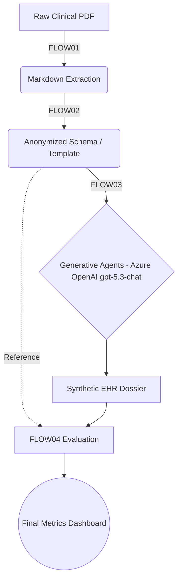

# SHDG on UbiOps - Operational README V15

## Table of Contents

1. [Purpose and Scope](#1-purpose-and-scope)
2. [Validated Baseline](#2-validated-baseline)
3. [Source Data and Secrets](#3-source-data-and-secrets)
4. [Operational Setup](#4-operational-setup)
5. [Batch Smoke-Test Runbook](#5-batch-smoke-test-runbook)
6. [Minimal Rebuild and Validation](#6-minimal-rebuild-and-validation)
7. [UbiOps Project Export](#7-ubiops-project-export)
8. [Validated Findings](#8-validated-findings)
9. [Final Conclusion](#9-final-conclusion)

---

## 1. Purpose and Scope

The reasons for this project are explicit. First, it is intended to reproduce the original SHDG methodology in an operational setting. That original repository introduces a method for generating highly realistic Synthetic Electronic Health Records by using Multi-Agent Large Language Models to ingest real clinical notes, remove Protected Health Information, and synthesize new patient trajectories that preserve the structural, semantic, and linguistic characteristics of the source material. The original prototype is available in the notebook-based SHDG repository and its `CODE` collection.

Second, this project is intended to perform smoke tests and operational validation to determine whether the combination of NutaNix hardware and UbiOps software and hardware orchestration is a feasible basis for a native cloud capability within Hogeschool Rotterdam. In that context, the work is relevant to IDT, the dienst Informatievoorziening en Digitale Transformatie, which is developing toward regie- and value-driven dienstverlening with Agile and Scrum as its working model under the CIO, spanning IT Operations and the CIO Office.

The project is an MLOps adaptation of the research repository: [Privacy-, Linguistic-, and Information-Preserving Synthesis of Clinical Documentation through Generative Agents](https://github.com/HR-DataLab-Healthcare/RESEARCH_SUPPORT/tree/main/PROJECTS/Generative_Agent_based_Data-Synthesis).

The reason this project exists is twofold. First, it aims to make sensitive clinical documentation usable for research, testing, and controlled sharing without exposing Protected Health Information or other directly identifying content. Second, it translates a notebook-based research prototype into a reproducible MLOps setup on UbiOps, where the separate SHDG stages can be deployed, versioned, validated, and executed as operational pipeline objects.

The original prototype source is available in the repository's SHDG notebook collection: [Generative_Agent_based_Data-Synthesis / CODE](https://github.com/HR-DataLab-Healthcare/RESEARCH_SUPPORT/tree/main/PROJECTS/Generative_Agent_based_Data-Synthesis/CODE). The original workflow was provided as notebooks covering ingestion, anonymization, synthesis, and evaluation.

In practical terms, the project tries to achieve four connected goals:

- ingest raw clinical PDF material in a controlled way
- anonymize or pseudonymize the source content while preserving clinical meaning
- synthesize realistic synthetic dossiers through FLOW03
- evaluate the synthetic output against the anonymized reference material to measure privacy preservation and semantic quality

Original SHDG notebook mapping:

| FLOW | Notebook | Purpose |
| --- | --- | --- |
| FLOW01 + FLOW02 | `FLOW01+FLOW02.ipynb` | Ingestion, parsing, and anonymization or pseudonymization of clinical source documents |
| FLOW03 | `FLOW03.ipynb` | Generative-agent-based synthesis of synthetic clinical documentation |
| FLOW04 | `FLOW04.ipynb` | Evaluation of synthetic output against anonymized reference material |

Repository note:

- the full SHDG pipeline is maintained in the `CODE` folder of the original research repository
- the original methodology operates in four sequential computational stages that were migrated to UbiOps deployments and a pipeline DAG

Operational workflow overview:

1. `FLOW01` ingests semi-structured clinical PDFs and translates them into structured Markdown templates.
2. `FLOW02` pseudonymizes the extracted content by masking direct identifiers while preserving clinical meaning.
3. `FLOW03` performs collaborative synthesis. In the Azure-path variant this uses Azure OpenAI deployment `gpt-5.3-chat` on `llmfoundrys.cognitiveservices.azure.com`.
4. `FLOW04` evaluates the synthetic dossier against the anonymized reference to measure structural alignment, privacy leakage risk, and semantic distance.



This V15 document focuses on the validated operational state of that implementation: the currently working deployment versions, the smoke-test procedure, the manifest and PDF reporting flow, and the minimum steps needed for rebuild, validation, and export tracking.

---

## 2. Validated Baseline

The currently validated production baseline is:

| Stage | Deployment | Version | Status |
| --- | --- | --- | --- |
| FLOW01+02 | `flow01-02-ingest-anonymize` | `v1` | Validated |
| FLOW03 | `flow03-ga-synthesis` | `v3` | Validated |
| FLOW04 | `flow04-evaluator` | `v1` | Validated |
| Pipeline | `shdg-pipeline` | `v2` | Validated |

The validated Azure-path alternative used for smoke testing is:

| Stage | Deployment | Version | Status |
| --- | --- | --- | --- |
| FLOW01+02 | `flow01-02-ingest-anonymize` | `v1` | Validated |
| FLOW03 | `flow03-ga-synthesis` | `v1` | Validated, using Azure OpenAI deployment `gpt-5.3-chat` |
| FLOW04 | `flow04-evaluator` | `v1` | Validated |
| Pipeline | `shdg-pipeline` | `v1` | Validated for Azure-path request completion |

Explicit Azure-path FLOW03 model note:

- object: `flow03-ga-synthesis:v1`
- provider: Azure OpenAI / Azure AI Foundry
- deployed model name: `gpt-5.3-chat`
- required secret: `AZURE_OPENAI_API_KEY`
- this Azure-backed FLOW03 object is the one used in the smoke-test path behind `shdg-pipeline:v1`

## 3. Source Data and Secrets

The source set contains 13 clinical PDFs in SURF Research Drive.

Validated EPD set:

- `EPDAfdruk_897_59037.pdf`
- `EPDAfdruk_897_59684.pdf`
- `EPDAfdruk_897_60038.pdf`
- `EPDAfdruk_897_60384.pdf`
- `EPDAfdruk_897_60818.pdf`
- `EPDAfdruk_897_61014.pdf`
- `EPDAfdruk_897_61368.pdf`
- `EPDAfdruk_897_61665.pdf`
- `EPDAfdruk_897_61810.pdf`
- `EPDAfdruk_897_62117.pdf`
- `EPDAfdruk_897_62177.pdf`
- `EPDAfdruk_897_62655.pdf`
- `EPDAfdruk_897_63175.pdf`

Required secrets by context:

| Context | Key | Secret |
| --- | --- | --- |
| FLOW01+02 | `SURF_SHARE_TOKEN` | Yes |
| FLOW01+02 | `SURF_SHARE_PASSWORD` | Yes |
| FLOW03 local | `HUGGINGFACE_TOKEN` | Yes |
| FLOW03 Azure alternative | `AZURE_OPENAI_API_KEY` | Yes |
| FLOW03 Azure alternative | `SURF_SHARE_TOKEN` | Yes |
| FLOW03 Azure alternative | `SURF_SHARE_PASSWORD` | Yes |
| Local CLI / SDK auth | `UBIOPS_API_TOKEN` | Yes |

For clarity:

- `flow03-ga-synthesis:v3` is the validated local production path
- `flow03-ga-synthesis:v1` is the validated Azure-path smoke-test object
- the Azure-path object uses Azure OpenAI deployment `gpt-5.3-chat`

Security rules:

- Never commit source PDFs.
- Never commit secrets.
- Never place share URLs, tokens, or passwords in distributable documentation.

---

## 4. Operational Setup

Recommended local environment:

- conda environment: `pubmed-env`
- Python SDK: `ubiops`
- CLI: `ubiops-cli`

Important:

- the Python SDK does not provide the CLI binary
- both the SDK and CLI are needed for the documented workflow

Recommended shell preparation:

```powershell
conda activate pubmed-env
ubiops status
ubiops current_project set shdg-hro-project
```

Correct PowerShell environment variable syntax:

```powershell
$env:UBIOPS_API_TOKEN="<your_ubiops_api_token>"
$env:SURF_SHARE_TOKEN="<your_surf_share_token>"
$env:SURF_SHARE_PASSWORD="<your_surf_share_password>"
```

Do not include leading spaces inside quoted values.

---

## 5. Batch Smoke-Test Runbook

Helper script:

- `DataAnalysisExpert/create_shdg_pipeline_batch_smoke_test.py`

Purpose:

- submit a batch smoke test to `shdg-pipeline:v1`
- write a local manifest after every submission
- optionally upload the final manifest to SURF Research Drive

Congruent `v2` usage:

- the same helper can also target `shdg-pipeline:v2` for the validated production path by adding `--pipeline-version v2`
- this keeps the same 13-EPD, manifest, retry, and PDF-reporting workflow while switching only the pipeline version

What it does:

- submits requests for the validated 13-file EPD set unless `--epd` is used
- writes the local manifest continuously
- prints a final JSON summary with pipeline version, request timing stats, failed submissions, and per-request object version details
- supports downstream PDF reporting from the produced manifest

What it does not do:

- it does not poll all submitted requests to final completion
- it does not download generated outputs back to the workspace
- it validates submission behavior, not full downstream harvesting

Operator-facing command shape:

```powershell
python .\DataAnalysisExpert\create_shdg_pipeline_batch_smoke_test.py [options]
```

Most important options:

- `--pipeline-version`: target pipeline version, for example `v1` or `v2`
- `--copies-per-epd`: number of requests per source PDF
- `--delay-seconds`: pause between submissions
- `--output`: local manifest filename
- `--epd`: limit the run to one or more named PDFs
- `--timeout-seconds`: HTTP timeout for submission calls
- `--max-retries`: retry count for transient submission failures
- `--rd-manifest-name`: optional WebDAV upload target name

Minimal mental model:

- `--pipeline-version` selects whether the batch targets the Azure-path smoke-test pipeline `v1` or the validated production pipeline `v2`
- `--output` names the local manifest file
- `--rd-manifest-name` names the optional RD upload target
- `--copies-per-epd` and `--delay-seconds` control batch size and pacing
- `--timeout-seconds` and `--max-retries` control submission retry behavior

Step-by-step CLI smoke-test procedure:

| Step | Goal | CLI command | Expected result |
| --- | --- | --- | --- |
| 1 | Activate the validated local environment | `conda activate pubmed-env` | The `pubmed-env` environment is active. |
| 2 | Move to the validated workspace root | `Set-Location "D:\OneDrive - Hogeschool Rotterdam\1_CURRENT_DOCUMENTS\DATALAB_ALIGNMENT\UbiOps-NutaNix"` | All relative paths in the runbook resolve correctly. |
| 3 | Load the required UbiOps token | `$env:UBIOPS_API_TOKEN="<your_ubiops_api_token>"` | The helper can authenticate against UbiOps. |
| 4 | Optionally load SURF Research Drive credentials for manifest upload | `$env:SURF_SHARE_TOKEN="<your_surf_share_token>"` and `$env:SURF_SHARE_PASSWORD="<your_surf_share_password>"` | RD upload becomes available when `--rd-manifest-name` is used. |
| 5 | Confirm the CLI can reach the current project | `ubiops status` | The CLI returns the current authentication and project status. |
| 6 | Ensure the correct project is selected | `ubiops current_project set shdg-hro-project` | The smoke test targets the intended UbiOps project. |
| 7 | Run the standard one-pass smoke test and write `dummy.json` | `python .\DataAnalysisExpert\create_shdg_pipeline_batch_smoke_test.py --copies-per-epd 1 --delay-seconds 40 --output ".\dummy.json"` | A 13-request submission run is attempted and the local manifest is written to `dummy.json`. |
| 8 | Alternative: run the full smoke test with RD manifest upload | `python .\DataAnalysisExpert\create_shdg_pipeline_batch_smoke_test.py --rd-manifest-name "batch_smoke_test_requests.json"` | The local manifest is written and the final manifest is also uploaded to RD. |
| 9 | Review the final CLI JSON summary | No extra command; inspect the helper output in the terminal | Confirm `submitted_requests`, `errors`, `failed_submissions`, `pipeline_version`, and `request_duration_stats`. |
| 10 | Validate the local manifest file exists | `Get-Item .\dummy.json` | The manifest file is present and ready for PDF reporting. |
| 11 | Generate the PDF smoke-test report | `python .\SMOKE_TEST\generate_smoke_test_pdf.py` | A timestamped PDF is written to `SMOKE_TEST`. |
| 12 | Validate the generated PDF files | `Get-ChildItem .\SMOKE_TEST\smoke_test_report_*.pdf \| Sort-Object LastWriteTime -Descending` | The newest PDF report is visible and can be opened for operator review. |

Recommended operator sequence:

1. Run step 7 for the standard local smoke test.
2. Check the terminal JSON summary from step 9.
3. Generate the PDF in step 11.
4. Open the newest PDF from step 12 and review failures first.

Useful commands:

1. Full run with RD upload:

```powershell
conda activate pubmed-env; Set-Location "D:\OneDrive - Hogeschool Rotterdam\1_CURRENT_DOCUMENTS\DATALAB_ALIGNMENT\UbiOps-NutaNix"; $env:UBIOPS_API_TOKEN="<your_ubiops_api_token>"; $env:SURF_SHARE_TOKEN="<your_surf_share_token>"; $env:SURF_SHARE_PASSWORD="<your_surf_share_password>"; python .\DataAnalysisExpert\create_shdg_pipeline_batch_smoke_test.py --rd-manifest-name "batch_smoke_test_requests.json"
```

1. One-pass run writing `dummy.json` locally:

```powershell
conda activate pubmed-env; Set-Location "D:\OneDrive - Hogeschool Rotterdam\1_CURRENT_DOCUMENTS\DATALAB_ALIGNMENT\UbiOps-NutaNix"; $env:UBIOPS_API_TOKEN="<your_ubiops_api_token>"; python .\DataAnalysisExpert\create_shdg_pipeline_batch_smoke_test.py --copies-per-epd 1 --delay-seconds 40 --output ".\dummy.json"
```

1. One-EPD pilot run:

```powershell
conda activate pubmed-env; Set-Location "D:\OneDrive - Hogeschool Rotterdam\1_CURRENT_DOCUMENTS\DATALAB_ALIGNMENT\UbiOps-NutaNix"; $env:UBIOPS_API_TOKEN="<your_ubiops_api_token>"; python .\DataAnalysisExpert\create_shdg_pipeline_batch_smoke_test.py --epd "EPDAfdruk_897_59037.pdf"
```

1. Congruent 13-EPD batch smoke test for `shdg-pipeline:v2`:

```powershell
conda activate pubmed-env; Set-Location "D:\OneDrive - Hogeschool Rotterdam\1_CURRENT_DOCUMENTS\DATALAB_ALIGNMENT\UbiOps-NutaNix"; $env:UBIOPS_API_TOKEN="<your_ubiops_api_token>"; python .\DataAnalysisExpert\create_shdg_pipeline_batch_smoke_test.py --pipeline-version v2 --copies-per-epd 1 --delay-seconds 40 --output ".\dummy_v2.json"
```

Expected result for the congruent `v2` run:

- the helper submits the same validated 13-file EPD set
- the manifest structure remains the same as the `v1` batch smoke test
- the final JSON summary reports `pipeline_version` as `v2`
- the resulting manifest can be passed explicitly to `SMOKE_TEST/generate_smoke_test_pdf.py --input ".\dummy_v2.json"`

Current observed `dummy.json` summary shape:

```json
{
  "output": "dummy.json",
  "pipeline": "shdg-pipeline",
  "pipeline_version": "v1",
  "submitted_requests": 12,
  "errors": 1,
  "total_expected_requests": 13,
  "rd_manifest_uploaded": false,
  "interrupted": false,
  "request_duration_stats": {
    "min_seconds": 31.808,
    "avg_seconds": 44.361,
    "max_seconds": 58.844
  },
  "failed_submissions": [
    {
      "epd_filename": "EPDAfdruk_897_59037.pdf",
      "copy_index": 1,
      "status": 0,
      "reason": "ReadTimeout"
    }
  ]
}
```

Interpretation:

- `submitted_requests < total_expected_requests` means a partial submission result
- `failed_submissions` is the short operator-facing failure list
- `request_duration_stats` summarizes successful request runtimes
- the local manifest remains the primary audit artifact

Failure-reporting behavior:

- the helper writes explicit submission failures into the manifest `errors` list
- the PDF report also treats requests with `success=false` as failures, even if the `errors` list is incomplete
- duplicate failure rows are removed before the PDF is rendered
- the failure section is intended as the first operator check after the summary table

PDF report creation:

- report script: `SMOKE_TEST/generate_smoke_test_pdf.py`
- input: a local manifest such as `dummy.json` or `dummy_v2.json`, passed explicitly with `--input` when needed
- output: a timestamped PDF in `SMOKE_TEST`
- format: portrait A4, with wrapped cells and split request tables so the report remains readable on a local Windows machine

What the PDF contains:

- summary table with test label, pipeline, counts, delay, timeout, retries, and `Total smoke-test duration (s)`
- request duration statistics: min, avg, max
- privacy pass count
- request overview, version mapping, request identifiers, and object-duration sections
- failed submissions table with `epd_filename`, `copy_index`, `attempts`, `status`, and `reason`

How total duration is calculated in the PDF:

- start point: `submitted_at_unix` when available, otherwise the earliest request creation or start timestamp
- end point: the latest available request completion timestamp
- result: `Total smoke-test duration (s)` in the summary table

How to create the PDF report locally:

```powershell
conda activate pubmed-env; Set-Location "D:\OneDrive - Hogeschool Rotterdam\1_CURRENT_DOCUMENTS\DATALAB_ALIGNMENT\UbiOps-NutaNix"; python .\SMOKE_TEST\generate_smoke_test_pdf.py --input ".\dummy.json"
```

How to create the congruent `v2` PDF report locally:

```powershell
conda activate pubmed-env; Set-Location "D:\OneDrive - Hogeschool Rotterdam\1_CURRENT_DOCUMENTS\DATALAB_ALIGNMENT\UbiOps-NutaNix"; python .\SMOKE_TEST\generate_smoke_test_pdf.py --input ".\dummy_v2.json"
```

Expected result:

- a file named like `SMOKE_TEST\smoke_test_report_YYYY-MM-DD_HH-MM-SS.pdf`
- the script prints a JSON result with the input file, output PDF path, request row count, and error row count

Operational reading order for the PDF:

1. Check `Failed submissions` first.
2. Check `Total smoke-test duration (s)` and the request duration min/avg/max values.
3. Check request versions to confirm the intended pipeline and object versions were used.
4. Check privacy status and cosine similarity only after submission integrity is confirmed.

---

## 6. Minimal Rebuild and Validation

Use this sequence to recreate the validated production path.

### Step 1 - verify FLOW01+02

- deployment: `flow01-02-ingest-anonymize`
- version: `v1`
- package: `flow01-02-v1-rev13.zip`
- env vars: `SURF_SHARE_TOKEN`, `SURF_SHARE_PASSWORD`

### Step 2 - verify FLOW03 local production path

- deployment: `flow03-ga-synthesis`
- version: `v3`
- runtime: `ubuntu22-04-python3-10-cuda12-3-2`
- instance group: `HRO - 1 GPU - 14 vCPU - 30GB RAM - 140GB Disk`
- env var: `HUGGINGFACE_TOKEN`
- scaling: `min=1`, `max=1`

### Step 3 - verify FLOW04

- deployment: `flow04-evaluator`
- version: `v1`
- output contract: `evaluation_metrics`

### Step 4 - verify pipeline wiring

- pipeline: `shdg-pipeline`
- version: `v2`
- wiring:
  - `flow01` -> `flow01-02-ingest-anonymize:v1`
  - `flow03` -> `flow03-ga-synthesis:v3`
  - `flow04` -> `flow04-evaluator:v1`

### Step 5 - smoke test the validated production path

Input:

```json
{
  "pipeline_input_epd_filename": "EPDAfdruk_897_59037.pdf"
}
```

Expected result:

- top-level pipeline request completes
- FLOW01 child request completes
- FLOW03 child request completes
- FLOW04 child request completes
- evaluation returns a valid metrics payload, for example privacy preservation `PASS`

### Step 6 - run a second distinct smoke test on `shdg-pipeline:v2`

Use this when you want a separate, explicitly traceable validation request on the validated production pipeline version `v2`.

Dedicated input file:

- `pipeline_test_input_61014_v2.json`

Input content:

```json
{
  "pipeline_input_epd_filename": "EPDAfdruk_897_61014.pdf"
}
```

Step-by-step operator procedure:

1. Activate the validated environment.

```powershell
conda activate pubmed-env
```

1. Move to the project root.

```powershell
Set-Location "D:\OneDrive - Hogeschool Rotterdam\1_CURRENT_DOCUMENTS\DATALAB_ALIGNMENT\UbiOps-NutaNix"
```

1. Load the UbiOps API token.

```powershell
$env:UBIOPS_API_TOKEN="<your_ubiops_api_token>"
```

1. Confirm the correct project is active.

```powershell
ubiops status
ubiops current_project set shdg-hro-project
```

1. Submit the second distinct smoke test to the validated production pipeline.

```powershell
ubiops pipelines requests create shdg-pipeline -v v2 -f ".\pipeline_test_input_61014_v2.json" -fmt json
```

1. Record the returned top-level request id and confirm the request reaches `completed`.

Expected validated example:

- request id: `5af2a95d-fc70-4ad3-822b-b0807bbbb209`
- pipeline: `shdg-pipeline:v2`
- status: `completed`

1. Validate the output payload.

Expected output shape:

```json
{
  "evaluation_metrics": {
    "cosine_similarity": 0.7124427995296532,
    "privacy_preservation_status": "PASS"
  },
  "synthetic_document": "ubiops-file://default/deployment_requests/53747694-07e7-4161-9fa5-08657cb37cbb/output/synthetic_dossier.md"
}
```

1. Validate the object-level execution chain.

Minimum checks:

- `flow01` completed on `flow01-02-ingest-anonymize:v1`
- `flow03` completed on `flow03-ga-synthesis:v3`
- `flow04` completed on `flow04-evaluator:v1`
- `privacy_preservation_status` is `PASS`

Interpretation:

- this request is distinct from the earlier batch smoke test because it targets one named EPD, one top-level request id, and the validated production pipeline version `v2`
- it is suitable as a clean operator-facing proof that the production path can complete end-to-end for a known input file

---

## 7. UbiOps Project Export

This section documents how to create and record a UbiOps project export.

### Purpose

Use a UbiOps project export when you want a point-in-time export of the project configuration for backup, migration support, audit, or handover.

### Recommended operator procedure

1. Open the UbiOps web interface.
2. Switch to the correct project: `shdg-hro-project`.
3. Open the project export function in the project settings or export area.
4. Start a new export.
5. Enter a clear description that identifies the intended baseline.
6. Wait until the export status becomes `completed`.
7. Record the export metadata in this README or in the operational change log.
8. If the platform provides a downloadable artifact, store it in the approved project archive location.

### What to record for every export

- export ID
- description
- status
- created timestamp
- exported by
- storage location of the downloaded export artifact, if applicable

### Recorded export for this project

| Field | Value |
| --- | --- |
| Export ID | `aac37215-aad7-47f0-a87d-336c9eb6ba51` |
| Description | `SDHG pipeline v1 READ / WRITE RD (REASERCH DRIVE) AZURE LLM` |
| Status | `completed` |
| Created at | `16-06-2026 12:56` |
| Exported by | `r.f.van.der.willigen@hr.nl` |

Operational note:

- this export description appears to refer to the Azure-path `shdg-pipeline:v1` setup with Research Drive read/write behavior
- keep the export record together with the matching deployment and pipeline version notes so the export remains interpretable later

---

## 8. Validated Findings

Validated outcomes retained from V14:

1. `flow01-02-ingest-anonymize:v1` returns anonymized output successfully.
2. `flow03-ga-synthesis:v3` returns synthetic dossier output successfully.
3. `flow04-evaluator:v1` returns `evaluation_metrics` successfully.
4. `shdg-pipeline:v2` completes end-to-end successfully.
5. `shdg-pipeline:v1` is validated as an Azure-path alternative using `flow01:v1`, `flow03:v1`, and `flow04:v1`.

---

## 9. Final Conclusion

The operationally validated production baseline remains:

- `flow01-02-ingest-anonymize:v1`
- `flow03-ga-synthesis:v3`
- `flow04-evaluator:v1`
- `shdg-pipeline:v2`

The Azure-path `shdg-pipeline:v1` remains useful for smoke testing and export/audit context.

This V15 file is the shorter operational variant intended for day-to-day use.
