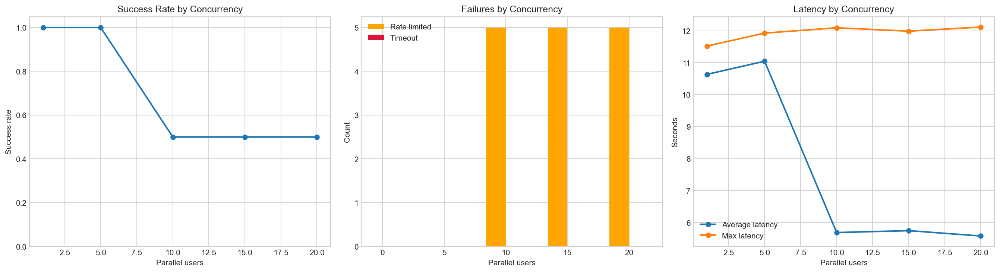

# WiLLMa Stress Test

## Context

This stress test was created because there was a concrete operational question around the reliability of WiLLMa / the SURF AI-HUB under classroom-style usage.

The practical concern was not whether a single notebook user could occasionally get a successful response, but whether the platform would remain usable when multiple students or participants sent requests at the same time. In the related email exchange with SURF, the key questions were:

1. Is the issue reproducible?
2. Is the observed behavior really rate limiting?
3. Which HTTP errors occur during failure?
4. Is the problem the same as downtime, or is it a different failure mode?
5. Does single-user usage remain mostly error free while concurrent usage fails?

Additional test were performed  
[STESS_TEST WITH PROXY](https://github.com/HR-AI-HUB/hr-ai-hub.github.io/blob/main/WILLMA_STESS_TEST/README_V04_PROXT_TEST.md)
to determine whether WiLLMa failures are caused locally or upstream at SURF. 

This work was carried out by Tech Lead Rob van der Willigen as part of:
[HR AI Hub](https://hr-ai-hub.github.io/)

## Why This Stress Test Was Needed

A normal successful response in a notebook is not enough to prove that WiLLMa is reliable in teaching or workshop settings. In a classroom, many users may submit prompts within the same short time window. That creates concurrency pressure.

This notebook was therefore designed to distinguish between:

- normal single-user behavior
- degraded behavior under parallel usage
- explicit HTTP 429 rate limiting
- other failure modes such as timeouts or server-side 5xx errors

## What This Stress Test Covers

The notebook performs only three stages:

1. Model discovery
2. Single-user baseline
3. Stepped concurrency test at 1, 5, 10, 15, and 20 parallel users

It then produces:

- a compact summary table
- three simple plots
- a plain-language conclusion for discussion with SURF

## Latest Observed Outcome

In the executed run, the notebook showed the following pattern:

- single-user usage succeeded reliably
- concurrency 5 also succeeded reliably
- concurrency 10, 15, and 20 each produced a 50% success rate
- the failures at concurrency 10, 15, and 20 were HTTP 429 responses
- no timeouts were observed in that run
- no 5xx server errors were observed in that run

That means the notebook reproduced a true rate-limiting pattern rather than a vague or mixed client-side failure pattern.

## Plot Overview

The executed notebook produces one figure with three side-by-side plots.



The left plot shows success rate, the middle plot shows failure counts by type, and the right plot shows latency. The explanations below describe how each of these visuals should be interpreted.

## Reading The Plots

### Plot 1: Success Rate by Concurrency

This plot shows the fraction of successful requests for each concurrency level.

How to read it:

- If the line stays close to 1.0, the system is handling that concurrency level well.
- If the line drops sharply as concurrency increases, the system is not scaling cleanly for that usage pattern.
- If single-user success is high but higher concurrency drops strongly, that suggests the issue is load-related rather than a general configuration problem.

How to interpret the observed result:

- At concurrency 1 and 5, success stayed at 1.0.
- At concurrency 10, 15, and 20, success dropped to 0.5.
- This indicates a clear threshold effect: the problem appears when enough users act in parallel.

### Plot 2: Failures by Concurrency

This plot shows the number of rate-limited responses and timeout responses at each concurrency level.

How to read it:

- Orange bars represent HTTP 429 rate limiting.
- Red bars represent timeouts.
- If orange bars appear while red bars remain low, the dominant issue is explicit rate limiting.
- If red bars dominate without 429 responses, the issue may be latency, queueing, or backend instability rather than formal rate limiting.
- If both appear together, the system may be under broader stress.

How to interpret the observed result:

- At concurrency 10, 15, and 20, the failures were rate-limited responses.
- Timeout bars stayed at zero.
- This strongly supports the interpretation that the reproduced issue is HTTP 429 rate limiting.

### Plot 3: Latency by Concurrency

This plot shows average latency and maximum latency for each concurrency level.

How to read it:

- Rising latency can indicate growing pressure on the system.
- A large gap between average and maximum latency can indicate unstable or uneven response behavior.
- If latency rises before failures appear, that can suggest the system is approaching saturation.
- If latency appears lower at higher concurrency while failures increase, that can happen because failed requests return quickly while successful requests still take longer.

How to interpret the observed result:

- Single-user latency was around 10 to 11.5 seconds.
- At higher concurrency, average latency dropped because many failed requests returned quickly as 429 responses.
- The lower average latency at high concurrency should therefore not be interpreted as better performance.
- In this case, lower latency combined with more 429 responses means the system is rejecting load rather than serving it faster.

## Practical Interpretation

The most important interpretation rule is this:

A lower latency number is not automatically good.

If success rate drops and 429 counts rise, then a lower average latency can simply mean the platform is refusing requests quickly. That is operationally worse for classroom usage, even if the latency plot alone might look superficially better.

For this reason, the three plots should always be read together:

- first check success rate
- then check which failures occurred
- then use latency only as supporting evidence

## Direct Answer To The Main Question

### Question

Are the failures due to the Python code used, or are they caused by the SURF AI HUB WiLLMa infrastructure?

### Conclusion

Based on this run, the failures are not primarily caused by the Python notebook code. The evidence points to rate limiting or capacity controls on the SURF AI HUB WiLLMa side.

The reasoning is straightforward:

- the same Python code succeeds fully at concurrency 1 and 5
- failures begin only when concurrency increases to 10, 15, and 20
- those failures are explicit HTTP 429 responses
- the returned error message says that the maximum allowed number of requests has been exceeded
- no timeout pattern or 5xx server-error pattern dominated this run

That means the notebook is acting as a valid load-generating client, while the platform is rejecting excess parallel traffic.

## Evidence Table

| Concurrency level | Total requests | Success count | Success rate | Rate-limited count | Timeout count | HTTP errors seen | Interpretation |
| --- | ---: | ---: | ---: | ---: | ---: | --- | --- |
| 1 | 10 | 10 | 1.0 | 0 | 0 | none | Normal single-user behavior |
| 5 | 10 | 10 | 1.0 | 0 | 0 | none | Normal low-parallel behavior |
| 10 | 10 | 5 | 0.5 | 5 | 0 | 429 | Clear rate limiting starts |
| 15 | 10 | 5 | 0.5 | 5 | 0 | 429 | Rate limiting continues |
| 20 | 10 | 5 | 0.5 | 5 | 0 | 429 | Rate limiting continues |

## Operational Interpretation

The Python code does trigger the limit because it sends parallel requests, but that is not the same as causing the fault. In this run, the code is functioning as intended for a stress test. The service is the component that decides to reject excess load with HTTP 429 responses.

So the most accurate wording is:

The observed failures are caused by SURF AI HUB WiLLMa throttling or infrastructure-side request limits, not by a bug in the notebook logic.

## Verbatim Code From The Notebook

The following code is copied verbatim from the current V02 notebook.

### Code Cell 1

```python
from pathlib import Path
import platform
import sys

expected_kernel_name = "langflow-fixed-ORG"
expected_python_version = "3.10.19"
python_version = platform.python_version()
executable_name = Path(sys.executable).name.lower()
executable_path = str(Path(sys.executable)).lower()
kernel_matches = expected_kernel_name.lower() in executable_path or expected_kernel_name.lower() in executable_name
version_matches = python_version == expected_python_version

print(f"Python executable: {sys.executable}")
print(f"Python version: {python_version}")

if not kernel_matches or not version_matches:
    raise RuntimeError(
        "This notebook must run with the 'langflow-fixed-ORG' kernel using Python 3.10.19. "
        f"Current executable: {sys.executable}; current version: {python_version}"
    )

print("Kernel check passed: langflow-fixed-ORG (Python 3.10.19)")
```

### Code Cell 2

```python
from pathlib import Path
import concurrent.futures
import platform
import sys
import time
import uuid
from datetime import datetime, timezone

import matplotlib.pyplot as plt
import pandas as pd
import requests

NOTEBOOK_ROOT = Path(r"D:\OneDrive - Hogeschool Rotterdam\SURF_PILOT\AI_HUB_PILOT\WILLMA_STRESS_TESTS")
ENV_PATH = NOTEBOOK_ROOT / ".env"
RESULTS_DIR = NOTEBOOK_ROOT / "assets" / "results"
RESULTS_DIR.mkdir(parents=True, exist_ok=True)

EXPECTED_KERNEL = "langflow-fixed-ORG"
EXPECTED_PYTHON = "3.10.19"

WILLMA_DISCOVERY_URL = "https://api.willma.surf.nl/v0/sequences"
WILLMA_CHAT_URL = "https://willma.surf.nl/api/v0/chat/completions"

CONCURRENCY_LEVELS = [1, 5, 10, 15, 20]
REQUESTS_PER_LEVEL = 10
CONNECT_TIMEOUT_SECONDS = 15
READ_TIMEOUT_SECONDS = 90
TEMPERATURE = 0.2
MAX_TOKENS = 300

TEST_PROMPT = (
    "Explain in simple markdown what WiLLMa / the SURF AI-HUB is, "
    "why single-user success does not prove classroom-scale reliability, "
    "and why concurrency can trigger rate limits or system errors."
)

python_version = platform.python_version()
executable_path = str(Path(sys.executable)).lower()
kernel_ok = EXPECTED_KERNEL.lower() in executable_path
version_ok = python_version == EXPECTED_PYTHON

print(f"Python executable: {sys.executable}")
print(f"Python version: {python_version}")
if not kernel_ok or not version_ok:
    raise RuntimeError(
        f"Use kernel {EXPECTED_KERNEL} with Python {EXPECTED_PYTHON}. Current: {sys.executable} / {python_version}"
    )

if not ENV_PATH.exists():
    raise FileNotFoundError(f"Missing .env file: {ENV_PATH}")

api_key = None
for raw_line in ENV_PATH.read_text(encoding="utf-8").splitlines():
    line = raw_line.strip()
    if not line or line.startswith("#") or "=" not in line:
        continue
    key, value = line.split("=", 1)
    if key.strip() == "api_key":
        api_key = value.strip().strip("\"'")
        break

if not api_key:
    raise ValueError(f"No api_key found in {ENV_PATH}")

def mask_secret(value: str, prefix: int = 12, suffix: int = 4) -> str:
    if len(value) <= prefix + suffix:
        return value
    return f"{value[:prefix]}...{value[-suffix:]}"

HEADERS = {"X-API-KEY": api_key, "Content-Type": "application/json"}
print(f"API key loaded: {mask_secret(api_key)}")
print(f"Results directory: {RESULTS_DIR}")
```

### Code Cell 3

```python
def discover_models() -> tuple[pd.DataFrame, list[str]]:
    response = requests.get(
        WILLMA_DISCOVERY_URL,
        headers=HEADERS,
        timeout=(CONNECT_TIMEOUT_SECONDS, READ_TIMEOUT_SECONDS),
    )
    print(f"Model discovery status: {response.status_code}")
    response.raise_for_status()
    payload = response.json()
    if not isinstance(payload, list):
        raise ValueError(f"Expected list from discovery endpoint, got {type(payload).__name__}")
    df = pd.DataFrame(payload)
    if "sequence_type" not in df.columns:
        df["sequence_type"] = "unknown"
    text_models = [
        row["name"]
        for _, row in df.iterrows()
        if str(row.get("sequence_type", "")).lower() == "text" and row.get("name")
    ]
    preferred = sorted(
        text_models,
        key=lambda name: (0 if "mistral" in name.lower() else 1, name.lower())
    )
    return df, preferred

models_df, text_models = discover_models()
display(models_df[[col for col in ["id", "name", "sequence_type", "latency_mode"] if col in models_df.columns]])
print("\nCandidate text models:")
for model_name in text_models:
    print(f"- {model_name}")

if not text_models:
    raise ValueError("No text models discovered for testing.")

selected_model = text_models[0]
print(f"\nSelected model for V02: {selected_model}")
```

### Code Cell 4

```python
def utc_now_iso() -> str:
    return datetime.now(timezone.utc).isoformat()

def classify_status(http_status: int | None, exception_type: str | None) -> str:
    if exception_type == "timeout":
        return "timeout"
    if exception_type == "request_error":
        return "request_error"
    if http_status is None:
        return "unknown"
    if 200 <= http_status < 300:
        return "success"
    if http_status == 429:
        return "rate_limited"
    if http_status in (401, 403):
        return "not_authorized"
    if http_status == 404:
        return "not_found"
    if 500 <= http_status < 600:
        return "server_error"
    return f"http_{http_status}"

def run_one_request(model_name: str, prompt_text: str, concurrency_level: int, request_number: int) -> dict:
    payload = {
        "model": model_name,
        "messages": [
            {"role": "system", "content": "You are a concise assistant."},
            {"role": "user", "content": prompt_text},
        ],
        "temperature": TEMPERATURE,
        "max_tokens": MAX_TOKENS,
        "stream": False,
    }

    started = time.perf_counter()
    response = None
    exception_type = None
    error_text = ""

    try:
        response = requests.post(
            WILLMA_CHAT_URL,
            headers=HEADERS,
            json=payload,
            timeout=(CONNECT_TIMEOUT_SECONDS, READ_TIMEOUT_SECONDS),
        )
        if not response.ok:
            error_text = response.text[:300]
    except requests.Timeout as exc:
        exception_type = "timeout"
        error_text = str(exc)
    except requests.RequestException as exc:
        exception_type = "request_error"
        error_text = str(exc)

    latency_seconds = round(time.perf_counter() - started, 4)
    http_status = None if response is None else response.status_code

    return {
        "timestamp_utc": utc_now_iso(),
        "request_id": uuid.uuid4().hex,
        "model": model_name,
        "concurrency_level": concurrency_level,
        "request_number": request_number,
        "http_status": http_status,
        "status": classify_status(http_status, exception_type),
        "latency_seconds": latency_seconds,
        "retry_after": None if response is None else response.headers.get("Retry-After"),
        "error_text": error_text,
    }
```

### Code Cell 5

```python
def run_level(model_name: str, concurrency_level: int, requests_per_level: int) -> pd.DataFrame:
    with concurrent.futures.ThreadPoolExecutor(max_workers=concurrency_level) as executor:
        futures = [
            executor.submit(run_one_request, model_name, TEST_PROMPT, concurrency_level, request_number)
            for request_number in range(1, requests_per_level + 1)
        ]
        rows = [future.result() for future in concurrent.futures.as_completed(futures)]
    return pd.DataFrame(rows).sort_values(by="request_number").reset_index(drop=True)

all_results = []
for level in CONCURRENCY_LEVELS:
    print(f"Running level {level} with {REQUESTS_PER_LEVEL} requests...")
    level_df = run_level(selected_model, level, REQUESTS_PER_LEVEL)
    all_results.append(level_df)

results_df = pd.concat(all_results, ignore_index=True)
display(results_df.head(10))
print(f"\nTotal requests executed: {len(results_df)}")
```

### Code Cell 6

```python
def summarize_level(level_df: pd.DataFrame) -> dict:
    latencies = level_df["latency_seconds"].dropna().tolist()
    return {
        "concurrency_level": int(level_df["concurrency_level"].iloc[0]),
        "total_requests": int(len(level_df)),
        "success_count": int((level_df["status"] == "success").sum()),
        "rate_limited_count": int((level_df["status"] == "rate_limited").sum()),
        "timeout_count": int((level_df["status"] == "timeout").sum()),
        "server_error_count": int((level_df["status"] == "server_error").sum()),
        "other_error_count": int((~level_df["status"].isin(["success", "rate_limited", "timeout", "server_error"])).sum()),
        "success_rate": round((level_df["status"] == "success").mean(), 3),
        "avg_latency_seconds": round(sum(latencies) / len(latencies), 3) if latencies else None,
        "max_latency_seconds": round(max(latencies), 3) if latencies else None,
        "http_errors_seen": ", ".join(sorted({str(value) for value in level_df["http_status"].dropna().tolist() if int(value) >= 400})) or "none",
    }

summary_df = pd.DataFrame([summarize_level(group) for _, group in results_df.groupby("concurrency_level")])
summary_df = summary_df.sort_values(by="concurrency_level").reset_index(drop=True)
display(summary_df)
```

### Code Cell 7

```python
plt.style.use("seaborn-v0_8-whitegrid")
fig, axes = plt.subplots(1, 3, figsize=(18, 5))

axes[0].plot(summary_df["concurrency_level"], summary_df["success_rate"], marker="o", linewidth=2)
axes[0].set_title("Success Rate by Concurrency")
axes[0].set_xlabel("Parallel users")
axes[0].set_ylabel("Success rate")
axes[0].set_ylim(0, 1.05)

axes[1].bar(summary_df["concurrency_level"] - 0.8, summary_df["rate_limited_count"], width=1.6, label="Rate limited", color="orange")
axes[1].bar(summary_df["concurrency_level"] + 0.8, summary_df["timeout_count"], width=1.6, label="Timeout", color="crimson")
axes[1].set_title("Failures by Concurrency")
axes[1].set_xlabel("Parallel users")
axes[1].set_ylabel("Count")
axes[1].legend()

axes[2].plot(summary_df["concurrency_level"], summary_df["avg_latency_seconds"], marker="o", linewidth=2, label="Average latency")
axes[2].plot(summary_df["concurrency_level"], summary_df["max_latency_seconds"], marker="o", linewidth=2, label="Max latency")
axes[2].set_title("Latency by Concurrency")
axes[2].set_xlabel("Parallel users")
axes[2].set_ylabel("Seconds")
axes[2].legend()

plt.tight_layout()
plt.show()
```

### Code Cell 8

```python
single_user_row = summary_df.loc[summary_df["concurrency_level"] == 1].iloc[0]
high_load_rows = summary_df.loc[summary_df["concurrency_level"] >= 10]

single_user_ok = single_user_row["success_rate"] >= 0.9
high_load_rate_limits = int(high_load_rows["rate_limited_count"].sum())
high_load_timeouts = int(high_load_rows["timeout_count"].sum())
high_load_success_drop = float(high_load_rows["success_rate"].min()) < float(single_user_row["success_rate"])

if high_load_rate_limits > 0:
    likely_interpretation = "The notebook reproduces HTTP 429 rate limiting under higher parallel usage."
elif high_load_timeouts > 0 and high_load_success_drop:
    likely_interpretation = "The notebook reproduces instability under higher parallel usage, but not clearly as HTTP 429 rate limiting."
elif single_user_ok and not high_load_success_drop:
    likely_interpretation = "This run does not reproduce the classroom issue clearly; single-user and parallel usage look similar."
else:
    likely_interpretation = "The notebook shows degraded behavior, but the pattern is mixed and needs follow-up."

conclusion_lines = [
    f"Selected model: {selected_model}",
    f"Single-user success rate: {single_user_row['success_rate']:.3f}",
    f"Total rate-limited responses at concurrency 10-20: {high_load_rate_limits}",
    f"Total timeout responses at concurrency 10-20: {high_load_timeouts}",
    f"Likely interpretation: {likely_interpretation}",
]

print("Conclusion for discussion with SURF:\n")
for line in conclusion_lines:
    print(f"- {line}")

conclusion_df = pd.DataFrame({"statement": conclusion_lines})
display(conclusion_df)

timestamp = datetime.now(timezone.utc).strftime("%Y%m%dT%H%M%SZ")
results_df.to_csv(RESULTS_DIR / f"willma_v02_raw_results_{timestamp}.csv", index=False)
summary_df.to_csv(RESULTS_DIR / f"willma_v02_summary_{timestamp}.csv", index=False)
conclusion_df.to_csv(RESULTS_DIR / f"willma_v02_conclusion_{timestamp}.csv", index=False)
print(f"\nSaved CSV outputs to {RESULTS_DIR}")
```

## Summary

This README documents a simplified stress test that was specifically built to answer whether WiLLMa / SURF AI-HUB problems can be reproduced under concurrent classroom-style usage.

The key interpretation from the executed run is straightforward:

- single-user usage worked
- higher concurrency reproduced HTTP 429 responses
- the observed issue is consistent with rate limiting under parallel load

That makes this README suitable both as technical documentation and as a communication aid for discussions with SURF.
