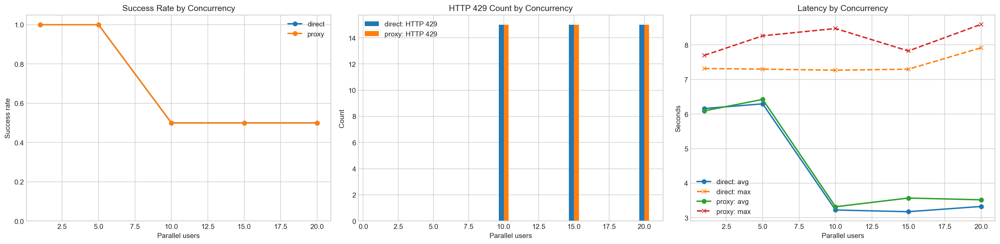
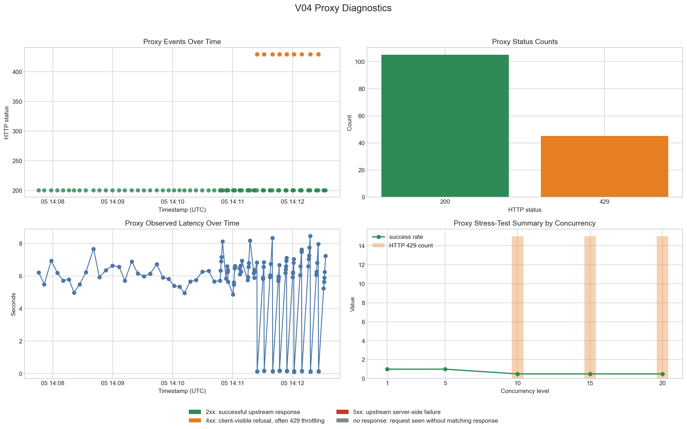
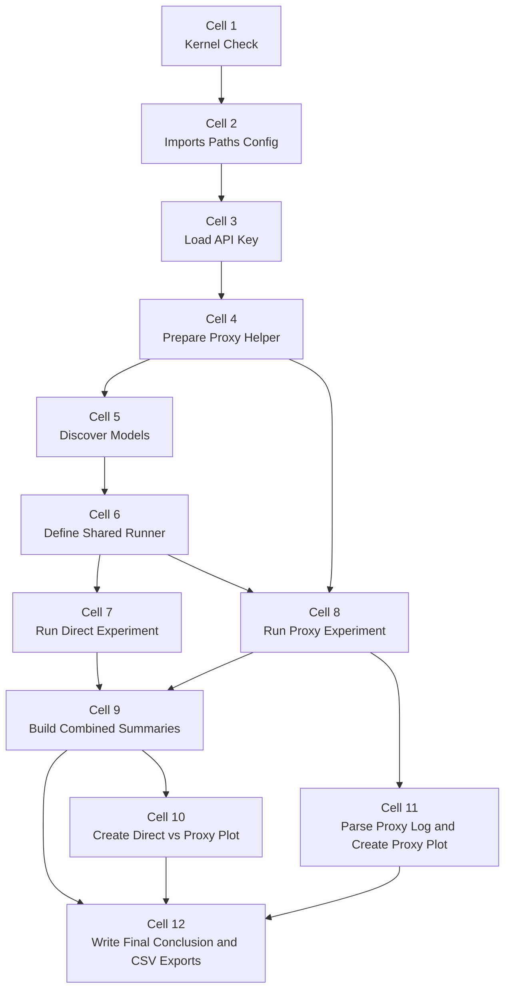

# WiLLMa Stress Test

## Context

This README focuses on one question: are the WiLLMa failures caused by the local notebook setup, or by the WiLLMa service upstream at SURF?

To answer that, V04 runs the same stress test in two ways:

1. `direct`: requests go straight to WiLLMa
2. `proxy`: requests go through a local monitor first

If both paths fail in the same way, the proxy and local notebook are unlikely to be the root cause.

The executed V04 run used:

- concurrency levels `1, 5, 10, 15, 20`
- `3` rounds per level
- `10` requests per round
- selected model `mistralai/Mistral-Small-3.2-24B-Instruct-2506`

## Main Conclusion

The most important findings are:

- WiLLMa works normally at low concurrency in both direct and proxy mode.
- Failures start at concurrency `10` and above.
- The main failure is `HTTP 429`, which means the service is refusing part of the load.
- The same pattern appears with and without the proxy.

In plain language:

The notebook is not showing a random local bug. The local proxy is also not the main problem. What happens is that once too many requests hit WiLLMa at the same time, the WiLLMa service starts saying "too many requests" and rejects part of them. That points to an upstream capacity or throttling limit at SURF WiLLMa, not to a broken test script on this machine.

## How To Interpret The Plots

### Direct vs Proxy Comparison Plot



What matters most:

- Direct and proxy runs match closely.
- Both modes stay healthy at `1` and `5`.
- Both modes fail in the same way from `10` onward.
- That makes an upstream WiLLMa limit the most likely explanation.

### Proxy Diagnostics Plot



What matters most:

- The proxy log captured `105` successful `200` responses and `45` `429` responses.
- That matches the notebook summary totals for the proxy run.
- So the proxy confirms what WiLLMa returned; it is not inventing a different error pattern.

Why more errors appear later in the proxy timeline:

- The test is run in sequence from low load to high load: `1`, then `5`, then `10`, then `15`, then `20`.
- So later timestamps also mean heavier test pressure.
- That is why more `429` errors appear later in time.
- In simple terms: the later part of the graph looks worse because that is where the notebook deliberately pushes WiLLMa harder.

For the exact per-mode numbers behind this interpretation, see `Appendix: Summary Table` below.

## Practical Interpretation

Do not treat lower latency as better performance here.

At higher concurrency, average latency drops partly because many rejected requests return quickly as `429`. That is faster refusal, not better service.

For this question, read the evidence in this order:

1. Success rate
2. Number of `429` responses
3. Latency as supporting evidence

## Environment Notes

Validated environment:

- kernel `langflow-fixed-ORG`
- Python `3.10.19`
- API key loaded from `.env`

For proxy mode, `mitmdump` was used from:

```text
C:\Users\PROMET02\anaconda3\envs\langflow-fixed-ORG\Scripts\mitmdump.exe
```

## Bottom Line

The clearest reading is this: the failures are most likely upstream at SURF WiLLMa. When the notebook sends only a small number of parallel requests, everything works. When it sends many at once, WiLLMa starts rejecting part of the load with `429 Too Many Requests`. Because this happens in both direct mode and proxy mode, the strongest explanation is an upstream throttling or capacity limit, not a local notebook or proxy problem.

## Appendix: Summary Table

| Mode | Concurrency | Total Requests | Success | HTTP 429 | Timeouts | Request Errors | Success Rate | Avg Latency (s) | Max Latency (s) |
| --- | --- | ---: | ---: | ---: | ---: | ---: | ---: | ---: | ---: |
| direct | 1 | 30 | 30 | 0 | 0 | 0 | 1.0 | 6.160 | 7.317 |
| direct | 5 | 30 | 30 | 0 | 0 | 0 | 1.0 | 6.295 | 7.300 |
| direct | 10 | 30 | 15 | 15 | 0 | 0 | 0.5 | 3.222 | 7.269 |
| direct | 15 | 30 | 15 | 15 | 0 | 0 | 0.5 | 3.173 | 7.298 |
| direct | 20 | 30 | 15 | 15 | 0 | 0 | 0.5 | 3.325 | 7.919 |
| proxy | 1 | 30 | 30 | 0 | 0 | 0 | 1.0 | 6.093 | 7.699 |
| proxy | 5 | 30 | 30 | 0 | 0 | 0 | 1.0 | 6.423 | 8.264 |
| proxy | 10 | 30 | 15 | 15 | 0 | 0 | 0.5 | 3.316 | 8.476 |
| proxy | 15 | 30 | 15 | 15 | 0 | 0 | 0.5 | 3.568 | 7.826 |
| proxy | 20 | 30 | 15 | 15 | 0 | 0 | 0.5 | 3.517 | 8.598 |

## Appendix: Produced Artifacts

The latest V04 run produced these key files:

- `assets/results/willma_v04_direct_vs_proxy_plots.png`
- `assets/proxy/PROXY-TESTS-V04.png`
- `assets/results/willma_v04_raw_results_20260805T141249Z.csv`
- `assets/results/willma_v04_summary_20260805T141249Z.csv`
- `assets/results/willma_v04_round_summary_20260805T141249Z.csv`
- `assets/results/willma_v04_conclusion_20260805T141249Z.csv`

## [Appendix: V04 Step Relationship Diagram](#appendix-v04-step-relationship-diagram)

Click any box in the diagram to jump to the matching cell in the verbatim code appendix.



## Appendix: V04 Verbatim Code

### CELL01: Kernel Integrity Check

This cell verifies that the notebook is running in the intended Python environment before any test logic starts.

```python
#### CELL01: Kernel Integrity Check
from pathlib import Path
import platform
import sys

EXPECTED_KERNEL = "langflow-fixed-ORG"
EXPECTED_PYTHON = "3.10.19"
python_version = platform.python_version()
executable_name = Path(sys.executable).name.lower()
executable_path = str(Path(sys.executable)).lower()
kernel_matches = EXPECTED_KERNEL.lower() in executable_path or EXPECTED_KERNEL.lower() in executable_name
version_matches = python_version == EXPECTED_PYTHON

print(f"Python executable: {sys.executable}")
print(f"Python version: {python_version}")

if not kernel_matches or not version_matches:
    raise RuntimeError(
        "This notebook must run with the 'langflow-fixed-ORG' kernel using Python 3.10.19. "
        f"Current executable: {sys.executable}; current version: {python_version}"
    )

print("Kernel check passed.")
```

### CELL02: Imports, Paths, and Configuration

This cell imports the required libraries and defines the shared paths, endpoints, and stress-test settings used by the rest of the notebook.

```python
#### CELL02: Imports, Paths, and Configuration
from pathlib import Path
import concurrent.futures
import json
import re
import subprocess
import time
import uuid
from datetime import datetime, timezone

import matplotlib.pyplot as plt
from matplotlib.patches import Patch
import pandas as pd
import requests

NOTEBOOK_ROOT = Path(r"D:\OneDrive - Hogeschool Rotterdam\SURF_PILOT\AI_HUB_PILOT\WILLMA_STRESS_TESTS")
ENV_PATH = NOTEBOOK_ROOT / ".env"
ASSETS_DIR = NOTEBOOK_ROOT / "assets"
RESULTS_DIR = ASSETS_DIR / "results"
PROXY_DIR = ASSETS_DIR / "proxy"
RESULTS_DIR.mkdir(parents=True, exist_ok=True)
PROXY_DIR.mkdir(parents=True, exist_ok=True)

WILLMA_DISCOVERY_URL = "https://api.willma.surf.nl/v0/sequences"
WILLMA_CHAT_URL = "https://willma.surf.nl/api/v0/chat/completions"
PROXY_BASE_URL = "http://127.0.0.1:8080"
PROXY_DISCOVERY_URL = f"{PROXY_BASE_URL}/v0/sequences"
PROXY_CHAT_URL = f"{PROXY_BASE_URL}/api/v0/chat/completions"

CONNECT_TIMEOUT_SECONDS = 30
READ_TIMEOUT_SECONDS = 180
VERIFY_TLS = True
TEMPERATURE = 0.2
MAX_TOKENS = 300
CONCURRENCY_LEVELS = [1, 5, 10, 15, 20]
ROUNDS_PER_LEVEL = 3
REQUESTS_PER_ROUND = 10
TEST_PROMPT = (
    "Explain in concise markdown what WiLLMa SURF is, what it is used for, "
    "and why a university teacher might use it in class."
)

print(f"Results directory: {RESULTS_DIR}")
print(f"Proxy directory: {PROXY_DIR}")
print(f"Concurrency levels: {CONCURRENCY_LEVELS}")
print(f"Rounds per level: {ROUNDS_PER_LEVEL}")
print(f"Requests per round: {REQUESTS_PER_ROUND}")
```

### CELL03: Load API Key From .env

This cell reads the API key from the local `.env` file and prepares the HTTP headers for all WiLLMa requests.

```python
#### CELL03: Load API Key From .env
def load_api_key(env_path: Path) -> str:
    if not env_path.exists():
        raise FileNotFoundError(f"Missing .env file: {env_path}")

    env_text = env_path.read_text(encoding="utf-8")
    for line in env_text.splitlines():
        stripped = line.strip()
        if not stripped or stripped.startswith("#") or "=" not in stripped:
            continue
        key, value = stripped.split("=", 1)
        if key.strip().upper() in {"WILLMA_API_KEY", "API_KEY", "X_API_KEY"}:
            api_key = value.strip().strip(chr(34)).strip(chr(39))
            if api_key:
                return api_key

    api_key_candidates = re.findall(r"[A-Za-z0-9]{20,}", env_text)
    if api_key_candidates:
        return api_key_candidates[0]

    raise ValueError(f"No usable API key found in {env_path}")

api_key = load_api_key(ENV_PATH)
HEADERS = {"X-API-KEY": api_key, "Content-Type": "application/json"}
print(f"API key loaded: {api_key[:12]}...{api_key[-4:]}")
```

### CELL04: Write Proxy Logging Script and Show Command

This cell writes the helper script for `mitmdump` and prints the command needed to start the proxy logging process.

```python
#### CELL04: Write Proxy Logging Script and Show Command
proxy_log_path = PROXY_DIR / "mitmproxy.log"
proxy_script_path = PROXY_DIR / "save_streams.py"
proxy_script_lines = [
    "from mitmproxy import http",
    "from pathlib import Path",
    "from datetime import datetime, timezone",
    "import json",
    "",
    f"LOG_PATH = Path(r'{proxy_log_path}')",
    "LOG_PATH.parent.mkdir(parents=True, exist_ok=True)",
    "",
    "def _write_event(stage: str, flow: http.HTTPFlow):",
    "    event = {",
    '        "timestamp_utc": datetime.now(timezone.utc).isoformat(),',
    '        "stage": stage,',
    '        "method": flow.request.method,',
    '        "url": flow.request.pretty_url,',
    '        "path": flow.request.path,',
    '        "status_code": None if flow.response is None else flow.response.status_code,',
    '        "has_api_key": "X-API-KEY" in flow.request.headers,',
    '        "user_agent": flow.request.headers.get("User-Agent", ""),',
    "    }",
    '    with LOG_PATH.open("a", encoding="utf-8") as handle:',
    '        handle.write(json.dumps(event, ensure_ascii=False) + "\\n")',
    "",
    "def request(flow: http.HTTPFlow):",
    '    _write_event("request", flow)',
    "",
    "def response(flow: http.HTTPFlow):",
    '    _write_event("response", flow)',
]
proxy_script = "\n".join(proxy_script_lines) + "\n"
proxy_script_path.write_text(proxy_script, encoding="utf-8", newline="\n")

mitmdump_command = (
    f'mitmdump --mode reverse:https://api.willma.surf.nl -p 8080 -s "{proxy_script_path}"'
)

print(f"Proxy script written to: {proxy_script_path}")
print(f"Proxy log path: {proxy_log_path}")
print("Run this in a separate terminal before the proxy experiment:")
print(mitmdump_command)
```

### CELL05: Discover Available Models and Select Default

This cell queries the WiLLMa discovery endpoint, lists the available text models, and selects the default model for the test run.

```python
#### CELL05: Discover Available Models and Select Default
def discover_models(discovery_url: str) -> tuple[pd.DataFrame, list[str]]:
    response = requests.get(
        discovery_url,
        headers=HEADERS,
        timeout=(CONNECT_TIMEOUT_SECONDS, READ_TIMEOUT_SECONDS),
        verify=VERIFY_TLS,
    )
    print(f"Model discovery status: {response.status_code}")
    response.raise_for_status()
    payload = response.json()
    if not isinstance(payload, list):
        raise ValueError(f"Expected list from discovery endpoint, got {type(payload).__name__}")

    models_df = pd.DataFrame(payload)
    if "sequence_type" not in models_df.columns:
        models_df["sequence_type"] = "unknown"

    text_models = [
        row["name"]
        for _, row in models_df.iterrows()
        if str(row.get("sequence_type", "")).lower() == "text" and row.get("name")
    ]
    preferred_models = sorted(
        text_models,
        key=lambda name: (0 if "mistral" in name.lower() else 1, name.lower())
    )
    return models_df, preferred_models

models_df, text_models = discover_models(WILLMA_DISCOVERY_URL)
display(models_df[[col for col in ["id", "name", "sequence_type", "latency_mode"] if col in models_df.columns]])
print("\nCandidate text models:")
for model_name in text_models:
    print(f"- {model_name}")

if not text_models:
    raise ValueError("No text models discovered for testing.")

selected_model = text_models[0]
print(f"\nSelected model for V04: {selected_model}")
```

### CELL06: Shared Request and Experiment Runner

This cell defines the shared request execution, status classification, and summary logic used by both direct and proxy experiments.

```python
#### CELL06: Shared Request and Experiment Runner
def utc_now_iso() -> str:
    return datetime.now(timezone.utc).isoformat()

def classify_status(http_status: int | None, exception_type: str | None) -> str:
    if exception_type == "timeout":
        return "timeout"
    if exception_type == "request_error":
        return "request_error"
    if http_status is None:
        return "unknown"
    if 200 <= http_status < 300:
        return "success"
    if http_status == 429:
        return "rate_limited"
    if http_status in (401, 403):
        return "not_authorized"
    if http_status == 404:
        return "not_found"
    if 500 <= http_status < 600:
        return "server_error"
    return f"http_{http_status}"

def run_one_request(mode_name: str, chat_url: str, model_name: str, prompt_text: str, concurrency_level: int, round_number: int, request_number: int) -> dict:
    payload = {
        "model": model_name,
        "messages": [
            {"role": "system", "content": "You are a concise assistant."},
            {"role": "user", "content": prompt_text},
        ],
        "temperature": TEMPERATURE,
        "max_tokens": MAX_TOKENS,
        "stream": False,
    }

    started = time.perf_counter()
    response = None
    exception_type = None
    error_text = ""

    try:
        response = requests.post(
            chat_url,
            headers=HEADERS,
            json=payload,
            timeout=(CONNECT_TIMEOUT_SECONDS, READ_TIMEOUT_SECONDS),
            verify=VERIFY_TLS,
        )
        if not response.ok:
            error_text = response.text[:500]
    except requests.Timeout as exc:
        exception_type = "timeout"
        error_text = str(exc)
    except requests.RequestException as exc:
        exception_type = "request_error"
        error_text = str(exc)

    latency_seconds = round(time.perf_counter() - started, 4)
    http_status = None if response is None else response.status_code

    return {
        "timestamp_utc": utc_now_iso(),
        "request_id": uuid.uuid4().hex,
        "transport_mode": mode_name,
        "target_url": chat_url,
        "model": model_name,
        "concurrency_level": concurrency_level,
        "round_number": round_number,
        "request_number": request_number,
        "http_status": http_status,
        "status": classify_status(http_status, exception_type),
        "latency_seconds": latency_seconds,
        "retry_after": None if response is None else response.headers.get("Retry-After"),
        "error_text": error_text,
    }

def run_round(mode_name: str, chat_url: str, model_name: str, concurrency_level: int, round_number: int, requests_per_round: int) -> pd.DataFrame:
    with concurrent.futures.ThreadPoolExecutor(max_workers=concurrency_level) as executor:
        futures = [
            executor.submit(
                run_one_request,
                mode_name,
                chat_url,
                model_name,
                TEST_PROMPT,
                concurrency_level,
                round_number,
                request_number,
            )
            for request_number in range(1, requests_per_round + 1)
        ]
        rows = [future.result() for future in concurrent.futures.as_completed(futures)]
    return pd.DataFrame(rows).sort_values(by="request_number").reset_index(drop=True)

def run_experiment(mode_name: str, chat_url: str, model_name: str) -> pd.DataFrame:
    all_results = []
    print(f"Starting experiment: {mode_name}")
    for level in CONCURRENCY_LEVELS:
        for round_number in range(1, ROUNDS_PER_LEVEL + 1):
            print(f"Running {mode_name}: level {level}, round {round_number}/{ROUNDS_PER_LEVEL} with {REQUESTS_PER_ROUND} requests...")
            round_df = run_round(mode_name, chat_url, model_name, level, round_number, REQUESTS_PER_ROUND)
            all_results.append(round_df)
    results_df = pd.concat(all_results, ignore_index=True)
    print(f"Completed experiment: {mode_name}; rows = {len(results_df)}")
    return results_df

def summarize_level(level_df: pd.DataFrame) -> dict:
    latencies = level_df["latency_seconds"].dropna().tolist()
    http_errors = sorted({str(int(value)) for value in level_df["http_status"].dropna().tolist() if int(value) >= 400})
    return {
        "transport_mode": level_df["transport_mode"].iloc[0],
        "concurrency_level": int(level_df["concurrency_level"].iloc[0]),
        "total_requests": int(len(level_df)),
        "success_count": int((level_df["status"] == "success").sum()),
        "rate_limited_count": int((level_df["status"] == "rate_limited").sum()),
        "timeout_count": int((level_df["status"] == "timeout").sum()),
        "request_error_count": int((level_df["status"] == "request_error").sum()),
        "server_error_count": int((level_df["status"] == "server_error").sum()),
        "other_error_count": int((~level_df["status"].isin(["success", "rate_limited", "timeout", "request_error", "server_error"])).sum()),
        "success_rate": round((level_df["status"] == "success").mean(), 3),
        "avg_latency_seconds": round(sum(latencies) / len(latencies), 3) if latencies else None,
        "max_latency_seconds": round(max(latencies), 3) if latencies else None,
        "http_errors_seen": ", ".join(http_errors) if http_errors else "none",
    }

def build_summaries(results_df: pd.DataFrame) -> tuple[pd.DataFrame, pd.DataFrame]:
    summary_df = pd.DataFrame([
        summarize_level(group)
        for _, group in results_df.groupby(["transport_mode", "concurrency_level"])
    ]).sort_values(by=["transport_mode", "concurrency_level"]).reset_index(drop=True)

    round_summary_df = (
        results_df.groupby(["transport_mode", "concurrency_level", "round_number"], dropna=False)
        .agg(
            total_requests=("request_id", "count"),
            success_count=("status", lambda values: int((values == "success").sum())),
            rate_limited_count=("status", lambda values: int((values == "rate_limited").sum())),
            timeout_count=("status", lambda values: int((values == "timeout").sum())),
            request_error_count=("status", lambda values: int((values == "request_error").sum())),
        )
        .reset_index()
    )
    round_summary_df["success_rate"] = (round_summary_df["success_count"] / round_summary_df["total_requests"]).round(3)
    return summary_df, round_summary_df
```

### CELL07: Run Direct Non-Proxy Stress Test

This cell runs the baseline experiment directly against WiLLMa without the local proxy in the path.

```python
#### CELL07: Run Direct Non-Proxy Stress Test
RUN_DIRECT_EXPERIMENT = True

if RUN_DIRECT_EXPERIMENT:
    direct_results_df = run_experiment("direct", WILLMA_CHAT_URL, selected_model)
    display(direct_results_df.head(10))
else:
    direct_results_df = pd.DataFrame()
    print("Direct experiment skipped.")
```

### CELL08: Run Proxy Monitoring Stress Test

This cell runs the same experiment through the local proxy so the direct and proxy paths can be compared fairly.

```python
#### CELL08: Run Proxy Monitoring Stress Test
RUN_PROXY_EXPERIMENT = True

if RUN_PROXY_EXPERIMENT:
    proxy_results_df = run_experiment("proxy", PROXY_CHAT_URL, selected_model)
    display(proxy_results_df.head(10))
else:
    proxy_results_df = pd.DataFrame()
    print("Proxy experiment skipped.")
```

### CELL09: Build Combined Summary Tables

This cell merges the available experiment outputs and builds the summary tables used for interpretation and plotting.

```python
#### CELL09: Build Combined Summary Tables
available_results = [df for df in [direct_results_df, proxy_results_df] if not df.empty]
if not available_results:
    raise ValueError("No experiment results are available. Run at least one experiment first.")

combined_results_df = pd.concat(available_results, ignore_index=True)
summary_df, round_summary_df = build_summaries(combined_results_df)

comparison_df = summary_df[[
    "transport_mode",
    "concurrency_level",
    "success_rate",
    "rate_limited_count",
    "request_error_count",
    "timeout_count",
    "avg_latency_seconds",
    "http_errors_seen",
]].copy()

display(summary_df)
display(round_summary_df)
display(comparison_df)
```

### CELL10: Plot Direct Versus Proxy Results

This cell creates the main comparison figure showing success rate, HTTP 429 counts, and latency across concurrency levels.

```python
#### CELL10: Plot Direct Versus Proxy Results
plt.style.use("seaborn-v0_8-whitegrid")
fig, axes = plt.subplots(1, 3, figsize=(20, 5))

for mode_name, mode_df in summary_df.groupby("transport_mode"):
    axes[0].plot(mode_df["concurrency_level"], mode_df["success_rate"], marker="o", linewidth=2, label=mode_name)
axes[0].set_title("Success Rate by Concurrency")
axes[0].set_xlabel("Parallel users")
axes[0].set_ylabel("Success rate")
axes[0].set_ylim(0, 1.05)
axes[0].legend()

plot_modes = list(summary_df["transport_mode"].unique())
bar_width = 0.35
for index, mode_name in enumerate(plot_modes):
    mode_df = summary_df.loc[summary_df["transport_mode"] == mode_name].sort_values("concurrency_level")
    x_positions = [value + (index - (len(plot_modes) - 1) / 2) * bar_width for value in mode_df["concurrency_level"]]
    axes[1].bar(x_positions, mode_df["rate_limited_count"], width=bar_width, label=f"{mode_name}: HTTP 429")
axes[1].set_title("HTTP 429 Count by Concurrency")
axes[1].set_xlabel("Parallel users")
axes[1].set_ylabel("Count")
axes[1].legend()

for mode_name, mode_df in summary_df.groupby("transport_mode"):
    axes[2].plot(mode_df["concurrency_level"], mode_df["avg_latency_seconds"], marker="o", linewidth=2, label=f"{mode_name}: avg")
    axes[2].plot(mode_df["concurrency_level"], mode_df["max_latency_seconds"], marker="x", linewidth=2, linestyle="--", label=f"{mode_name}: max")
axes[2].set_title("Latency by Concurrency")
axes[2].set_xlabel("Parallel users")
axes[2].set_ylabel("Seconds")
axes[2].legend()

plt.tight_layout()
plot_path = RESULTS_DIR / "willma_v04_direct_vs_proxy_plots.png"
fig.savefig(plot_path, dpi=150, bbox_inches="tight")
print(f"Saved plot image to {plot_path}")
plt.show()
```

### CELL11: Optional Proxy Log Summary and Dedicated Proxy Plot

This cell parses the proxy log, summarizes the observed HTTP traffic, and creates the dedicated proxy diagnostics figure.

```python
#### CELL11: Optional Proxy Log Summary and Dedicated Proxy Plot
if proxy_log_path.exists():
    proxy_log_text = proxy_log_path.read_text(encoding="utf-8")
    proxy_events = []

    for line in proxy_log_text.splitlines():
        stripped = line.strip()
        if not stripped:
            continue
        if stripped.startswith("{") and stripped.endswith("}"):
            try:
                proxy_events.append(json.loads(stripped))
            except json.JSONDecodeError:
                pass

    if not proxy_events:
        request_pattern = re.compile(
            r"=== REQUEST ===\s*(?P<timestamp>[^\r\n]+)\s*(?P<method>[A-Z]+)\s+(?P<url>https?://\S+)(?P<headers>.*?)(?=(?:=== RESPONSE ===)|(?:=== REQUEST ===)|\Z)",
            re.DOTALL,
        )
        response_pattern = re.compile(
            r"=== RESPONSE ===\s*(?P<timestamp>[^\r\n]+)(?P<body>.*?)(?=(?:=== REQUEST ===)|(?:=== RESPONSE ===)|\Z)",
            re.DOTALL,
        )

        request_matches = list(request_pattern.finditer(proxy_log_text))
        response_matches = list(response_pattern.finditer(proxy_log_text))

        for index, request_match in enumerate(request_matches):
            headers_text = request_match.group("headers")
            url = request_match.group("url").strip()
            proxy_events.append({
                "timestamp_utc": request_match.group("timestamp").strip(),
                "stage": "request",
                "method": request_match.group("method").strip(),
                "url": url,
                "path": re.sub(r"^https?://[^/]+", "", url),
                "status_code": None,
                "has_api_key": "x-api-key:" in headers_text.lower(),
                "user_agent": next((
                    header_line.split(":", 1)[1].strip()
                    for header_line in headers_text.splitlines()
                    if header_line.lower().startswith("user-agent:")
                ), ""),
            })

            if index < len(response_matches):
                response_body = response_matches[index].group("body")
                status_match = re.search(r"Status:\s*(\d+)", response_body)
                proxy_events.append({
                    "timestamp_utc": response_matches[index].group("timestamp").strip(),
                    "stage": "response",
                    "method": request_match.group("method").strip(),
                    "url": url,
                    "path": re.sub(r"^https?://[^/]+", "", url),
                    "status_code": None if status_match is None else int(status_match.group(1)),
                    "has_api_key": "x-api-key:" in headers_text.lower(),
                    "user_agent": next((
                        header_line.split(":", 1)[1].strip()
                        for header_line in headers_text.splitlines()
                        if header_line.lower().startswith("user-agent:")
                    ), ""),
                })

    proxy_events_df = pd.DataFrame(proxy_events)
    if proxy_events_df.empty:
        print("Proxy log exists but no readable events were found.")
    else:
        for column_name, default_value in {
            "timestamp_utc": pd.NaT,
            "stage": "unknown",
            "method": None,
            "url": None,
            "path": None,
            "status_code": None,
            "has_api_key": False,
            "user_agent": "",
        }.items():
            if column_name not in proxy_events_df.columns:
                proxy_events_df[column_name] = default_value

        proxy_events_df["timestamp_utc"] = pd.to_datetime(proxy_events_df["timestamp_utc"], utc=True, errors="coerce")
        proxy_events_df["status_code"] = pd.to_numeric(proxy_events_df["status_code"], errors="coerce")
        proxy_events_df["status_family"] = proxy_events_df["status_code"].apply(lambda value: "no_response" if pd.isna(value) else f"{int(value) // 100}xx")
        proxy_events_df["status_label"] = proxy_events_df["status_code"].apply(lambda value: "no_response" if pd.isna(value) else str(int(value)))
        proxy_events_df["is_browser_like"] = proxy_events_df["user_agent"].fillna("").str.contains("Mozilla|Chrome|Safari|Edge", case=False, regex=True)
        proxy_events_df["is_notebook_api_call"] = proxy_events_df["has_api_key"].fillna(False) & (~proxy_events_df["is_browser_like"])

        request_events_df = proxy_events_df.loc[proxy_events_df["stage"] == "request"].copy()
        response_events_df = proxy_events_df.loc[proxy_events_df["stage"] == "response"].copy()
        request_events_df = request_events_df.rename(columns={"timestamp_utc": "request_timestamp"})
        response_events_df = response_events_df.rename(columns={"timestamp_utc": "response_timestamp"})

        request_events_df["event_key"] = range(len(request_events_df))
        response_events_df["event_key"] = range(len(response_events_df))
        merge_columns = ["event_key", "method", "url", "path", "has_api_key", "user_agent"]
        proxy_pairs_df = request_events_df[["request_timestamp"] + merge_columns].merge(
            response_events_df[["response_timestamp", "status_code", "status_family", "status_label", "event_key"]],
            on="event_key",
            how="left"
        )
        proxy_pairs_df["is_browser_like"] = proxy_pairs_df["user_agent"].fillna("").str.contains("Mozilla|Chrome|Safari|Edge", case=False, regex=True)
        proxy_pairs_df["is_notebook_api_call"] = proxy_pairs_df["has_api_key"].fillna(False) & (~proxy_pairs_df["is_browser_like"])
        proxy_pairs_df["event_timestamp"] = proxy_pairs_df["response_timestamp"].fillna(proxy_pairs_df["request_timestamp"])
        proxy_pairs_df["elapsed_seconds"] = (proxy_pairs_df["response_timestamp"] - proxy_pairs_df["request_timestamp"]).dt.total_seconds()
        proxy_pairs_df["status_family"] = proxy_pairs_df["status_family"].fillna("no_response")
        proxy_pairs_df["status_label"] = proxy_pairs_df["status_label"].fillna("no_response")
        proxy_pairs_df = proxy_pairs_df.sort_values("event_timestamp").reset_index(drop=True)

        notebook_proxy_df = proxy_pairs_df.loc[proxy_pairs_df["is_notebook_api_call"]].copy()
        if notebook_proxy_df.empty:
            notebook_proxy_df = proxy_pairs_df.copy()

        display(notebook_proxy_df.tail(20))

        status_counts_df = (
            notebook_proxy_df.groupby(["status_label", "status_family"], dropna=False)
            .size()
            .reset_index(name="count")
            .sort_values(by=["status_family", "status_label"])
            .reset_index(drop=True)
        )
        display(status_counts_df)

        proxy_summary_for_plot = pd.DataFrame()
        if "proxy_results_df" in globals() and not proxy_results_df.empty:
            proxy_summary_for_plot, _ = build_summaries(proxy_results_df)

        status_colors = {"2xx": "#2E8B57", "4xx": "#E67E22", "5xx": "#C0392B", "no_response": "#7F8C8D"}
        notebook_proxy_df["plot_color"] = notebook_proxy_df["status_family"].map(status_colors).fillna("#4C78A8")

        fig, axes = plt.subplots(2, 2, figsize=(16, 10))

        axes[0, 0].scatter(
            notebook_proxy_df["event_timestamp"],
            notebook_proxy_df["status_code"].fillna(-1),
            c=notebook_proxy_df["plot_color"],
            alpha=0.8
        )
        axes[0, 0].set_title("Proxy Events Over Time")
        axes[0, 0].set_xlabel("Timestamp (UTC)")
        axes[0, 0].set_ylabel("HTTP status")

        axes[0, 1].bar(status_counts_df["status_label"], status_counts_df["count"], color=[status_colors.get(family, "#4C78A8") for family in status_counts_df["status_family"]])
        axes[0, 1].set_title("Proxy Status Counts")
        axes[0, 1].set_xlabel("HTTP status")
        axes[0, 1].set_ylabel("Count")

        latency_df = notebook_proxy_df.dropna(subset=["elapsed_seconds"]).copy()
        if not latency_df.empty:
            axes[1, 0].plot(latency_df["event_timestamp"], latency_df["elapsed_seconds"], marker="o", linewidth=1.5, color="#4C78A8")
            axes[1, 0].set_title("Proxy Observed Latency Over Time")
            axes[1, 0].set_xlabel("Timestamp (UTC)")
            axes[1, 0].set_ylabel("Seconds")
        else:
            axes[1, 0].text(0.5, 0.5, "No request/response latency pairs found", ha="center", va="center", transform=axes[1, 0].transAxes)
            axes[1, 0].set_title("Proxy Observed Latency Over Time")
            axes[1, 0].set_axis_off()

        if not proxy_summary_for_plot.empty:
            axes[1, 1].plot(proxy_summary_for_plot["concurrency_level"], proxy_summary_for_plot["success_rate"], marker="o", linewidth=2, color="#2E8B57", label="success rate")
            axes[1, 1].bar(proxy_summary_for_plot["concurrency_level"], proxy_summary_for_plot["rate_limited_count"], alpha=0.35, color="#E67E22", label="HTTP 429 count")
            axes[1, 1].set_title("Proxy Stress-Test Summary by Concurrency")
            axes[1, 1].set_xlabel("Concurrency level")
            axes[1, 1].set_ylabel("Value")
            axes[1, 1].set_xticks(proxy_summary_for_plot["concurrency_level"].tolist())
            axes[1, 1].legend()
        else:
            axes[1, 1].text(0.5, 0.5, "Run the proxy experiment first to populate this panel", ha="center", va="center", transform=axes[1, 1].transAxes)
            axes[1, 1].set_title("Proxy Stress-Test Summary by Concurrency")
            axes[1, 1].set_axis_off()

        legend_handles = [
            Patch(facecolor="#2E8B57", label="2xx: successful upstream response"),
            Patch(facecolor="#E67E22", label="4xx: client-visible refusal, often 429 throttling"),
            Patch(facecolor="#C0392B", label="5xx: upstream server-side failure"),
            Patch(facecolor="#7F8C8D", label="no response: request seen without matching response"),
        ]
        fig.legend(handles=legend_handles, loc="lower center", ncol=2, frameon=False)
        fig.suptitle("V04 Proxy Diagnostics", fontsize=16)
        fig.tight_layout(rect=[0, 0.06, 1, 0.95])

        proxy_plot_path = PROXY_DIR / "PROXY-TESTS-V04.png"
        fig.savefig(proxy_plot_path, dpi=150, bbox_inches="tight")
        print(f"Saved proxy diagnostics plot to {proxy_plot_path}")
        plt.show()
else:
    print(f"Proxy log not found: {proxy_log_path}")
```

### CELL12: Final Conclusion and Save CSV Outputs

This cell derives the final interpretation from the summaries and writes the CSV artifacts produced by the notebook.

```python
#### CELL12: Final Conclusion and Save CSV Outputs
timestamp = datetime.now(timezone.utc).strftime("%Y%m%dT%H%M%SZ")

direct_summary = summary_df.loc[summary_df["transport_mode"] == "direct"]
proxy_summary = summary_df.loc[summary_df["transport_mode"] == "proxy"]

direct_has_429 = int(direct_summary["rate_limited_count"].sum()) > 0 if not direct_summary.empty else False
proxy_has_429 = int(proxy_summary["rate_limited_count"].sum()) > 0 if not proxy_summary.empty else False
direct_has_request_errors = int(direct_summary["request_error_count"].sum()) > 0 if not direct_summary.empty else False
proxy_has_request_errors = int(proxy_summary["request_error_count"].sum()) > 0 if not proxy_summary.empty else False

if not direct_summary.empty and not proxy_summary.empty and direct_has_429 and proxy_has_429:
    likely_interpretation = "Direct mode and proxy mode both show HTTP 429 under higher concurrency. This supports an upstream WiLLMa throttling explanation rather than a proxy-only problem."
elif not direct_summary.empty and not proxy_summary.empty and (not direct_has_429) and proxy_has_429:
    likely_interpretation = "Only proxy mode shows HTTP 429 in this run. Inspect proxy setup, timing, and whether the two runs were truly comparable."
elif direct_has_request_errors or proxy_has_request_errors:
    likely_interpretation = "At least one mode shows local request errors. Inspect transport, connectivity, and proxy configuration before concluding this is purely upstream throttling."
else:
    likely_interpretation = "The result is mixed. Use the summary tables and proxy log together before drawing a final conclusion."

conclusion_lines = [
    f"Selected model: {selected_model}",
    f"Direct run executed: {not direct_results_df.empty}",
    f"Proxy run executed: {not proxy_results_df.empty}",
    f"Direct HTTP 429 total: {int(direct_summary['rate_limited_count'].sum()) if not direct_summary.empty else 0}",
    f"Proxy HTTP 429 total: {int(proxy_summary['rate_limited_count'].sum()) if not proxy_summary.empty else 0}",
    f"Direct request error total: {int(direct_summary['request_error_count'].sum()) if not direct_summary.empty else 0}",
    f"Proxy request error total: {int(proxy_summary['request_error_count'].sum()) if not proxy_summary.empty else 0}",
    f"Likely interpretation: {likely_interpretation}",
    f"Proxy log path: {proxy_log_path}",
]

print("Conclusion:\n")
for line in conclusion_lines:
    print(f"- {line}")

conclusion_df = pd.DataFrame({"statement": conclusion_lines})
display(conclusion_df)

combined_results_df.to_csv(RESULTS_DIR / f"willma_v04_raw_results_{timestamp}.csv", index=False)
summary_df.to_csv(RESULTS_DIR / f"willma_v04_summary_{timestamp}.csv", index=False)
round_summary_df.to_csv(RESULTS_DIR / f"willma_v04_round_summary_{timestamp}.csv", index=False)
conclusion_df.to_csv(RESULTS_DIR / f"willma_v04_conclusion_{timestamp}.csv", index=False)
print(f"\nSaved CSV outputs to {RESULTS_DIR}")
```
